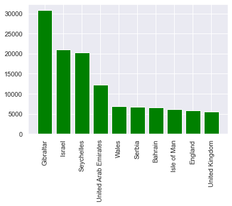

This a dataset that has been acquired from kaggle. This dataset deals with data of vaccination around the world.


```python
import pandas as pd
import numpy as np
import seaborn as sns
import matplotlib.pyplot as plt
import os
import plotly.express as px
sns.set()
```


```python
vc = pd.read_csv("country_vaccinations.csv")
```


```python
vc
```


<div>
<style scoped>
    .dataframe tbody tr th:only-of-type {
        vertical-align: middle;
    }

    .dataframe tbody tr th {
        vertical-align: top;
    }

    .dataframe thead th {
        text-align: right;
    }
</style>
<table border="1" class="dataframe">
  <thead>
    <tr style="text-align: right;">
      <th></th>
      <th>country</th>
      <th>iso_code</th>
      <th>date</th>
      <th>total_vaccinations</th>
      <th>people_vaccinated</th>
      <th>people_fully_vaccinated</th>
      <th>daily_vaccinations_raw</th>
      <th>daily_vaccinations</th>
      <th>total_vaccinations_per_hundred</th>
      <th>people_vaccinated_per_hundred</th>
      <th>people_fully_vaccinated_per_hundred</th>
      <th>daily_vaccinations_per_million</th>
      <th>vaccines</th>
      <th>source_name</th>
      <th>source_website</th>
    </tr>
  </thead>
  <tbody>
    <tr>
      <th>0</th>
      <td>Algeria</td>
      <td>DZA</td>
      <td>2021-01-29</td>
      <td>0.0</td>
      <td>NaN</td>
      <td>NaN</td>
      <td>NaN</td>
      <td>NaN</td>
      <td>0.00</td>
      <td>NaN</td>
      <td>NaN</td>
      <td>NaN</td>
      <td>Sputnik V</td>
      <td>Ministry of Health</td>
      <td>https://www.aps.dz/regions/116777-blida-covid-...</td>
    </tr>
    <tr>
      <th>1</th>
      <td>Algeria</td>
      <td>DZA</td>
      <td>2021-01-30</td>
      <td>30.0</td>
      <td>NaN</td>
      <td>NaN</td>
      <td>30.0</td>
      <td>30.0</td>
      <td>0.00</td>
      <td>NaN</td>
      <td>NaN</td>
      <td>1.0</td>
      <td>Sputnik V</td>
      <td>Ministry of Health</td>
      <td>https://www.aps.dz/regions/116777-blida-covid-...</td>
    </tr>
    <tr>
      <th>2</th>
      <td>Argentina</td>
      <td>ARG</td>
      <td>2020-12-29</td>
      <td>700.0</td>
      <td>NaN</td>
      <td>NaN</td>
      <td>NaN</td>
      <td>NaN</td>
      <td>0.00</td>
      <td>NaN</td>
      <td>NaN</td>
      <td>NaN</td>
      <td>Sputnik V</td>
      <td>Ministry of Health</td>
      <td>http://datos.salud.gob.ar/dataset/vacunas-cont...</td>
    </tr>
    <tr>
      <th>3</th>
      <td>Argentina</td>
      <td>ARG</td>
      <td>2020-12-30</td>
      <td>NaN</td>
      <td>NaN</td>
      <td>NaN</td>
      <td>NaN</td>
      <td>15656.0</td>
      <td>NaN</td>
      <td>NaN</td>
      <td>NaN</td>
      <td>346.0</td>
      <td>Sputnik V</td>
      <td>Ministry of Health</td>
      <td>http://datos.salud.gob.ar/dataset/vacunas-cont...</td>
    </tr>
    <tr>
      <th>4</th>
      <td>Argentina</td>
      <td>ARG</td>
      <td>2020-12-31</td>
      <td>32013.0</td>
      <td>NaN</td>
      <td>NaN</td>
      <td>NaN</td>
      <td>15656.0</td>
      <td>0.07</td>
      <td>NaN</td>
      <td>NaN</td>
      <td>346.0</td>
      <td>Sputnik V</td>
      <td>Ministry of Health</td>
      <td>http://datos.salud.gob.ar/dataset/vacunas-cont...</td>
    </tr>
    <tr>
      <th>...</th>
      <td>...</td>
      <td>...</td>
      <td>...</td>
      <td>...</td>
      <td>...</td>
      <td>...</td>
      <td>...</td>
      <td>...</td>
      <td>...</td>
      <td>...</td>
      <td>...</td>
      <td>...</td>
      <td>...</td>
      <td>...</td>
      <td>...</td>
    </tr>
    <tr>
      <th>1840</th>
      <td>Wales</td>
      <td>NaN</td>
      <td>2021-01-26</td>
      <td>312944.0</td>
      <td>312305.0</td>
      <td>639.0</td>
      <td>22797.0</td>
      <td>19537.0</td>
      <td>9.93</td>
      <td>9.91</td>
      <td>0.02</td>
      <td>6197.0</td>
      <td>Oxford/AstraZeneca, Pfizer/BioNTech</td>
      <td>Government of the United Kingdom</td>
      <td>https://coronavirus.data.gov.uk/details/health...</td>
    </tr>
    <tr>
      <th>1841</th>
      <td>Wales</td>
      <td>NaN</td>
      <td>2021-01-27</td>
      <td>336745.0</td>
      <td>336071.0</td>
      <td>674.0</td>
      <td>23801.0</td>
      <td>20845.0</td>
      <td>10.68</td>
      <td>10.66</td>
      <td>0.02</td>
      <td>6611.0</td>
      <td>Oxford/AstraZeneca, Pfizer/BioNTech</td>
      <td>Government of the United Kingdom</td>
      <td>https://coronavirus.data.gov.uk/details/health...</td>
    </tr>
    <tr>
      <th>1842</th>
      <td>Wales</td>
      <td>NaN</td>
      <td>2021-01-28</td>
      <td>362970.0</td>
      <td>362253.0</td>
      <td>717.0</td>
      <td>26225.0</td>
      <td>21463.0</td>
      <td>11.51</td>
      <td>11.49</td>
      <td>0.02</td>
      <td>6807.0</td>
      <td>Oxford/AstraZeneca, Pfizer/BioNTech</td>
      <td>Government of the United Kingdom</td>
      <td>https://coronavirus.data.gov.uk/details/health...</td>
    </tr>
    <tr>
      <th>1843</th>
      <td>Wales</td>
      <td>NaN</td>
      <td>2021-01-29</td>
      <td>378950.0</td>
      <td>378200.0</td>
      <td>750.0</td>
      <td>15980.0</td>
      <td>19705.0</td>
      <td>12.02</td>
      <td>12.00</td>
      <td>0.02</td>
      <td>6250.0</td>
      <td>Oxford/AstraZeneca, Pfizer/BioNTech</td>
      <td>Government of the United Kingdom</td>
      <td>https://coronavirus.data.gov.uk/details/health...</td>
    </tr>
    <tr>
      <th>1844</th>
      <td>Wales</td>
      <td>NaN</td>
      <td>2021-01-30</td>
      <td>404249.0</td>
      <td>403463.0</td>
      <td>786.0</td>
      <td>25299.0</td>
      <td>19885.0</td>
      <td>12.82</td>
      <td>12.80</td>
      <td>0.02</td>
      <td>6307.0</td>
      <td>Oxford/AstraZeneca, Pfizer/BioNTech</td>
      <td>Government of the United Kingdom</td>
      <td>https://coronavirus.data.gov.uk/details/health...</td>
    </tr>
  </tbody>
</table>
<p>1845 rows × 15 columns</p>
</div>


```python
vc.head()
```


<div>
<style scoped>
    .dataframe tbody tr th:only-of-type {
        vertical-align: middle;
    }

    .dataframe tbody tr th {
        vertical-align: top;
    }

    .dataframe thead th {
        text-align: right;
    }
</style>
<table border="1" class="dataframe">
  <thead>
    <tr style="text-align: right;">
      <th></th>
      <th>country</th>
      <th>iso_code</th>
      <th>date</th>
      <th>total_vaccinations</th>
      <th>people_vaccinated</th>
      <th>people_fully_vaccinated</th>
      <th>daily_vaccinations_raw</th>
      <th>daily_vaccinations</th>
      <th>total_vaccinations_per_hundred</th>
      <th>people_vaccinated_per_hundred</th>
      <th>people_fully_vaccinated_per_hundred</th>
      <th>daily_vaccinations_per_million</th>
      <th>vaccines</th>
      <th>source_name</th>
      <th>source_website</th>
    </tr>
  </thead>
  <tbody>
    <tr>
      <th>0</th>
      <td>Algeria</td>
      <td>DZA</td>
      <td>2021-01-29</td>
      <td>0.0</td>
      <td>NaN</td>
      <td>NaN</td>
      <td>NaN</td>
      <td>NaN</td>
      <td>0.00</td>
      <td>NaN</td>
      <td>NaN</td>
      <td>NaN</td>
      <td>Sputnik V</td>
      <td>Ministry of Health</td>
      <td>https://www.aps.dz/regions/116777-blida-covid-...</td>
    </tr>
    <tr>
      <th>1</th>
      <td>Algeria</td>
      <td>DZA</td>
      <td>2021-01-30</td>
      <td>30.0</td>
      <td>NaN</td>
      <td>NaN</td>
      <td>30.0</td>
      <td>30.0</td>
      <td>0.00</td>
      <td>NaN</td>
      <td>NaN</td>
      <td>1.0</td>
      <td>Sputnik V</td>
      <td>Ministry of Health</td>
      <td>https://www.aps.dz/regions/116777-blida-covid-...</td>
    </tr>
    <tr>
      <th>2</th>
      <td>Argentina</td>
      <td>ARG</td>
      <td>2020-12-29</td>
      <td>700.0</td>
      <td>NaN</td>
      <td>NaN</td>
      <td>NaN</td>
      <td>NaN</td>
      <td>0.00</td>
      <td>NaN</td>
      <td>NaN</td>
      <td>NaN</td>
      <td>Sputnik V</td>
      <td>Ministry of Health</td>
      <td>http://datos.salud.gob.ar/dataset/vacunas-cont...</td>
    </tr>
    <tr>
      <th>3</th>
      <td>Argentina</td>
      <td>ARG</td>
      <td>2020-12-30</td>
      <td>NaN</td>
      <td>NaN</td>
      <td>NaN</td>
      <td>NaN</td>
      <td>15656.0</td>
      <td>NaN</td>
      <td>NaN</td>
      <td>NaN</td>
      <td>346.0</td>
      <td>Sputnik V</td>
      <td>Ministry of Health</td>
      <td>http://datos.salud.gob.ar/dataset/vacunas-cont...</td>
    </tr>
    <tr>
      <th>4</th>
      <td>Argentina</td>
      <td>ARG</td>
      <td>2020-12-31</td>
      <td>32013.0</td>
      <td>NaN</td>
      <td>NaN</td>
      <td>NaN</td>
      <td>15656.0</td>
      <td>0.07</td>
      <td>NaN</td>
      <td>NaN</td>
      <td>346.0</td>
      <td>Sputnik V</td>
      <td>Ministry of Health</td>
      <td>http://datos.salud.gob.ar/dataset/vacunas-cont...</td>
    </tr>
  </tbody>
</table>
</div>


Dropping irrelevamt fields like "source name" and "source website"


```python
vc.drop(['source_name', 'source_website'], axis = 1, inplace = True)
vc.head()
```


<div>
<style scoped>
    .dataframe tbody tr th:only-of-type {
        vertical-align: middle;
    }

    .dataframe tbody tr th {
        vertical-align: top;
    }

    .dataframe thead th {
        text-align: right;
    }
</style>
<table border="1" class="dataframe">
  <thead>
    <tr style="text-align: right;">
      <th></th>
      <th>country</th>
      <th>iso_code</th>
      <th>date</th>
      <th>total_vaccinations</th>
      <th>people_vaccinated</th>
      <th>people_fully_vaccinated</th>
      <th>daily_vaccinations_raw</th>
      <th>daily_vaccinations</th>
      <th>total_vaccinations_per_hundred</th>
      <th>people_vaccinated_per_hundred</th>
      <th>people_fully_vaccinated_per_hundred</th>
      <th>daily_vaccinations_per_million</th>
      <th>vaccines</th>
    </tr>
  </thead>
  <tbody>
    <tr>
      <th>0</th>
      <td>Algeria</td>
      <td>DZA</td>
      <td>2021-01-29</td>
      <td>0.0</td>
      <td>NaN</td>
      <td>NaN</td>
      <td>NaN</td>
      <td>NaN</td>
      <td>0.00</td>
      <td>NaN</td>
      <td>NaN</td>
      <td>NaN</td>
      <td>Sputnik V</td>
    </tr>
    <tr>
      <th>1</th>
      <td>Algeria</td>
      <td>DZA</td>
      <td>2021-01-30</td>
      <td>30.0</td>
      <td>NaN</td>
      <td>NaN</td>
      <td>30.0</td>
      <td>30.0</td>
      <td>0.00</td>
      <td>NaN</td>
      <td>NaN</td>
      <td>1.0</td>
      <td>Sputnik V</td>
    </tr>
    <tr>
      <th>2</th>
      <td>Argentina</td>
      <td>ARG</td>
      <td>2020-12-29</td>
      <td>700.0</td>
      <td>NaN</td>
      <td>NaN</td>
      <td>NaN</td>
      <td>NaN</td>
      <td>0.00</td>
      <td>NaN</td>
      <td>NaN</td>
      <td>NaN</td>
      <td>Sputnik V</td>
    </tr>
    <tr>
      <th>3</th>
      <td>Argentina</td>
      <td>ARG</td>
      <td>2020-12-30</td>
      <td>NaN</td>
      <td>NaN</td>
      <td>NaN</td>
      <td>NaN</td>
      <td>15656.0</td>
      <td>NaN</td>
      <td>NaN</td>
      <td>NaN</td>
      <td>346.0</td>
      <td>Sputnik V</td>
    </tr>
    <tr>
      <th>4</th>
      <td>Argentina</td>
      <td>ARG</td>
      <td>2020-12-31</td>
      <td>32013.0</td>
      <td>NaN</td>
      <td>NaN</td>
      <td>NaN</td>
      <td>15656.0</td>
      <td>0.07</td>
      <td>NaN</td>
      <td>NaN</td>
      <td>346.0</td>
      <td>Sputnik V</td>
    </tr>
  </tbody>
</table>
</div>


Removing null values from the dataset. 


```python
vc.isnull().sum(axis = 0 )
```


    country                                   0
    iso_code                                198
    date                                      0
    total_vaccinations                      613
    people_vaccinated                       876
    people_fully_vaccinated                1358
    daily_vaccinations_raw                  837
    daily_vaccinations                       70
    total_vaccinations_per_hundred          613
    people_vaccinated_per_hundred           876
    people_fully_vaccinated_per_hundred    1358
    daily_vaccinations_per_million           70
    vaccines                                  0
    dtype: int64


```python
vc
```


<div>
<style scoped>
    .dataframe tbody tr th:only-of-type {
        vertical-align: middle;
    }

    .dataframe tbody tr th {
        vertical-align: top;
    }

    .dataframe thead th {
        text-align: right;
    }
</style>
<table border="1" class="dataframe">
  <thead>
    <tr style="text-align: right;">
      <th></th>
      <th>country</th>
      <th>iso_code</th>
      <th>date</th>
      <th>total_vaccinations</th>
      <th>people_vaccinated</th>
      <th>people_fully_vaccinated</th>
      <th>daily_vaccinations_raw</th>
      <th>daily_vaccinations</th>
      <th>total_vaccinations_per_hundred</th>
      <th>people_vaccinated_per_hundred</th>
      <th>people_fully_vaccinated_per_hundred</th>
      <th>daily_vaccinations_per_million</th>
      <th>vaccines</th>
    </tr>
  </thead>
  <tbody>
    <tr>
      <th>0</th>
      <td>Algeria</td>
      <td>DZA</td>
      <td>2021-01-29</td>
      <td>0.0</td>
      <td>NaN</td>
      <td>NaN</td>
      <td>NaN</td>
      <td>NaN</td>
      <td>0.00</td>
      <td>NaN</td>
      <td>NaN</td>
      <td>NaN</td>
      <td>Sputnik V</td>
    </tr>
    <tr>
      <th>1</th>
      <td>Algeria</td>
      <td>DZA</td>
      <td>2021-01-30</td>
      <td>30.0</td>
      <td>NaN</td>
      <td>NaN</td>
      <td>30.0</td>
      <td>30.0</td>
      <td>0.00</td>
      <td>NaN</td>
      <td>NaN</td>
      <td>1.0</td>
      <td>Sputnik V</td>
    </tr>
    <tr>
      <th>2</th>
      <td>Argentina</td>
      <td>ARG</td>
      <td>2020-12-29</td>
      <td>700.0</td>
      <td>NaN</td>
      <td>NaN</td>
      <td>NaN</td>
      <td>NaN</td>
      <td>0.00</td>
      <td>NaN</td>
      <td>NaN</td>
      <td>NaN</td>
      <td>Sputnik V</td>
    </tr>
    <tr>
      <th>3</th>
      <td>Argentina</td>
      <td>ARG</td>
      <td>2020-12-30</td>
      <td>NaN</td>
      <td>NaN</td>
      <td>NaN</td>
      <td>NaN</td>
      <td>15656.0</td>
      <td>NaN</td>
      <td>NaN</td>
      <td>NaN</td>
      <td>346.0</td>
      <td>Sputnik V</td>
    </tr>
    <tr>
      <th>4</th>
      <td>Argentina</td>
      <td>ARG</td>
      <td>2020-12-31</td>
      <td>32013.0</td>
      <td>NaN</td>
      <td>NaN</td>
      <td>NaN</td>
      <td>15656.0</td>
      <td>0.07</td>
      <td>NaN</td>
      <td>NaN</td>
      <td>346.0</td>
      <td>Sputnik V</td>
    </tr>
    <tr>
      <th>...</th>
      <td>...</td>
      <td>...</td>
      <td>...</td>
      <td>...</td>
      <td>...</td>
      <td>...</td>
      <td>...</td>
      <td>...</td>
      <td>...</td>
      <td>...</td>
      <td>...</td>
      <td>...</td>
      <td>...</td>
    </tr>
    <tr>
      <th>1840</th>
      <td>Wales</td>
      <td>NaN</td>
      <td>2021-01-26</td>
      <td>312944.0</td>
      <td>312305.0</td>
      <td>639.0</td>
      <td>22797.0</td>
      <td>19537.0</td>
      <td>9.93</td>
      <td>9.91</td>
      <td>0.02</td>
      <td>6197.0</td>
      <td>Oxford/AstraZeneca, Pfizer/BioNTech</td>
    </tr>
    <tr>
      <th>1841</th>
      <td>Wales</td>
      <td>NaN</td>
      <td>2021-01-27</td>
      <td>336745.0</td>
      <td>336071.0</td>
      <td>674.0</td>
      <td>23801.0</td>
      <td>20845.0</td>
      <td>10.68</td>
      <td>10.66</td>
      <td>0.02</td>
      <td>6611.0</td>
      <td>Oxford/AstraZeneca, Pfizer/BioNTech</td>
    </tr>
    <tr>
      <th>1842</th>
      <td>Wales</td>
      <td>NaN</td>
      <td>2021-01-28</td>
      <td>362970.0</td>
      <td>362253.0</td>
      <td>717.0</td>
      <td>26225.0</td>
      <td>21463.0</td>
      <td>11.51</td>
      <td>11.49</td>
      <td>0.02</td>
      <td>6807.0</td>
      <td>Oxford/AstraZeneca, Pfizer/BioNTech</td>
    </tr>
    <tr>
      <th>1843</th>
      <td>Wales</td>
      <td>NaN</td>
      <td>2021-01-29</td>
      <td>378950.0</td>
      <td>378200.0</td>
      <td>750.0</td>
      <td>15980.0</td>
      <td>19705.0</td>
      <td>12.02</td>
      <td>12.00</td>
      <td>0.02</td>
      <td>6250.0</td>
      <td>Oxford/AstraZeneca, Pfizer/BioNTech</td>
    </tr>
    <tr>
      <th>1844</th>
      <td>Wales</td>
      <td>NaN</td>
      <td>2021-01-30</td>
      <td>404249.0</td>
      <td>403463.0</td>
      <td>786.0</td>
      <td>25299.0</td>
      <td>19885.0</td>
      <td>12.82</td>
      <td>12.80</td>
      <td>0.02</td>
      <td>6307.0</td>
      <td>Oxford/AstraZeneca, Pfizer/BioNTech</td>
    </tr>
  </tbody>
</table>
<p>1845 rows × 13 columns</p>
</div>


To find what vaccines are used in different countries. 


```python
countries = vc['country'].unique()
countries
```


    array(['Algeria', 'Argentina', 'Austria', 'Bahrain', 'Belgium', 'Bermuda',
           'Brazil', 'Bulgaria', 'Canada', 'Chile', 'China', 'Costa Rica',
           'Croatia', 'Cyprus', 'Czechia', 'Denmark', 'Ecuador', 'England',
           'Estonia', 'Finland', 'France', 'Germany', 'Gibraltar', 'Greece',
           'Hungary', 'Iceland', 'India', 'Indonesia', 'Ireland',
           'Isle of Man', 'Israel', 'Italy', 'Kuwait', 'Latvia', 'Lithuania',
           'Luxembourg', 'Malta', 'Mexico', 'Morocco', 'Myanmar',
           'Netherlands', 'Northern Cyprus', 'Northern Ireland', 'Norway',
           'Oman', 'Panama', 'Poland', 'Portugal', 'Romania', 'Russia',
           'Saudi Arabia', 'Scotland', 'Serbia', 'Seychelles', 'Singapore',
           'Slovakia', 'Slovenia', 'Spain', 'Sri Lanka', 'Sweden',
           'Switzerland', 'Turkey', 'United Arab Emirates', 'United Kingdom',
           'United States', 'Wales'], dtype=object)


```python
d = {}
for i in vc.values:
    d[i[0]] = d.get(i[0], [])
    if i[12] not in d[i[0]]:
        d[i[0]].append(i[12])
for i, j in d.items():
    print(i, " : ", j)
                      
                        
```

    Algeria  :  ['Sputnik V']
    Argentina  :  ['Sputnik V']
    Austria  :  ['Pfizer/BioNTech']
    Bahrain  :  ['Pfizer/BioNTech, Sinopharm']
    Belgium  :  ['Moderna, Pfizer/BioNTech']
    Bermuda  :  ['Pfizer/BioNTech']
    Brazil  :  ['Oxford/AstraZeneca, Sinovac']
    Bulgaria  :  ['Moderna, Pfizer/BioNTech']
    Canada  :  ['Moderna, Pfizer/BioNTech']
    Chile  :  ['Pfizer/BioNTech']
    China  :  ['CNBG, Sinovac']
    Costa Rica  :  ['Pfizer/BioNTech']
    Croatia  :  ['Pfizer/BioNTech']
    Cyprus  :  ['Pfizer/BioNTech']
    Czechia  :  ['Moderna, Pfizer/BioNTech']
    Denmark  :  ['Moderna, Pfizer/BioNTech']
    Ecuador  :  ['Pfizer/BioNTech']
    England  :  ['Oxford/AstraZeneca, Pfizer/BioNTech']
    Estonia  :  ['Pfizer/BioNTech']
    Finland  :  ['Pfizer/BioNTech']
    France  :  ['Pfizer/BioNTech']
    Germany  :  ['Moderna, Pfizer/BioNTech']
    Gibraltar  :  ['Pfizer/BioNTech']
    Greece  :  ['Pfizer/BioNTech']
    Hungary  :  ['Pfizer/BioNTech']
    Iceland  :  ['Moderna, Pfizer/BioNTech']
    India  :  ['Covaxin, Oxford/AstraZeneca']
    Indonesia  :  ['Sinovac']
    Ireland  :  ['Pfizer/BioNTech']
    Isle of Man  :  ['Pfizer/BioNTech']
    Israel  :  ['Moderna, Pfizer/BioNTech']
    Italy  :  ['Pfizer/BioNTech']
    Kuwait  :  ['Pfizer/BioNTech']
    Latvia  :  ['Pfizer/BioNTech']
    Lithuania  :  ['Moderna, Pfizer/BioNTech']
    Luxembourg  :  ['Pfizer/BioNTech']
    Malta  :  ['Pfizer/BioNTech']
    Mexico  :  ['Pfizer/BioNTech']
    Morocco  :  ['Oxford/AstraZeneca, Sinopharm']
    Myanmar  :  ['Oxford/AstraZeneca']
    Netherlands  :  ['Moderna, Pfizer/BioNTech']
    Northern Cyprus  :  ['Pfizer/BioNTech, Sinovac']
    Northern Ireland  :  ['Oxford/AstraZeneca, Pfizer/BioNTech']
    Norway  :  ['Pfizer/BioNTech']
    Oman  :  ['Pfizer/BioNTech']
    Panama  :  ['Pfizer/BioNTech']
    Poland  :  ['Pfizer/BioNTech']
    Portugal  :  ['Pfizer/BioNTech']
    Romania  :  ['Pfizer/BioNTech']
    Russia  :  ['Sputnik V']
    Saudi Arabia  :  ['Pfizer/BioNTech']
    Scotland  :  ['Oxford/AstraZeneca, Pfizer/BioNTech']
    Serbia  :  ['Pfizer/BioNTech, Sinopharm, Sputnik V']
    Seychelles  :  ['Oxford/AstraZeneca, Sinopharm']
    Singapore  :  ['Pfizer/BioNTech']
    Slovakia  :  ['Pfizer/BioNTech']
    Slovenia  :  ['Pfizer/BioNTech']
    Spain  :  ['Moderna, Pfizer/BioNTech']
    Sri Lanka  :  ['Oxford/AstraZeneca']
    Sweden  :  ['Pfizer/BioNTech']
    Switzerland  :  ['Moderna, Pfizer/BioNTech']
    Turkey  :  ['Sinovac']
    United Arab Emirates  :  ['Pfizer/BioNTech, Sinopharm']
    United Kingdom  :  ['Oxford/AstraZeneca, Pfizer/BioNTech']
    United States  :  ['Moderna, Pfizer/BioNTech']
    Wales  :  ['Oxford/AstraZeneca, Pfizer/BioNTech']
    

Maximum people vaccinated in different countries. Here we can see United States has gone through maximum vaccination.


```python
vc_country = vc.groupby(['country'])['people_vaccinated'].max()
vc_country = vc_country.sort_values(ascending = False)[:10]
plt.bar(vc_country.index, vc_country.values)
plt.xticks(rotation = 90)
plt.show()
```


Israel is the country where a huge percentage of population has been vaccinated. 


```python
vc_country = vc.groupby(['country'])['people_fully_vaccinated_per_hundred'].max()
vc_country = vc_country.sort_values(ascending = False)[:10]
plt.bar(vc_country.index, vc_country.values, color = 'violet')
plt.xticks(rotation = 90)
plt.show()
```


Daily vaccination per million is max in Gibraltar, Israel in on second max. 


```python
vc_country = vc.groupby(['country'])['daily_vaccinations_per_million'].max()
vc_country = vc_country.sort_values(ascending = False)[:10]
plt.bar(vc_country.index, vc_country.values, color = 'green')
plt.xticks(rotation = 90)
plt.show()
```





Vaccination per day: Max vaccination around 21s dec 2020. 


```python
vc_date = vc.groupby('date')['total_vaccinations'].sum()
vc_date = vc_date.sort_values()[:10]
plt.plot(vc_date.index, vc_date.values)
plt.xticks(rotation = 90)
plt.show()
```


Vaccination per day country wise. Maximum vaccination per day is taking place in U.S. then China and U.K. 


```python
vc_country = vc.groupby(['country'])['total_vaccinations'].max()
vc_country = vc_country.sort_values(ascending = False)[:10].
plt.bar(vc_country.index, vc_country.values, color = 'red')
plt.xticks(rotation = 90)
plt.show()
```


Total vaccines received according to dataset: U.S. : 31.1233 mln, China: 22.767 mln, 
U.K. : 9.468382 mln, England: 8.25 mln, Israel: 4.736 mln,India: 3.744 mln 


```python
vc_country
fig = px.bar(x = vc_country.index, y = vc_country.values, color = vc_country.index, labels = {"x": "country", "y": "total vaccinations"},
            color_discrete_sequence = px.colors.sequential.Plasma)
fig.show()
```


<div>                            <div id="769d318f-4b5e-49bb-bf7f-190fc4f29476" class="plotly-graph-div" style="height:525px; width:100%;"></div>            <script type="text/javascript">                require(["plotly"], function(Plotly) {                    window.PLOTLYENV=window.PLOTLYENV || {};                                    if (document.getElementById("769d318f-4b5e-49bb-bf7f-190fc4f29476")) {                    Plotly.newPlot(                        "769d318f-4b5e-49bb-bf7f-190fc4f29476",                        [{"alignmentgroup": "True", "hovertemplate": "color=United States<br>country=%{x}<br>total vaccinations=%{y}<extra></extra>", "legendgroup": "United States", "marker": {"color": "#0d0887"}, "name": "United States", "offsetgroup": "United States", "orientation": "v", "showlegend": true, "textposition": "auto", "type": "bar", "x": ["United States"], "xaxis": "x", "y": [31123299.0], "yaxis": "y"}, {"alignmentgroup": "True", "hovertemplate": "color=China<br>country=%{x}<br>total vaccinations=%{y}<extra></extra>", "legendgroup": "China", "marker": {"color": "#46039f"}, "name": "China", "offsetgroup": "China", "orientation": "v", "showlegend": true, "textposition": "auto", "type": "bar", "x": ["China"], "xaxis": "x", "y": [22767000.0], "yaxis": "y"}, {"alignmentgroup": "True", "hovertemplate": "color=United Kingdom<br>country=%{x}<br>total vaccinations=%{y}<extra></extra>", "legendgroup": "United Kingdom", "marker": {"color": "#7201a8"}, "name": "United Kingdom", "offsetgroup": "United Kingdom", "orientation": "v", "showlegend": true, "textposition": "auto", "type": "bar", "x": ["United Kingdom"], "xaxis": "x", "y": [9468382.0], "yaxis": "y"}, {"alignmentgroup": "True", "hovertemplate": "color=England<br>country=%{x}<br>total vaccinations=%{y}<extra></extra>", "legendgroup": "England", "marker": {"color": "#9c179e"}, "name": "England", "offsetgroup": "England", "orientation": "v", "showlegend": true, "textposition": "auto", "type": "bar", "x": ["England"], "xaxis": "x", "y": [8251146.0], "yaxis": "y"}, {"alignmentgroup": "True", "hovertemplate": "color=Israel<br>country=%{x}<br>total vaccinations=%{y}<extra></extra>", "legendgroup": "Israel", "marker": {"color": "#bd3786"}, "name": "Israel", "offsetgroup": "Israel", "orientation": "v", "showlegend": true, "textposition": "auto", "type": "bar", "x": ["Israel"], "xaxis": "x", "y": [4736037.0], "yaxis": "y"}, {"alignmentgroup": "True", "hovertemplate": "color=India<br>country=%{x}<br>total vaccinations=%{y}<extra></extra>", "legendgroup": "India", "marker": {"color": "#d8576b"}, "name": "India", "offsetgroup": "India", "orientation": "v", "showlegend": true, "textposition": "auto", "type": "bar", "x": ["India"], "xaxis": "x", "y": [3744334.0], "yaxis": "y"}, {"alignmentgroup": "True", "hovertemplate": "color=United Arab Emirates<br>country=%{x}<br>total vaccinations=%{y}<extra></extra>", "legendgroup": "United Arab Emirates", "marker": {"color": "#ed7953"}, "name": "United Arab Emirates", "offsetgroup": "United Arab Emirates", "orientation": "v", "showlegend": true, "textposition": "auto", "type": "bar", "x": ["United Arab Emirates"], "xaxis": "x", "y": [3334162.0], "yaxis": "y"}, {"alignmentgroup": "True", "hovertemplate": "color=Germany<br>country=%{x}<br>total vaccinations=%{y}<extra></extra>", "legendgroup": "Germany", "marker": {"color": "#fb9f3a"}, "name": "Germany", "offsetgroup": "Germany", "orientation": "v", "showlegend": true, "textposition": "auto", "type": "bar", "x": ["Germany"], "xaxis": "x", "y": [2317158.0], "yaxis": "y"}, {"alignmentgroup": "True", "hovertemplate": "color=Brazil<br>country=%{x}<br>total vaccinations=%{y}<extra></extra>", "legendgroup": "Brazil", "marker": {"color": "#fdca26"}, "name": "Brazil", "offsetgroup": "Brazil", "orientation": "v", "showlegend": true, "textposition": "auto", "type": "bar", "x": ["Brazil"], "xaxis": "x", "y": [2074059.0], "yaxis": "y"}, {"alignmentgroup": "True", "hovertemplate": "color=Turkey<br>country=%{x}<br>total vaccinations=%{y}<extra></extra>", "legendgroup": "Turkey", "marker": {"color": "#f0f921"}, "name": "Turkey", "offsetgroup": "Turkey", "orientation": "v", "showlegend": true, "textposition": "auto", "type": "bar", "x": ["Turkey"], "xaxis": "x", "y": [1986237.0], "yaxis": "y"}],                        {"barmode": "relative", "legend": {"title": {"text": "color"}, "tracegroupgap": 0}, "margin": {"t": 60}, "template": {"data": {"bar": [{"error_x": {"color": "#2a3f5f"}, "error_y": {"color": "#2a3f5f"}, "marker": {"line": {"color": "#E5ECF6", "width": 0.5}}, "type": "bar"}], "barpolar": [{"marker": {"line": {"color": "#E5ECF6", "width": 0.5}}, "type": "barpolar"}], "carpet": [{"aaxis": {"endlinecolor": "#2a3f5f", "gridcolor": "white", "linecolor": "white", "minorgridcolor": "white", "startlinecolor": "#2a3f5f"}, "baxis": {"endlinecolor": "#2a3f5f", "gridcolor": "white", "linecolor": "white", "minorgridcolor": "white", "startlinecolor": "#2a3f5f"}, "type": "carpet"}], "choropleth": [{"colorbar": {"outlinewidth": 0, "ticks": ""}, "type": "choropleth"}], "contour": [{"colorbar": {"outlinewidth": 0, "ticks": ""}, "colorscale": [[0.0, "#0d0887"], [0.1111111111111111, "#46039f"], [0.2222222222222222, "#7201a8"], [0.3333333333333333, "#9c179e"], [0.4444444444444444, "#bd3786"], [0.5555555555555556, "#d8576b"], [0.6666666666666666, "#ed7953"], [0.7777777777777778, "#fb9f3a"], [0.8888888888888888, "#fdca26"], [1.0, "#f0f921"]], "type": "contour"}], "contourcarpet": [{"colorbar": {"outlinewidth": 0, "ticks": ""}, "type": "contourcarpet"}], "heatmap": [{"colorbar": {"outlinewidth": 0, "ticks": ""}, "colorscale": [[0.0, "#0d0887"], [0.1111111111111111, "#46039f"], [0.2222222222222222, "#7201a8"], [0.3333333333333333, "#9c179e"], [0.4444444444444444, "#bd3786"], [0.5555555555555556, "#d8576b"], [0.6666666666666666, "#ed7953"], [0.7777777777777778, "#fb9f3a"], [0.8888888888888888, "#fdca26"], [1.0, "#f0f921"]], "type": "heatmap"}], "heatmapgl": [{"colorbar": {"outlinewidth": 0, "ticks": ""}, "colorscale": [[0.0, "#0d0887"], [0.1111111111111111, "#46039f"], [0.2222222222222222, "#7201a8"], [0.3333333333333333, "#9c179e"], [0.4444444444444444, "#bd3786"], [0.5555555555555556, "#d8576b"], [0.6666666666666666, "#ed7953"], [0.7777777777777778, "#fb9f3a"], [0.8888888888888888, "#fdca26"], [1.0, "#f0f921"]], "type": "heatmapgl"}], "histogram": [{"marker": {"colorbar": {"outlinewidth": 0, "ticks": ""}}, "type": "histogram"}], "histogram2d": [{"colorbar": {"outlinewidth": 0, "ticks": ""}, "colorscale": [[0.0, "#0d0887"], [0.1111111111111111, "#46039f"], [0.2222222222222222, "#7201a8"], [0.3333333333333333, "#9c179e"], [0.4444444444444444, "#bd3786"], [0.5555555555555556, "#d8576b"], [0.6666666666666666, "#ed7953"], [0.7777777777777778, "#fb9f3a"], [0.8888888888888888, "#fdca26"], [1.0, "#f0f921"]], "type": "histogram2d"}], "histogram2dcontour": [{"colorbar": {"outlinewidth": 0, "ticks": ""}, "colorscale": [[0.0, "#0d0887"], [0.1111111111111111, "#46039f"], [0.2222222222222222, "#7201a8"], [0.3333333333333333, "#9c179e"], [0.4444444444444444, "#bd3786"], [0.5555555555555556, "#d8576b"], [0.6666666666666666, "#ed7953"], [0.7777777777777778, "#fb9f3a"], [0.8888888888888888, "#fdca26"], [1.0, "#f0f921"]], "type": "histogram2dcontour"}], "mesh3d": [{"colorbar": {"outlinewidth": 0, "ticks": ""}, "type": "mesh3d"}], "parcoords": [{"line": {"colorbar": {"outlinewidth": 0, "ticks": ""}}, "type": "parcoords"}], "pie": [{"automargin": true, "type": "pie"}], "scatter": [{"marker": {"colorbar": {"outlinewidth": 0, "ticks": ""}}, "type": "scatter"}], "scatter3d": [{"line": {"colorbar": {"outlinewidth": 0, "ticks": ""}}, "marker": {"colorbar": {"outlinewidth": 0, "ticks": ""}}, "type": "scatter3d"}], "scattercarpet": [{"marker": {"colorbar": {"outlinewidth": 0, "ticks": ""}}, "type": "scattercarpet"}], "scattergeo": [{"marker": {"colorbar": {"outlinewidth": 0, "ticks": ""}}, "type": "scattergeo"}], "scattergl": [{"marker": {"colorbar": {"outlinewidth": 0, "ticks": ""}}, "type": "scattergl"}], "scattermapbox": [{"marker": {"colorbar": {"outlinewidth": 0, "ticks": ""}}, "type": "scattermapbox"}], "scatterpolar": [{"marker": {"colorbar": {"outlinewidth": 0, "ticks": ""}}, "type": "scatterpolar"}], "scatterpolargl": [{"marker": {"colorbar": {"outlinewidth": 0, "ticks": ""}}, "type": "scatterpolargl"}], "scatterternary": [{"marker": {"colorbar": {"outlinewidth": 0, "ticks": ""}}, "type": "scatterternary"}], "surface": [{"colorbar": {"outlinewidth": 0, "ticks": ""}, "colorscale": [[0.0, "#0d0887"], [0.1111111111111111, "#46039f"], [0.2222222222222222, "#7201a8"], [0.3333333333333333, "#9c179e"], [0.4444444444444444, "#bd3786"], [0.5555555555555556, "#d8576b"], [0.6666666666666666, "#ed7953"], [0.7777777777777778, "#fb9f3a"], [0.8888888888888888, "#fdca26"], [1.0, "#f0f921"]], "type": "surface"}], "table": [{"cells": {"fill": {"color": "#EBF0F8"}, "line": {"color": "white"}}, "header": {"fill": {"color": "#C8D4E3"}, "line": {"color": "white"}}, "type": "table"}]}, "layout": {"annotationdefaults": {"arrowcolor": "#2a3f5f", "arrowhead": 0, "arrowwidth": 1}, "coloraxis": {"colorbar": {"outlinewidth": 0, "ticks": ""}}, "colorscale": {"diverging": [[0, "#8e0152"], [0.1, "#c51b7d"], [0.2, "#de77ae"], [0.3, "#f1b6da"], [0.4, "#fde0ef"], [0.5, "#f7f7f7"], [0.6, "#e6f5d0"], [0.7, "#b8e186"], [0.8, "#7fbc41"], [0.9, "#4d9221"], [1, "#276419"]], "sequential": [[0.0, "#0d0887"], [0.1111111111111111, "#46039f"], [0.2222222222222222, "#7201a8"], [0.3333333333333333, "#9c179e"], [0.4444444444444444, "#bd3786"], [0.5555555555555556, "#d8576b"], [0.6666666666666666, "#ed7953"], [0.7777777777777778, "#fb9f3a"], [0.8888888888888888, "#fdca26"], [1.0, "#f0f921"]], "sequentialminus": [[0.0, "#0d0887"], [0.1111111111111111, "#46039f"], [0.2222222222222222, "#7201a8"], [0.3333333333333333, "#9c179e"], [0.4444444444444444, "#bd3786"], [0.5555555555555556, "#d8576b"], [0.6666666666666666, "#ed7953"], [0.7777777777777778, "#fb9f3a"], [0.8888888888888888, "#fdca26"], [1.0, "#f0f921"]]}, "colorway": ["#636efa", "#EF553B", "#00cc96", "#ab63fa", "#FFA15A", "#19d3f3", "#FF6692", "#B6E880", "#FF97FF", "#FECB52"], "font": {"color": "#2a3f5f"}, "geo": {"bgcolor": "white", "lakecolor": "white", "landcolor": "#E5ECF6", "showlakes": true, "showland": true, "subunitcolor": "white"}, "hoverlabel": {"align": "left"}, "hovermode": "closest", "mapbox": {"style": "light"}, "paper_bgcolor": "white", "plot_bgcolor": "#E5ECF6", "polar": {"angularaxis": {"gridcolor": "white", "linecolor": "white", "ticks": ""}, "bgcolor": "#E5ECF6", "radialaxis": {"gridcolor": "white", "linecolor": "white", "ticks": ""}}, "scene": {"xaxis": {"backgroundcolor": "#E5ECF6", "gridcolor": "white", "gridwidth": 2, "linecolor": "white", "showbackground": true, "ticks": "", "zerolinecolor": "white"}, "yaxis": {"backgroundcolor": "#E5ECF6", "gridcolor": "white", "gridwidth": 2, "linecolor": "white", "showbackground": true, "ticks": "", "zerolinecolor": "white"}, "zaxis": {"backgroundcolor": "#E5ECF6", "gridcolor": "white", "gridwidth": 2, "linecolor": "white", "showbackground": true, "ticks": "", "zerolinecolor": "white"}}, "shapedefaults": {"line": {"color": "#2a3f5f"}}, "ternary": {"aaxis": {"gridcolor": "white", "linecolor": "white", "ticks": ""}, "baxis": {"gridcolor": "white", "linecolor": "white", "ticks": ""}, "bgcolor": "#E5ECF6", "caxis": {"gridcolor": "white", "linecolor": "white", "ticks": ""}}, "title": {"x": 0.05}, "xaxis": {"automargin": true, "gridcolor": "white", "linecolor": "white", "ticks": "", "title": {"standoff": 15}, "zerolinecolor": "white", "zerolinewidth": 2}, "yaxis": {"automargin": true, "gridcolor": "white", "linecolor": "white", "ticks": "", "title": {"standoff": 15}, "zerolinecolor": "white", "zerolinewidth": 2}}}, "xaxis": {"anchor": "y", "domain": [0.0, 1.0], "title": {"text": "country"}}, "yaxis": {"anchor": "x", "domain": [0.0, 1.0], "title": {"text": "total vaccinations"}}},                        {"responsive": true}                    ).then(function(){

var gd = document.getElementById('769d318f-4b5e-49bb-bf7f-190fc4f29476');
var x = new MutationObserver(function (mutations, observer) {{
        var display = window.getComputedStyle(gd).display;
        if (!display || display === 'none') {{
            console.log([gd, 'removed!']);
            Plotly.purge(gd);
            observer.disconnect();
        }}
}});

// Listen for the removal of the full notebook cells
var notebookContainer = gd.closest('#notebook-container');
if (notebookContainer) {{
    x.observe(notebookContainer, {childList: true});
}}

// Listen for the clearing of the current output cell
var outputEl = gd.closest('.output');
if (outputEl) {{
    x.observe(outputEl, {childList: true});
}}

                        })                };                });            </script>        </div>


```python
vc_country
```


    country
    United States           31123299.0
    China                   22767000.0
    United Kingdom           9468382.0
    England                  8251146.0
    Israel                   4736037.0
    India                    3744334.0
    United Arab Emirates     3334162.0
    Germany                  2317158.0
    Brazil                   2074059.0
    Turkey                   1986237.0
    Name: total_vaccinations, dtype: float64


```python

```


    <matplotlib.collections.PathCollection at 0x14d47ae5970>


```python
vc
```


<div>
<style scoped>
    .dataframe tbody tr th:only-of-type {
        vertical-align: middle;
    }

    .dataframe tbody tr th {
        vertical-align: top;
    }

    .dataframe thead th {
        text-align: right;
    }
</style>
<table border="1" class="dataframe">
  <thead>
    <tr style="text-align: right;">
      <th></th>
      <th>country</th>
      <th>iso_code</th>
      <th>date</th>
      <th>total_vaccinations</th>
      <th>people_vaccinated</th>
      <th>people_fully_vaccinated</th>
      <th>daily_vaccinations_raw</th>
      <th>daily_vaccinations</th>
      <th>total_vaccinations_per_hundred</th>
      <th>people_vaccinated_per_hundred</th>
      <th>people_fully_vaccinated_per_hundred</th>
      <th>daily_vaccinations_per_million</th>
      <th>vaccines</th>
    </tr>
  </thead>
  <tbody>
    <tr>
      <th>0</th>
      <td>Algeria</td>
      <td>DZA</td>
      <td>2021-01-29</td>
      <td>0.0</td>
      <td>NaN</td>
      <td>NaN</td>
      <td>NaN</td>
      <td>NaN</td>
      <td>0.00</td>
      <td>NaN</td>
      <td>NaN</td>
      <td>NaN</td>
      <td>Sputnik V</td>
    </tr>
    <tr>
      <th>1</th>
      <td>Algeria</td>
      <td>DZA</td>
      <td>2021-01-30</td>
      <td>30.0</td>
      <td>NaN</td>
      <td>NaN</td>
      <td>30.0</td>
      <td>30.0</td>
      <td>0.00</td>
      <td>NaN</td>
      <td>NaN</td>
      <td>1.0</td>
      <td>Sputnik V</td>
    </tr>
    <tr>
      <th>2</th>
      <td>Argentina</td>
      <td>ARG</td>
      <td>2020-12-29</td>
      <td>700.0</td>
      <td>NaN</td>
      <td>NaN</td>
      <td>NaN</td>
      <td>NaN</td>
      <td>0.00</td>
      <td>NaN</td>
      <td>NaN</td>
      <td>NaN</td>
      <td>Sputnik V</td>
    </tr>
    <tr>
      <th>3</th>
      <td>Argentina</td>
      <td>ARG</td>
      <td>2020-12-30</td>
      <td>NaN</td>
      <td>NaN</td>
      <td>NaN</td>
      <td>NaN</td>
      <td>15656.0</td>
      <td>NaN</td>
      <td>NaN</td>
      <td>NaN</td>
      <td>346.0</td>
      <td>Sputnik V</td>
    </tr>
    <tr>
      <th>4</th>
      <td>Argentina</td>
      <td>ARG</td>
      <td>2020-12-31</td>
      <td>32013.0</td>
      <td>NaN</td>
      <td>NaN</td>
      <td>NaN</td>
      <td>15656.0</td>
      <td>0.07</td>
      <td>NaN</td>
      <td>NaN</td>
      <td>346.0</td>
      <td>Sputnik V</td>
    </tr>
    <tr>
      <th>...</th>
      <td>...</td>
      <td>...</td>
      <td>...</td>
      <td>...</td>
      <td>...</td>
      <td>...</td>
      <td>...</td>
      <td>...</td>
      <td>...</td>
      <td>...</td>
      <td>...</td>
      <td>...</td>
      <td>...</td>
    </tr>
    <tr>
      <th>1840</th>
      <td>Wales</td>
      <td>NaN</td>
      <td>2021-01-26</td>
      <td>312944.0</td>
      <td>312305.0</td>
      <td>639.0</td>
      <td>22797.0</td>
      <td>19537.0</td>
      <td>9.93</td>
      <td>9.91</td>
      <td>0.02</td>
      <td>6197.0</td>
      <td>Oxford/AstraZeneca, Pfizer/BioNTech</td>
    </tr>
    <tr>
      <th>1841</th>
      <td>Wales</td>
      <td>NaN</td>
      <td>2021-01-27</td>
      <td>336745.0</td>
      <td>336071.0</td>
      <td>674.0</td>
      <td>23801.0</td>
      <td>20845.0</td>
      <td>10.68</td>
      <td>10.66</td>
      <td>0.02</td>
      <td>6611.0</td>
      <td>Oxford/AstraZeneca, Pfizer/BioNTech</td>
    </tr>
    <tr>
      <th>1842</th>
      <td>Wales</td>
      <td>NaN</td>
      <td>2021-01-28</td>
      <td>362970.0</td>
      <td>362253.0</td>
      <td>717.0</td>
      <td>26225.0</td>
      <td>21463.0</td>
      <td>11.51</td>
      <td>11.49</td>
      <td>0.02</td>
      <td>6807.0</td>
      <td>Oxford/AstraZeneca, Pfizer/BioNTech</td>
    </tr>
    <tr>
      <th>1843</th>
      <td>Wales</td>
      <td>NaN</td>
      <td>2021-01-29</td>
      <td>378950.0</td>
      <td>378200.0</td>
      <td>750.0</td>
      <td>15980.0</td>
      <td>19705.0</td>
      <td>12.02</td>
      <td>12.00</td>
      <td>0.02</td>
      <td>6250.0</td>
      <td>Oxford/AstraZeneca, Pfizer/BioNTech</td>
    </tr>
    <tr>
      <th>1844</th>
      <td>Wales</td>
      <td>NaN</td>
      <td>2021-01-30</td>
      <td>404249.0</td>
      <td>403463.0</td>
      <td>786.0</td>
      <td>25299.0</td>
      <td>19885.0</td>
      <td>12.82</td>
      <td>12.80</td>
      <td>0.02</td>
      <td>6307.0</td>
      <td>Oxford/AstraZeneca, Pfizer/BioNTech</td>
    </tr>
  </tbody>
</table>
<p>1845 rows × 13 columns</p>
</div>


```python
total_vaccinations = vc.groupby(['country']).max()[["total_vaccinations", "vaccines"]].reset_index()
total_vaccinations
```


<div>
<style scoped>
    .dataframe tbody tr th:only-of-type {
        vertical-align: middle;
    }

    .dataframe tbody tr th {
        vertical-align: top;
    }

    .dataframe thead th {
        text-align: right;
    }
</style>
<table border="1" class="dataframe">
  <thead>
    <tr style="text-align: right;">
      <th></th>
      <th>country</th>
      <th>total_vaccinations</th>
      <th>vaccines</th>
    </tr>
  </thead>
  <tbody>
    <tr>
      <th>0</th>
      <td>Algeria</td>
      <td>30.0</td>
      <td>Sputnik V</td>
    </tr>
    <tr>
      <th>1</th>
      <td>Argentina</td>
      <td>366384.0</td>
      <td>Sputnik V</td>
    </tr>
    <tr>
      <th>2</th>
      <td>Austria</td>
      <td>200498.0</td>
      <td>Pfizer/BioNTech</td>
    </tr>
    <tr>
      <th>3</th>
      <td>Bahrain</td>
      <td>170433.0</td>
      <td>Pfizer/BioNTech, Sinopharm</td>
    </tr>
    <tr>
      <th>4</th>
      <td>Belgium</td>
      <td>283584.0</td>
      <td>Moderna, Pfizer/BioNTech</td>
    </tr>
    <tr>
      <th>...</th>
      <td>...</td>
      <td>...</td>
      <td>...</td>
    </tr>
    <tr>
      <th>61</th>
      <td>Turkey</td>
      <td>1986237.0</td>
      <td>Sinovac</td>
    </tr>
    <tr>
      <th>62</th>
      <td>United Arab Emirates</td>
      <td>3334162.0</td>
      <td>Pfizer/BioNTech, Sinopharm</td>
    </tr>
    <tr>
      <th>63</th>
      <td>United Kingdom</td>
      <td>9468382.0</td>
      <td>Oxford/AstraZeneca, Pfizer/BioNTech</td>
    </tr>
    <tr>
      <th>64</th>
      <td>United States</td>
      <td>31123299.0</td>
      <td>Moderna, Pfizer/BioNTech</td>
    </tr>
    <tr>
      <th>65</th>
      <td>Wales</td>
      <td>404249.0</td>
      <td>Oxford/AstraZeneca, Pfizer/BioNTech</td>
    </tr>
  </tbody>
</table>
<p>66 rows × 3 columns</p>
</div>


```python
fig = px.choropleth(total_vaccinations, locations = 'country',locationmode = 'country names',color = 'vaccines',
                   title = 'Vaccines used for each country',hover_data= ['total_vaccinations'],
                   color_discrete_map=dict(zip(total_vaccinations['vaccines'], px.colors.sequential.Viridis)),
                   labels={'vaccines': 'Name of vaccine', 'country': 'Country', 'total_vaccinations': 'Number of vaccinations'})
fig.update_geos(
    visible=True, 
    resolution=50,
    showcountries=True, 
    countrycolor="darkgrey"
    )
fig.update_layout(
    geo=dict(
        showframe=False,
        showcoastlines=False,
        projection_type='equirectangular'
    ),
)
fig.show()
```


<div>                            <div id="81e3ce38-34be-4737-b3b6-2e325665f0a1" class="plotly-graph-div" style="height:525px; width:100%;"></div>            <script type="text/javascript">                require(["plotly"], function(Plotly) {                    window.PLOTLYENV=window.PLOTLYENV || {};                                    if (document.getElementById("81e3ce38-34be-4737-b3b6-2e325665f0a1")) {                    Plotly.newPlot(                        "81e3ce38-34be-4737-b3b6-2e325665f0a1",                        [{"colorscale": [[0.0, "#482878"], [1.0, "#482878"]], "customdata": [[30.0], [366384.0], [1000000.0]], "geo": "geo", "hovertemplate": "Name of vaccine=Sputnik V<br>Country=%{location}<br>Number of vaccinations=%{customdata[0]}<extra></extra>", "locationmode": "country names", "locations": ["Algeria", "Argentina", "Russia"], "name": "Sputnik V", "showlegend": true, "showscale": false, "type": "choropleth", "z": [1, 1, 1]}, {"colorscale": [[0.0, "#fde725"], [1.0, "#fde725"]], "customdata": [[200498.0], [2932.0], [67123.0], [48128.0], [80000.0], [25168.0], [2982.0], [38055.0], [162277.0], [1525377.0], [12866.0], [269106.0], [278830.0], [161500.0], [7640.0], [1958691.0], [2500.0], [23400.0], [11373.0], [25822.0], [662217.0], [116385.0], [37045.0], [6420.0], [1156931.0], [336771.0], [691415.0], [391643.0], [113050.0], [134092.0], [75977.0], [248991.0]], "geo": "geo", "hovertemplate": "Name of vaccine=Pfizer/BioNTech<br>Country=%{location}<br>Number of vaccinations=%{customdata[0]}<extra></extra>", "locationmode": "country names", "locations": ["Austria", "Bermuda", "Chile", "Costa Rica", "Croatia", "Cyprus", "Ecuador", "Estonia", "Finland", "France", "Gibraltar", "Greece", "Hungary", "Ireland", "Isle of Man", "Italy", "Kuwait", "Latvia", "Luxembourg", "Malta", "Mexico", "Norway", "Oman", "Panama", "Poland", "Portugal", "Romania", "Saudi Arabia", "Singapore", "Slovakia", "Slovenia", "Sweden"], "name": "Pfizer/BioNTech", "showlegend": true, "showscale": false, "type": "choropleth", "z": [1, 1, 1, 1, 1, 1, 1, 1, 1, 1, 1, 1, 1, 1, 1, 1, 1, 1, 1, 1, 1, 1, 1, 1, 1, 1, 1, 1, 1, 1, 1, 1]}, {"colorscale": [[0.0, "#31688e"], [1.0, "#31688e"]], "customdata": [[170433.0], [3334162.0]], "geo": "geo", "hovertemplate": "Name of vaccine=Pfizer/BioNTech, Sinopharm<br>Country=%{location}<br>Number of vaccinations=%{customdata[0]}<extra></extra>", "locationmode": "country names", "locations": ["Bahrain", "United Arab Emirates"], "name": "Pfizer/BioNTech, Sinopharm", "showlegend": true, "showscale": false, "type": "choropleth", "z": [1, 1]}, {"colorscale": [[0.0, "#b5de2b"], [1.0, "#b5de2b"]], "customdata": [[283584.0], [41020.0], [937338.0], [266060.0], [258998.0], [2317158.0], [15522.0], [4736037.0], [92425.0], [176286.0], [1474189.0], [262081.0], [31123299.0]], "geo": "geo", "hovertemplate": "Name of vaccine=Moderna, Pfizer/BioNTech<br>Country=%{location}<br>Number of vaccinations=%{customdata[0]}<extra></extra>", "locationmode": "country names", "locations": ["Belgium", "Bulgaria", "Canada", "Czechia", "Denmark", "Germany", "Iceland", "Israel", "Lithuania", "Netherlands", "Spain", "Switzerland", "United States"], "name": "Moderna, Pfizer/BioNTech", "showlegend": true, "showscale": false, "type": "choropleth", "z": [1, 1, 1, 1, 1, 1, 1, 1, 1, 1, 1, 1, 1]}, {"colorscale": [[0.0, "#35b779"], [1.0, "#35b779"]], "customdata": [[2074059.0]], "geo": "geo", "hovertemplate": "Name of vaccine=Oxford/AstraZeneca, Sinovac<br>Country=%{location}<br>Number of vaccinations=%{customdata[0]}<extra></extra>", "locationmode": "country names", "locations": ["Brazil"], "name": "Oxford/AstraZeneca, Sinovac", "showlegend": true, "showscale": false, "type": "choropleth", "z": [1]}, {"colorscale": [[0.0, "#19d3f3"], [1.0, "#19d3f3"]], "customdata": [[22767000.0]], "geo": "geo", "hovertemplate": "Name of vaccine=CNBG, Sinovac<br>Country=%{location}<br>Number of vaccinations=%{customdata[0]}<extra></extra>", "locationmode": "country names", "locations": ["China"], "name": "CNBG, Sinovac", "showlegend": true, "showscale": false, "type": "choropleth", "z": [1]}, {"colorscale": [[0.0, "#FF6692"], [1.0, "#FF6692"]], "customdata": [[8251146.0], [238924.0], [574063.0], [9468382.0], [404249.0]], "geo": "geo", "hovertemplate": "Name of vaccine=Oxford/AstraZeneca, Pfizer/BioNTech<br>Country=%{location}<br>Number of vaccinations=%{customdata[0]}<extra></extra>", "locationmode": "country names", "locations": ["England", "Northern Ireland", "Scotland", "United Kingdom", "Wales"], "name": "Oxford/AstraZeneca, Pfizer/BioNTech", "showlegend": true, "showscale": false, "type": "choropleth", "z": [1, 1, 1, 1, 1]}, {"colorscale": [[0.0, "#B6E880"], [1.0, "#B6E880"]], "customdata": [[3744334.0]], "geo": "geo", "hovertemplate": "Name of vaccine=Covaxin, Oxford/AstraZeneca<br>Country=%{location}<br>Number of vaccinations=%{customdata[0]}<extra></extra>", "locationmode": "country names", "locations": ["India"], "name": "Covaxin, Oxford/AstraZeneca", "showlegend": true, "showscale": false, "type": "choropleth", "z": [1]}, {"colorscale": [[0.0, "#FF97FF"], [1.0, "#FF97FF"]], "customdata": [[515681.0], [1986237.0]], "geo": "geo", "hovertemplate": "Name of vaccine=Sinovac<br>Country=%{location}<br>Number of vaccinations=%{customdata[0]}<extra></extra>", "locationmode": "country names", "locations": ["Indonesia", "Turkey"], "name": "Sinovac", "showlegend": true, "showscale": false, "type": "choropleth", "z": [1, 1]}, {"colorscale": [[0.0, "#FECB52"], [1.0, "#FECB52"]], "customdata": [[90000.0], [30861.0]], "geo": "geo", "hovertemplate": "Name of vaccine=Oxford/AstraZeneca, Sinopharm<br>Country=%{location}<br>Number of vaccinations=%{customdata[0]}<extra></extra>", "locationmode": "country names", "locations": ["Morocco", "Seychelles"], "name": "Oxford/AstraZeneca, Sinopharm", "showlegend": true, "showscale": false, "type": "choropleth", "z": [1, 1]}, {"colorscale": [[0.0, "#636efa"], [1.0, "#636efa"]], "customdata": [[3800.0], [37825.0]], "geo": "geo", "hovertemplate": "Name of vaccine=Oxford/AstraZeneca<br>Country=%{location}<br>Number of vaccinations=%{customdata[0]}<extra></extra>", "locationmode": "country names", "locations": ["Myanmar", "Sri Lanka"], "name": "Oxford/AstraZeneca", "showlegend": true, "showscale": false, "type": "choropleth", "z": [1, 1]}, {"colorscale": [[0.0, "#EF553B"], [1.0, "#EF553B"]], "customdata": [[11000.0]], "geo": "geo", "hovertemplate": "Name of vaccine=Pfizer/BioNTech, Sinovac<br>Country=%{location}<br>Number of vaccinations=%{customdata[0]}<extra></extra>", "locationmode": "country names", "locations": ["Northern Cyprus"], "name": "Pfizer/BioNTech, Sinovac", "showlegend": true, "showscale": false, "type": "choropleth", "z": [1]}, {"colorscale": [[0.0, "#00cc96"], [1.0, "#00cc96"]], "customdata": [[437380.0]], "geo": "geo", "hovertemplate": "Name of vaccine=Pfizer/BioNTech, Sinopharm, Sputnik V<br>Country=%{location}<br>Number of vaccinations=%{customdata[0]}<extra></extra>", "locationmode": "country names", "locations": ["Serbia"], "name": "Pfizer/BioNTech, Sinopharm, Sputnik V", "showlegend": true, "showscale": false, "type": "choropleth", "z": [1]}],                        {"geo": {"center": {}, "countrycolor": "darkgrey", "domain": {"x": [0.0, 1.0], "y": [0.0, 1.0]}, "projection": {"type": "equirectangular"}, "resolution": 50, "showcoastlines": false, "showcountries": true, "showframe": false, "visible": true}, "legend": {"title": {"text": "Name of vaccine"}, "tracegroupgap": 0}, "template": {"data": {"bar": [{"error_x": {"color": "#2a3f5f"}, "error_y": {"color": "#2a3f5f"}, "marker": {"line": {"color": "#E5ECF6", "width": 0.5}}, "type": "bar"}], "barpolar": [{"marker": {"line": {"color": "#E5ECF6", "width": 0.5}}, "type": "barpolar"}], "carpet": [{"aaxis": {"endlinecolor": "#2a3f5f", "gridcolor": "white", "linecolor": "white", "minorgridcolor": "white", "startlinecolor": "#2a3f5f"}, "baxis": {"endlinecolor": "#2a3f5f", "gridcolor": "white", "linecolor": "white", "minorgridcolor": "white", "startlinecolor": "#2a3f5f"}, "type": "carpet"}], "choropleth": [{"colorbar": {"outlinewidth": 0, "ticks": ""}, "type": "choropleth"}], "contour": [{"colorbar": {"outlinewidth": 0, "ticks": ""}, "colorscale": [[0.0, "#0d0887"], [0.1111111111111111, "#46039f"], [0.2222222222222222, "#7201a8"], [0.3333333333333333, "#9c179e"], [0.4444444444444444, "#bd3786"], [0.5555555555555556, "#d8576b"], [0.6666666666666666, "#ed7953"], [0.7777777777777778, "#fb9f3a"], [0.8888888888888888, "#fdca26"], [1.0, "#f0f921"]], "type": "contour"}], "contourcarpet": [{"colorbar": {"outlinewidth": 0, "ticks": ""}, "type": "contourcarpet"}], "heatmap": [{"colorbar": {"outlinewidth": 0, "ticks": ""}, "colorscale": [[0.0, "#0d0887"], [0.1111111111111111, "#46039f"], [0.2222222222222222, "#7201a8"], [0.3333333333333333, "#9c179e"], [0.4444444444444444, "#bd3786"], [0.5555555555555556, "#d8576b"], [0.6666666666666666, "#ed7953"], [0.7777777777777778, "#fb9f3a"], [0.8888888888888888, "#fdca26"], [1.0, "#f0f921"]], "type": "heatmap"}], "heatmapgl": [{"colorbar": {"outlinewidth": 0, "ticks": ""}, "colorscale": [[0.0, "#0d0887"], [0.1111111111111111, "#46039f"], [0.2222222222222222, "#7201a8"], [0.3333333333333333, "#9c179e"], [0.4444444444444444, "#bd3786"], [0.5555555555555556, "#d8576b"], [0.6666666666666666, "#ed7953"], [0.7777777777777778, "#fb9f3a"], [0.8888888888888888, "#fdca26"], [1.0, "#f0f921"]], "type": "heatmapgl"}], "histogram": [{"marker": {"colorbar": {"outlinewidth": 0, "ticks": ""}}, "type": "histogram"}], "histogram2d": [{"colorbar": {"outlinewidth": 0, "ticks": ""}, "colorscale": [[0.0, "#0d0887"], [0.1111111111111111, "#46039f"], [0.2222222222222222, "#7201a8"], [0.3333333333333333, "#9c179e"], [0.4444444444444444, "#bd3786"], [0.5555555555555556, "#d8576b"], [0.6666666666666666, "#ed7953"], [0.7777777777777778, "#fb9f3a"], [0.8888888888888888, "#fdca26"], [1.0, "#f0f921"]], "type": "histogram2d"}], "histogram2dcontour": [{"colorbar": {"outlinewidth": 0, "ticks": ""}, "colorscale": [[0.0, "#0d0887"], [0.1111111111111111, "#46039f"], [0.2222222222222222, "#7201a8"], [0.3333333333333333, "#9c179e"], [0.4444444444444444, "#bd3786"], [0.5555555555555556, "#d8576b"], [0.6666666666666666, "#ed7953"], [0.7777777777777778, "#fb9f3a"], [0.8888888888888888, "#fdca26"], [1.0, "#f0f921"]], "type": "histogram2dcontour"}], "mesh3d": [{"colorbar": {"outlinewidth": 0, "ticks": ""}, "type": "mesh3d"}], "parcoords": [{"line": {"colorbar": {"outlinewidth": 0, "ticks": ""}}, "type": "parcoords"}], "pie": [{"automargin": true, "type": "pie"}], "scatter": [{"marker": {"colorbar": {"outlinewidth": 0, "ticks": ""}}, "type": "scatter"}], "scatter3d": [{"line": {"colorbar": {"outlinewidth": 0, "ticks": ""}}, "marker": {"colorbar": {"outlinewidth": 0, "ticks": ""}}, "type": "scatter3d"}], "scattercarpet": [{"marker": {"colorbar": {"outlinewidth": 0, "ticks": ""}}, "type": "scattercarpet"}], "scattergeo": [{"marker": {"colorbar": {"outlinewidth": 0, "ticks": ""}}, "type": "scattergeo"}], "scattergl": [{"marker": {"colorbar": {"outlinewidth": 0, "ticks": ""}}, "type": "scattergl"}], "scattermapbox": [{"marker": {"colorbar": {"outlinewidth": 0, "ticks": ""}}, "type": "scattermapbox"}], "scatterpolar": [{"marker": {"colorbar": {"outlinewidth": 0, "ticks": ""}}, "type": "scatterpolar"}], "scatterpolargl": [{"marker": {"colorbar": {"outlinewidth": 0, "ticks": ""}}, "type": "scatterpolargl"}], "scatterternary": [{"marker": {"colorbar": {"outlinewidth": 0, "ticks": ""}}, "type": "scatterternary"}], "surface": [{"colorbar": {"outlinewidth": 0, "ticks": ""}, "colorscale": [[0.0, "#0d0887"], [0.1111111111111111, "#46039f"], [0.2222222222222222, "#7201a8"], [0.3333333333333333, "#9c179e"], [0.4444444444444444, "#bd3786"], [0.5555555555555556, "#d8576b"], [0.6666666666666666, "#ed7953"], [0.7777777777777778, "#fb9f3a"], [0.8888888888888888, "#fdca26"], [1.0, "#f0f921"]], "type": "surface"}], "table": [{"cells": {"fill": {"color": "#EBF0F8"}, "line": {"color": "white"}}, "header": {"fill": {"color": "#C8D4E3"}, "line": {"color": "white"}}, "type": "table"}]}, "layout": {"annotationdefaults": {"arrowcolor": "#2a3f5f", "arrowhead": 0, "arrowwidth": 1}, "coloraxis": {"colorbar": {"outlinewidth": 0, "ticks": ""}}, "colorscale": {"diverging": [[0, "#8e0152"], [0.1, "#c51b7d"], [0.2, "#de77ae"], [0.3, "#f1b6da"], [0.4, "#fde0ef"], [0.5, "#f7f7f7"], [0.6, "#e6f5d0"], [0.7, "#b8e186"], [0.8, "#7fbc41"], [0.9, "#4d9221"], [1, "#276419"]], "sequential": [[0.0, "#0d0887"], [0.1111111111111111, "#46039f"], [0.2222222222222222, "#7201a8"], [0.3333333333333333, "#9c179e"], [0.4444444444444444, "#bd3786"], [0.5555555555555556, "#d8576b"], [0.6666666666666666, "#ed7953"], [0.7777777777777778, "#fb9f3a"], [0.8888888888888888, "#fdca26"], [1.0, "#f0f921"]], "sequentialminus": [[0.0, "#0d0887"], [0.1111111111111111, "#46039f"], [0.2222222222222222, "#7201a8"], [0.3333333333333333, "#9c179e"], [0.4444444444444444, "#bd3786"], [0.5555555555555556, "#d8576b"], [0.6666666666666666, "#ed7953"], [0.7777777777777778, "#fb9f3a"], [0.8888888888888888, "#fdca26"], [1.0, "#f0f921"]]}, "colorway": ["#636efa", "#EF553B", "#00cc96", "#ab63fa", "#FFA15A", "#19d3f3", "#FF6692", "#B6E880", "#FF97FF", "#FECB52"], "font": {"color": "#2a3f5f"}, "geo": {"bgcolor": "white", "lakecolor": "white", "landcolor": "#E5ECF6", "showlakes": true, "showland": true, "subunitcolor": "white"}, "hoverlabel": {"align": "left"}, "hovermode": "closest", "mapbox": {"style": "light"}, "paper_bgcolor": "white", "plot_bgcolor": "#E5ECF6", "polar": {"angularaxis": {"gridcolor": "white", "linecolor": "white", "ticks": ""}, "bgcolor": "#E5ECF6", "radialaxis": {"gridcolor": "white", "linecolor": "white", "ticks": ""}}, "scene": {"xaxis": {"backgroundcolor": "#E5ECF6", "gridcolor": "white", "gridwidth": 2, "linecolor": "white", "showbackground": true, "ticks": "", "zerolinecolor": "white"}, "yaxis": {"backgroundcolor": "#E5ECF6", "gridcolor": "white", "gridwidth": 2, "linecolor": "white", "showbackground": true, "ticks": "", "zerolinecolor": "white"}, "zaxis": {"backgroundcolor": "#E5ECF6", "gridcolor": "white", "gridwidth": 2, "linecolor": "white", "showbackground": true, "ticks": "", "zerolinecolor": "white"}}, "shapedefaults": {"line": {"color": "#2a3f5f"}}, "ternary": {"aaxis": {"gridcolor": "white", "linecolor": "white", "ticks": ""}, "baxis": {"gridcolor": "white", "linecolor": "white", "ticks": ""}, "bgcolor": "#E5ECF6", "caxis": {"gridcolor": "white", "linecolor": "white", "ticks": ""}}, "title": {"x": 0.05}, "xaxis": {"automargin": true, "gridcolor": "white", "linecolor": "white", "ticks": "", "title": {"standoff": 15}, "zerolinecolor": "white", "zerolinewidth": 2}, "yaxis": {"automargin": true, "gridcolor": "white", "linecolor": "white", "ticks": "", "title": {"standoff": 15}, "zerolinecolor": "white", "zerolinewidth": 2}}}, "title": {"text": "Vaccines used for each country"}},                        {"responsive": true}                    ).then(function(){

var gd = document.getElementById('81e3ce38-34be-4737-b3b6-2e325665f0a1');
var x = new MutationObserver(function (mutations, observer) {{
        var display = window.getComputedStyle(gd).display;
        if (!display || display === 'none') {{
            console.log([gd, 'removed!']);
            Plotly.purge(gd);
            observer.disconnect();
        }}
}});

// Listen for the removal of the full notebook cells
var notebookContainer = gd.closest('#notebook-container');
if (notebookContainer) {{
    x.observe(notebookContainer, {childList: true});
}}

// Listen for the clearing of the current output cell
var outputEl = gd.closest('.output');
if (outputEl) {{
    x.observe(outputEl, {childList: true});
}}

                        })                };                });            </script>        </div>


Vaccines used by each country: U.S. , Canada, Spain, Germany, Bulgaria Morderna, Pfizer/ BioNTech is being used. In India: Covaxin is beign used. 


```python
vc
```


<div>
<style scoped>
    .dataframe tbody tr th:only-of-type {
        vertical-align: middle;
    }

    .dataframe tbody tr th {
        vertical-align: top;
    }

    .dataframe thead th {
        text-align: right;
    }
</style>
<table border="1" class="dataframe">
  <thead>
    <tr style="text-align: right;">
      <th></th>
      <th>country</th>
      <th>iso_code</th>
      <th>date</th>
      <th>total_vaccinations</th>
      <th>people_vaccinated</th>
      <th>people_fully_vaccinated</th>
      <th>daily_vaccinations_raw</th>
      <th>daily_vaccinations</th>
      <th>total_vaccinations_per_hundred</th>
      <th>people_vaccinated_per_hundred</th>
      <th>people_fully_vaccinated_per_hundred</th>
      <th>daily_vaccinations_per_million</th>
      <th>vaccines</th>
    </tr>
  </thead>
  <tbody>
    <tr>
      <th>0</th>
      <td>Algeria</td>
      <td>DZA</td>
      <td>2021-01-29</td>
      <td>0.0</td>
      <td>NaN</td>
      <td>NaN</td>
      <td>NaN</td>
      <td>NaN</td>
      <td>0.00</td>
      <td>NaN</td>
      <td>NaN</td>
      <td>NaN</td>
      <td>Sputnik V</td>
    </tr>
    <tr>
      <th>1</th>
      <td>Algeria</td>
      <td>DZA</td>
      <td>2021-01-30</td>
      <td>30.0</td>
      <td>NaN</td>
      <td>NaN</td>
      <td>30.0</td>
      <td>30.0</td>
      <td>0.00</td>
      <td>NaN</td>
      <td>NaN</td>
      <td>1.0</td>
      <td>Sputnik V</td>
    </tr>
    <tr>
      <th>2</th>
      <td>Argentina</td>
      <td>ARG</td>
      <td>2020-12-29</td>
      <td>700.0</td>
      <td>NaN</td>
      <td>NaN</td>
      <td>NaN</td>
      <td>NaN</td>
      <td>0.00</td>
      <td>NaN</td>
      <td>NaN</td>
      <td>NaN</td>
      <td>Sputnik V</td>
    </tr>
    <tr>
      <th>3</th>
      <td>Argentina</td>
      <td>ARG</td>
      <td>2020-12-30</td>
      <td>NaN</td>
      <td>NaN</td>
      <td>NaN</td>
      <td>NaN</td>
      <td>15656.0</td>
      <td>NaN</td>
      <td>NaN</td>
      <td>NaN</td>
      <td>346.0</td>
      <td>Sputnik V</td>
    </tr>
    <tr>
      <th>4</th>
      <td>Argentina</td>
      <td>ARG</td>
      <td>2020-12-31</td>
      <td>32013.0</td>
      <td>NaN</td>
      <td>NaN</td>
      <td>NaN</td>
      <td>15656.0</td>
      <td>0.07</td>
      <td>NaN</td>
      <td>NaN</td>
      <td>346.0</td>
      <td>Sputnik V</td>
    </tr>
    <tr>
      <th>...</th>
      <td>...</td>
      <td>...</td>
      <td>...</td>
      <td>...</td>
      <td>...</td>
      <td>...</td>
      <td>...</td>
      <td>...</td>
      <td>...</td>
      <td>...</td>
      <td>...</td>
      <td>...</td>
      <td>...</td>
    </tr>
    <tr>
      <th>1840</th>
      <td>Wales</td>
      <td>NaN</td>
      <td>2021-01-26</td>
      <td>312944.0</td>
      <td>312305.0</td>
      <td>639.0</td>
      <td>22797.0</td>
      <td>19537.0</td>
      <td>9.93</td>
      <td>9.91</td>
      <td>0.02</td>
      <td>6197.0</td>
      <td>Oxford/AstraZeneca, Pfizer/BioNTech</td>
    </tr>
    <tr>
      <th>1841</th>
      <td>Wales</td>
      <td>NaN</td>
      <td>2021-01-27</td>
      <td>336745.0</td>
      <td>336071.0</td>
      <td>674.0</td>
      <td>23801.0</td>
      <td>20845.0</td>
      <td>10.68</td>
      <td>10.66</td>
      <td>0.02</td>
      <td>6611.0</td>
      <td>Oxford/AstraZeneca, Pfizer/BioNTech</td>
    </tr>
    <tr>
      <th>1842</th>
      <td>Wales</td>
      <td>NaN</td>
      <td>2021-01-28</td>
      <td>362970.0</td>
      <td>362253.0</td>
      <td>717.0</td>
      <td>26225.0</td>
      <td>21463.0</td>
      <td>11.51</td>
      <td>11.49</td>
      <td>0.02</td>
      <td>6807.0</td>
      <td>Oxford/AstraZeneca, Pfizer/BioNTech</td>
    </tr>
    <tr>
      <th>1843</th>
      <td>Wales</td>
      <td>NaN</td>
      <td>2021-01-29</td>
      <td>378950.0</td>
      <td>378200.0</td>
      <td>750.0</td>
      <td>15980.0</td>
      <td>19705.0</td>
      <td>12.02</td>
      <td>12.00</td>
      <td>0.02</td>
      <td>6250.0</td>
      <td>Oxford/AstraZeneca, Pfizer/BioNTech</td>
    </tr>
    <tr>
      <th>1844</th>
      <td>Wales</td>
      <td>NaN</td>
      <td>2021-01-30</td>
      <td>404249.0</td>
      <td>403463.0</td>
      <td>786.0</td>
      <td>25299.0</td>
      <td>19885.0</td>
      <td>12.82</td>
      <td>12.80</td>
      <td>0.02</td>
      <td>6307.0</td>
      <td>Oxford/AstraZeneca, Pfizer/BioNTech</td>
    </tr>
  </tbody>
</table>
<p>1845 rows × 13 columns</p>
</div>


```python
fig = go.Figure()
title = "Total vaccinations by vaccines"
for vaccine in vc['vaccines'].unique():
    dv = vc[vc['vaccines'] == vaccine]
    fig.add_trace(go.Scatter(x = dv['date'],
                            y = dv['total_vaccinations'],
                            name = vaccine,
                            mode = "lines+markers",
                            hovertemplate = "Date: %{x}<br>Value: %{y}"))
fig.update_layout(title={"text": title})
fig.show()
```


<div>                            <div id="cf4ed720-a6ed-4a70-9868-d290d32f61b0" class="plotly-graph-div" style="height:525px; width:100%;"></div>            <script type="text/javascript">                require(["plotly"], function(Plotly) {                    window.PLOTLYENV=window.PLOTLYENV || {};                                    if (document.getElementById("cf4ed720-a6ed-4a70-9868-d290d32f61b0")) {                    Plotly.newPlot(                        "cf4ed720-a6ed-4a70-9868-d290d32f61b0",                        [{"hovertemplate": "Date: %{x}<br>Value: %{y}", "mode": "lines+markers", "name": "Sputnik V", "type": "scatter", "x": ["2021-01-29", "2021-01-30", "2020-12-29", "2020-12-30", "2020-12-31", "2021-01-01", "2021-01-02", "2021-01-03", "2021-01-04", "2021-01-05", "2021-01-06", "2021-01-07", "2021-01-08", "2021-01-09", "2021-01-10", "2021-01-11", "2021-01-12", "2021-01-13", "2021-01-14", "2021-01-15", "2021-01-16", "2021-01-17", "2021-01-18", "2021-01-19", "2021-01-20", "2021-01-21", "2021-01-22", "2021-01-23", "2021-01-24", "2021-01-25", "2021-01-26", "2021-01-27", "2021-01-28", "2021-01-29", "2021-01-30", "2020-12-15", "2020-12-16", "2020-12-17", "2020-12-18", "2020-12-19", "2020-12-20", "2020-12-21", "2020-12-22", "2020-12-23", "2020-12-24", "2020-12-25", "2020-12-26", "2020-12-27", "2020-12-28", "2020-12-29", "2020-12-30", "2020-12-31", "2021-01-01", "2021-01-02", "2021-01-03", "2021-01-04", "2021-01-05", "2021-01-06", "2021-01-07", "2021-01-08", "2021-01-09", "2021-01-10", "2021-01-11", "2021-01-12", "2021-01-13"], "y": [0.0, 30.0, 700.0, null, 32013.0, null, null, null, 39599.0, null, null, null, 107542.0, null, null, null, null, 166833.0, null, 200759.0, null, null, null, null, 247933.0, 265724.0, 279602.0, 288064.0, 292023.0, 292386.0, 305880.0, 318033.0, 327999.0, 344034.0, 366384.0, 28500.0, null, null, null, null, null, null, 52000.0, null, null, null, null, null, null, null, null, null, null, 800000.0, null, null, null, null, null, null, null, null, null, null, 1000000.0]}, {"hovertemplate": "Date: %{x}<br>Value: %{y}", "mode": "lines+markers", "name": "Pfizer/BioNTech", "type": "scatter", "x": ["2021-01-10", "2021-01-11", "2021-01-12", "2021-01-13", "2021-01-14", "2021-01-15", "2021-01-16", "2021-01-17", "2021-01-18", "2021-01-19", "2021-01-20", "2021-01-21", "2021-01-22", "2021-01-23", "2021-01-24", "2021-01-25", "2021-01-26", "2021-01-27", "2021-01-28", "2021-01-29", "2021-01-30", "2021-01-31", "2021-01-10", "2021-01-11", "2021-01-12", "2021-01-13", "2021-01-14", "2021-01-15", "2021-01-16", "2021-01-17", "2021-01-18", "2021-01-19", "2021-01-20", "2021-01-21", "2021-01-22", "2021-01-23", "2020-12-24", "2020-12-25", "2020-12-26", "2020-12-27", "2020-12-28", "2020-12-29", "2020-12-30", "2020-12-31", "2021-01-01", "2021-01-02", "2021-01-03", "2021-01-04", "2021-01-05", "2021-01-06", "2021-01-07", "2021-01-08", "2021-01-09", "2021-01-10", "2021-01-11", "2021-01-12", "2021-01-13", "2021-01-14", "2021-01-15", "2021-01-16", "2021-01-17", "2021-01-18", "2021-01-19", "2021-01-20", "2021-01-21", "2021-01-22", "2021-01-23", "2021-01-24", "2021-01-25", "2021-01-26", "2021-01-27", "2021-01-28", "2021-01-29", "2021-01-30", "2020-12-24", "2020-12-25", "2020-12-26", "2020-12-27", "2020-12-28", "2020-12-29", "2020-12-30", "2020-12-31", "2021-01-01", "2021-01-02", "2021-01-03", "2021-01-04", "2021-01-05", "2021-01-06", "2021-01-07", "2021-01-08", "2021-01-09", "2021-01-10", "2021-01-11", "2021-01-12", "2021-01-13", "2021-01-14", "2021-01-15", "2021-01-16", "2021-01-17", "2021-01-18", "2021-01-19", "2021-01-20", "2021-01-21", "2021-01-22", "2021-01-23", "2021-01-24", "2021-01-25", "2020-12-30", "2020-12-31", "2021-01-01", "2021-01-02", "2021-01-03", "2021-01-04", "2021-01-05", "2021-01-06", "2021-01-07", "2021-01-08", "2021-01-09", "2021-01-10", "2021-01-11", "2021-01-12", "2021-01-13", "2021-01-14", "2021-01-15", "2021-01-16", "2021-01-17", "2021-01-18", "2021-01-19", "2021-01-20", "2021-01-21", "2021-01-22", "2021-01-23", "2021-01-24", "2021-01-25", "2021-01-26", "2021-01-27", "2021-01-28", "2021-01-29", "2021-01-06", "2021-01-07", "2021-01-08", "2021-01-09", "2021-01-10", "2021-01-11", "2021-01-12", "2021-01-13", "2021-01-14", "2021-01-15", "2021-01-16", "2021-01-17", "2021-01-18", "2021-01-19", "2021-01-20", "2021-01-21", "2021-01-22", "2021-01-23", "2021-01-24", "2021-01-25", "2021-01-26", "2021-01-27", "2021-01-28", "2021-01-29", "2021-01-21", "2021-01-22", "2021-01-23", "2021-01-24", "2021-01-25", "2021-01-26", "2021-01-27", "2021-01-28", "2020-12-28", "2020-12-29", "2020-12-30", "2020-12-31", "2021-01-01", "2021-01-02", "2021-01-03", "2021-01-04", "2021-01-05", "2021-01-06", "2021-01-07", "2021-01-08", "2021-01-09", "2021-01-10", "2021-01-11", "2021-01-12", "2021-01-13", "2021-01-14", "2021-01-15", "2021-01-16", "2021-01-17", "2021-01-18", "2021-01-19", "2021-01-20", "2021-01-21", "2021-01-22", "2021-01-23", "2021-01-24", "2021-01-25", "2021-01-26", "2021-01-27", "2021-01-28", "2021-01-29", "2021-01-30", "2021-01-31", "2020-12-31", "2021-01-01", "2021-01-02", "2021-01-03", "2021-01-04", "2021-01-05", "2021-01-06", "2021-01-07", "2021-01-08", "2021-01-09", "2021-01-10", "2021-01-11", "2021-01-12", "2021-01-13", "2021-01-14", "2021-01-15", "2021-01-16", "2021-01-17", "2021-01-18", "2021-01-19", "2021-01-20", "2021-01-21", "2021-01-22", "2021-01-23", "2021-01-24", "2021-01-25", "2021-01-26", "2021-01-27", "2021-01-28", "2021-01-29", "2021-01-30", "2020-12-27", "2020-12-28", "2020-12-29", "2020-12-30", "2020-12-31", "2021-01-01", "2021-01-02", "2021-01-03", "2021-01-04", "2021-01-05", "2021-01-06", "2021-01-07", "2021-01-08", "2021-01-09", "2021-01-10", "2021-01-11", "2021-01-12", "2021-01-13", "2021-01-14", "2021-01-15", "2021-01-16", "2021-01-17", "2021-01-18", "2021-01-19", "2021-01-20", "2021-01-21", "2021-01-22", "2021-01-23", "2021-01-24", "2021-01-25", "2021-01-26", "2021-01-27", "2021-01-28", "2021-01-29", "2021-01-30", "2021-01-10", "2021-01-11", "2021-01-12", "2021-01-13", "2021-01-14", "2021-01-15", "2021-01-16", "2021-01-17", "2021-01-18", "2021-01-19", "2021-01-20", "2021-01-21", "2021-01-22", "2021-01-23", "2021-01-24", "2021-01-25", "2021-01-26", "2021-01-27", "2021-01-28", "2021-01-29", "2021-01-30", "2020-12-28", "2020-12-29", "2020-12-30", "2020-12-31", "2021-01-01", "2021-01-02", "2021-01-03", "2021-01-04", "2021-01-05", "2021-01-06", "2021-01-07", "2021-01-08", "2021-01-09", "2021-01-10", "2021-01-11", "2021-01-12", "2021-01-13", "2021-01-14", "2021-01-15", "2021-01-16", "2021-01-17", "2021-01-18", "2021-01-19", "2021-01-20", "2021-01-21", "2021-01-22", "2021-01-23", "2021-01-24", "2021-01-25", "2021-01-26", "2021-01-27", "2021-01-28", "2021-01-29", "2021-01-30", "2020-12-28", "2020-12-29", "2020-12-30", "2020-12-31", "2021-01-01", "2021-01-02", "2021-01-03", "2021-01-04", "2021-01-05", "2021-01-06", "2021-01-07", "2021-01-08", "2021-01-09", "2021-01-10", "2021-01-11", "2021-01-12", "2021-01-13", "2021-01-14", "2021-01-15", "2021-01-16", "2021-01-17", "2021-01-18", "2021-01-19", "2021-01-20", "2021-01-21", "2021-01-22", "2021-01-23", "2021-01-24", "2021-01-25", "2021-01-26", "2021-01-27", "2021-01-28", "2021-01-29", "2021-01-30", "2020-12-31", "2021-01-01", "2021-01-02", "2021-01-03", "2021-01-04", "2021-01-05", "2021-01-06", "2021-01-07", "2021-01-08", "2021-01-09", "2021-01-10", "2021-01-11", "2021-01-12", "2021-01-13", "2021-01-14", "2021-01-15", "2021-01-16", "2021-01-17", "2021-01-18", "2021-01-19", "2021-01-20", "2021-01-21", "2021-01-22", "2021-01-23", "2021-01-24", "2021-01-25", "2021-01-26", "2021-01-27", "2021-01-21", "2021-01-22", "2021-01-23", "2021-01-24", "2021-01-25", "2021-01-26", "2021-01-27", "2021-01-28", "2021-01-29", "2021-01-30", "2021-01-31", "2020-12-27", "2020-12-28", "2020-12-29", "2020-12-30", "2020-12-31", "2021-01-01", "2021-01-02", "2021-01-03", "2021-01-04", "2021-01-05", "2021-01-06", "2021-01-07", "2021-01-08", "2021-01-09", "2021-01-10", "2021-01-11", "2021-01-12", "2021-01-13", "2021-01-14", "2021-01-15", "2021-01-16", "2021-01-17", "2021-01-18", "2021-01-19", "2021-01-20", "2021-01-21", "2021-01-22", "2021-01-23", "2021-01-24", "2021-01-25", "2021-01-26", "2021-01-27", "2021-01-28", "2021-01-29", "2021-01-30", "2021-01-31", "2020-12-28", "2020-12-28", "2020-12-29", "2020-12-30", "2020-12-31", "2021-01-01", "2021-01-02", "2021-01-03", "2021-01-04", "2021-01-05", "2021-01-06", "2021-01-07", "2021-01-08", "2021-01-09", "2021-01-10", "2021-01-11", "2021-01-12", "2021-01-13", "2021-01-14", "2021-01-15", "2021-01-16", "2021-01-17", "2021-01-18", "2021-01-19", "2021-01-20", "2021-01-21", "2021-01-22", "2021-01-23", "2021-01-24", "2021-01-25", "2021-01-26", "2021-01-27", "2021-01-28", "2021-01-29", "2021-01-30", "2020-12-30", "2020-12-31", "2021-01-01", "2021-01-02", "2021-01-03", "2021-01-04", "2021-01-05", "2021-01-06", "2021-01-07", "2021-01-08", "2021-01-09", "2021-01-10", "2021-01-11", "2021-01-12", "2021-01-13", "2021-01-14", "2021-01-15", "2021-01-16", "2021-01-17", "2021-01-18", "2021-01-19", "2021-01-20", "2021-01-21", "2021-01-22", "2021-01-23", "2021-01-24", "2021-01-25", "2021-01-26", "2021-01-27", "2021-01-28", "2020-12-28", "2020-12-29", "2020-12-30", "2020-12-31", "2021-01-01", "2021-01-02", "2021-01-03", "2021-01-04", "2021-01-05", "2021-01-06", "2021-01-07", "2021-01-08", "2021-01-09", "2021-01-10", "2021-01-11", "2021-01-12", "2021-01-13", "2021-01-14", "2021-01-15", "2021-01-16", "2021-01-17", "2021-01-18", "2021-01-19", "2021-01-20", "2021-01-21", "2021-01-22", "2021-01-23", "2021-01-24", "2021-01-25", "2021-01-26", "2021-01-27", "2021-01-28", "2021-01-29", "2020-12-24", "2020-12-25", "2020-12-26", "2020-12-27", "2020-12-28", "2020-12-29", "2020-12-30", "2020-12-31", "2021-01-01", "2021-01-02", "2021-01-03", "2021-01-04", "2021-01-05", "2021-01-06", "2021-01-07", "2021-01-08", "2021-01-09", "2021-01-10", "2021-01-11", "2021-01-12", "2021-01-13", "2021-01-14", "2021-01-15", "2021-01-16", "2021-01-17", "2021-01-18", "2021-01-19", "2021-01-20", "2021-01-21", "2021-01-22", "2021-01-23", "2021-01-24", "2021-01-25", "2021-01-26", "2021-01-27", "2021-01-28", "2021-01-29", "2020-12-27", "2020-12-28", "2020-12-29", "2020-12-30", "2020-12-31", "2021-01-01", "2021-01-02", "2021-01-03", "2021-01-04", "2021-01-05", "2021-01-06", "2021-01-07", "2021-01-08", "2021-01-09", "2021-01-10", "2021-01-11", "2021-01-12", "2021-01-13", "2021-01-14", "2021-01-15", "2021-01-16", "2021-01-17", "2021-01-18", "2021-01-19", "2021-01-20", "2021-01-21", "2021-01-22", "2021-01-23", "2021-01-24", "2021-01-25", "2021-01-26", "2021-01-27", "2021-01-28", "2020-12-28", "2020-12-29", "2020-12-30", "2020-12-31", "2021-01-01", "2021-01-02", "2021-01-03", "2021-01-04", "2021-01-05", "2021-01-06", "2021-01-07", "2021-01-08", "2021-01-09", "2021-01-10", "2021-01-11", "2021-01-12", "2021-01-13", "2021-01-14", "2021-01-15", "2021-01-16", "2021-01-17", "2021-01-18", "2021-01-19", "2021-01-20", "2021-01-21", "2021-01-22", "2021-01-23", "2021-01-24", "2021-01-25", "2021-01-26", "2021-01-27", "2021-01-19", "2021-01-20", "2021-01-21", "2021-01-22", "2021-01-23", "2021-01-24", "2020-12-28", "2020-12-29", "2020-12-30", "2020-12-31", "2021-01-01", "2021-01-02", "2021-01-03", "2021-01-04", "2021-01-05", "2021-01-06", "2021-01-07", "2021-01-08", "2021-01-09", "2021-01-10", "2021-01-11", "2021-01-12", "2021-01-13", "2021-01-14", "2021-01-15", "2021-01-16", "2021-01-17", "2021-01-18", "2021-01-19", "2021-01-20", "2021-01-21", "2021-01-22", "2021-01-23", "2021-01-24", "2021-01-25", "2021-01-26", "2021-01-27", "2021-01-28", "2021-01-29", "2021-01-30", "2020-12-28", "2020-12-29", "2020-12-30", "2020-12-31", "2021-01-01", "2021-01-02", "2021-01-03", "2021-01-04", "2021-01-05", "2021-01-06", "2021-01-07", "2021-01-08", "2021-01-09", "2021-01-10", "2021-01-11", "2021-01-12", "2021-01-13", "2021-01-14", "2021-01-15", "2021-01-16", "2021-01-17", "2021-01-18", "2021-01-19", "2021-01-20", "2021-01-21", "2021-01-22", "2021-01-23", "2021-01-24", "2021-01-25", "2021-01-26", "2021-01-27", "2021-01-28", "2021-01-29", "2021-01-30", "2021-01-31", "2020-12-28", "2020-12-29", "2020-12-30", "2020-12-31", "2021-01-01", "2021-01-02", "2021-01-03", "2021-01-04", "2021-01-05", "2021-01-06", "2021-01-07", "2021-01-08", "2021-01-09", "2021-01-10", "2021-01-11", "2021-01-12", "2021-01-13", "2021-01-14", "2021-01-15", "2021-01-16", "2021-01-17", "2021-01-18", "2021-01-19", "2021-01-20", "2021-01-21", "2021-01-22", "2021-01-23", "2021-01-24", "2021-01-25", "2021-01-26", "2021-01-27", "2021-01-28", "2021-01-29", "2021-01-30", "2021-01-31", "2021-01-06", "2021-01-07", "2021-01-08", "2021-01-09", "2021-01-10", "2021-01-11", "2021-01-12", "2021-01-13", "2021-01-14", "2021-01-15", "2021-01-16", "2021-01-17", "2021-01-18", "2021-01-19", "2021-01-20", "2021-01-21", "2021-01-22", "2021-01-23", "2021-01-24", "2021-01-25", "2021-01-26", "2021-01-27", "2021-01-28", "2021-01-29", "2021-01-11", "2021-01-12", "2021-01-13", "2021-01-14", "2021-01-15", "2021-01-16", "2021-01-17", "2021-01-18", "2021-01-19", "2021-01-20", "2021-01-21", "2021-01-22", "2021-01-23", "2021-01-24", "2021-01-25", "2021-01-26", "2021-01-27", "2021-01-28", "2021-01-04", "2021-01-05", "2021-01-06", "2021-01-07", "2021-01-08", "2021-01-09", "2021-01-10", "2021-01-11", "2021-01-12", "2021-01-13", "2021-01-14", "2021-01-15", "2021-01-16", "2021-01-17", "2021-01-18", "2021-01-19", "2021-01-20", "2021-01-21", "2021-01-22", "2021-01-23", "2021-01-24", "2021-01-25", "2021-01-26", "2021-01-27", "2021-01-28", "2021-01-29", "2021-01-30", "2021-01-03", "2021-01-04", "2021-01-05", "2021-01-06", "2021-01-07", "2021-01-08", "2021-01-09", "2021-01-10", "2021-01-11", "2021-01-12", "2021-01-13", "2021-01-14", "2021-01-15", "2021-01-16", "2021-01-17", "2021-01-18", "2021-01-19", "2021-01-20", "2021-01-21", "2021-01-22", "2021-01-23", "2021-01-24", "2021-01-25", "2021-01-26", "2021-01-27", "2021-01-28", "2021-01-29", "2021-01-30", "2020-12-27", "2020-12-28", "2020-12-29", "2020-12-30", "2020-12-31", "2021-01-01", "2021-01-02", "2021-01-03", "2021-01-04", "2021-01-05", "2021-01-06", "2021-01-07", "2021-01-08", "2021-01-09", "2021-01-10", "2021-01-11", "2021-01-12", "2021-01-13", "2021-01-14", "2021-01-15", "2021-01-16", "2021-01-17", "2021-01-18", "2021-01-19", "2021-01-20", "2021-01-21", "2021-01-22", "2021-01-23", "2021-01-24", "2021-01-25", "2021-01-26", "2021-01-27", "2021-01-28", "2021-01-29"], "y": [6784.0, 11559.0, 13172.0, 20064.0, 29359.0, 39751.0, 50402.0, 55450.0, 61012.0, 71508.0, 88895.0, 108252.0, 124756.0, 136348.0, 139538.0, 141350.0, 150933.0, 158985.0, 169439.0, 181419.0, 197179.0, 200498.0, 0.0, null, null, null, null, null, 1665.0, null, null, null, null, null, null, 2932.0, 420.0, 5191.0, 8335.0, 8646.0, null, null, null, null, null, null, null, 9051.0, 10494.0, 10699.0, null, null, null, null, null, null, 14612.0, 18526.0, 21876.0, 21937.0, 21972.0, 32385.0, 50924.0, 54036.0, 62822.0, 63047.0, 63939.0, null, 64286.0, 66569.0, 67096.0, 67111.0, 67115.0, 67123.0, 55.0, null, null, null, null, null, null, null, null, null, 2455.0, null, null, null, null, 9751.0, null, null, null, null, null, null, 24859.0, null, null, 29389.0, null, null, null, null, null, null, 48128.0, 7864.0, null, null, null, 12285.0, null, 13798.0, null, 20603.0, 24985.0, 30000.0, null, null, null, 34553.0, 38000.0, 41532.0, 45906.0, null, null, 54304.0, null, null, 64951.0, null, null, 69984.0, null, null, null, 80000.0, 3901.0, null, null, null, 6035.0, null, null, null, null, 10226.0, null, null, null, null, null, null, 17379.0, null, null, null, null, null, null, 25168.0, 0.0, 108.0, null, null, null, null, null, 2982.0, 207.0, 516.0, 884.0, 1907.0, 2487.0, null, 2517.0, 2535.0, 3188.0, 5009.0, 6632.0, 7973.0, 10197.0, 10749.0, 10972.0, 11896.0, 13481.0, 14879.0, 16677.0, 17959.0, 18179.0, 18275.0, 19315.0, 20478.0, 21985.0, 24196.0, 25704.0, 25964.0, 26126.0, 27180.0, 29594.0, 31629.0, 34019.0, 37230.0, 38055.0, 1767.0, null, null, null, 3604.0, 5445.0, null, 8155.0, 11135.0, null, null, 14196.0, 17617.0, 23126.0, 33033.0, 43143.0, null, null, 54568.0, 55824.0, 62061.0, 78300.0, 91260.0, null, null, 110651.0, 117007.0, 126910.0, 138323.0, 151790.0, 162277.0, 13.0, 52.0, 138.0, 237.0, 316.0, 325.0, 367.0, 441.0, 1800.0, 6744.0, 17064.0, 43282.0, 76022.0, 86315.0, 91629.0, 125412.0, 179119.0, 235786.0, 306206.0, 364846.0, 382326.0, 391910.0, 468073.0, null, null, null, null, null, null, null, null, null, null, null, 1525377.0, 420.0, 1445.0, 2501.0, null, null, 5135.0, 5847.0, 5847.0, 6435.0, 7017.0, 7017.0, 7947.0, 8877.0, 9807.0, 10341.0, 10539.0, 11073.0, 11607.0, 12332.0, 12866.0, 12866.0, 386.0, 1056.0, 1709.0, 2313.0, 2591.0, 3132.0, 3843.0, 9975.0, 16233.0, 20466.0, 26006.0, 34787.0, 40163.0, 44080.0, 49645.0, 56199.0, 64619.0, 70695.0, 75276.0, 79744.0, null, 85223.0, 93179.0, 107335.0, 123347.0, 140870.0, 157388.0, null, 177377.0, 195783.0, 213735.0, 232070.0, 251303.0, 269106.0, 1094.0, 2461.0, 3789.0, 5110.0, null, null, 12000.0, 15000.0, 21000.0, 31500.0, 42549.0, null, null, 71000.0, 78579.0, 86929.0, 96101.0, 105728.0, 112847.0, 119944.0, 123188.0, 131332.0, 133257.0, 138584.0, 144798.0, 150128.0, 153392.0, 156098.0, 162315.0, 170476.0, 187508.0, 213010.0, 247889.0, 278830.0, 1800.0, null, null, null, 4000.0, null, null, 15314.0, null, null, 40000.0, null, null, 77303.0, null, null, null, 94000.0, null, null, 121900.0, null, null, null, 143000.0, null, null, 161500.0, 3558.0, 3648.0, null, null, 4209.0, 4886.0, 5587.0, 6281.0, 6859.0, 7220.0, 7640.0, 6955.0, 7903.0, 8809.0, 13406.0, 38516.0, 49427.0, 87309.0, 122129.0, 189711.0, 268401.0, 333087.0, 424174.0, 518626.0, 604809.0, 664852.0, 744656.0, 824671.0, 916519.0, 1007252.0, 1093701.0, 1156192.0, 1191917.0, 1232836.0, 1264166.0, 1293080.0, 1327043.0, 1352307.0, 1390356.0, 1423845.0, 1491554.0, 1570375.0, 1639498.0, 1730870.0, 1823985.0, 1908529.0, 1958691.0, 2500.0, 595.0, 1473.0, 2261.0, null, null, null, null, 2960.0, 3849.0, 4625.0, 5433.0, 6338.0, 6643.0, 6974.0, 8336.0, 9956.0, 11462.0, 13279.0, 15144.0, 15807.0, 15924.0, 16767.0, 17643.0, 18413.0, 18692.0, 18905.0, 19020.0, null, 19687.0, 20535.0, 21353.0, 22132.0, 23093.0, 23400.0, 1200.0, null, null, null, null, null, null, null, null, null, null, null, 1943.0, 2372.0, 2871.0, 3233.0, null, null, 3755.0, 4569.0, 5294.0, 6193.0, 6897.0, null, null, null, 8554.0, 9525.0, 10449.0, 11373.0, 130.0, null, null, null, null, null, null, 1940.0, null, null, null, null, null, null, 4870.0, null, null, null, 9496.0, null, 11705.0, 13002.0, 14276.0, 15316.0, 16531.0, 17767.0, 18930.0, 19981.0, 21172.0, 22371.0, 23512.0, 24680.0, 25822.0, 2924.0, null, null, 6824.0, 9579.0, 18529.0, 24998.0, null, null, null, null, 43960.0, 48236.0, 53185.0, 58402.0, 67468.0, 74794.0, 81300.0, 87060.0, 92879.0, 192567.0, 329983.0, 417375.0, 463246.0, 472142.0, 492529.0, 498122.0, 501030.0, 552335.0, 614808.0, 618768.0, 629626.0, 645105.0, 652319.0, 656044.0, 657842.0, 662217.0, 5.0, 605.0, 1673.0, 2095.0, 2167.0, 2173.0, 2173.0, 2173.0, 2174.0, 5595.0, 14592.0, 21138.0, 22739.0, 22870.0, 22976.0, 23317.0, 27574.0, 37229.0, 45587.0, 50048.0, 50762.0, 51092.0, 52602.0, 57888.0, 68396.0, 76729.0, 79951.0, 80304.0, 80362.0, 80934.0, 84855.0, 102036.0, 116385.0, 1717.0, 3363.0, 5043.0, 6516.0, null, 7231.0, 8826.0, 10728.0, 12751.0, 14005.0, 14911.0, 14980.0, 15023.0, 15907.0, 18287.0, 20649.0, 22749.0, 24204.0, null, 24773.0, 25446.0, 26758.0, 28049.0, 29548.0, null, null, 30675.0, 32765.0, 34606.0, 36206.0, 37045.0, 0.0, 6.0, 2728.0, 5081.0, 5594.0, 6420.0, 2000.0, 6300.0, 36300.0, 47600.0, null, 50391.0, 50833.0, 92220.0, 140226.0, 160359.0, 188956.0, 198787.0, 200022.0, 203053.0, 257834.0, 309620.0, 369212.0, 410480.0, 436963.0, 457303.0, 469466.0, 495164.0, 541229.0, 591785.0, 644999.0, 684277.0, 701164.0, 707474.0, 776987.0, 905457.0, 1008253.0, 1097036.0, 1141081.0, 1156931.0, 4828.0, 16701.0, 26850.0, null, null, null, 32000.0, null, null, 42035.0, null, 70000.0, null, null, null, null, null, null, 106000.0, null, null, null, null, null, null, 212000.0, 232725.0, null, null, 263499.0, 278413.0, 296004.0, 315737.0, 330233.0, 336771.0, 2066.0, 2778.0, 5666.0, 10289.0, 11656.0, 13242.0, 13596.0, 25508.0, 41609.0, 58554.0, 76400.0, 92706.0, 102301.0, 108294.0, 125190.0, 140447.0, 154268.0, 167612.0, 183669.0, 196090.0, 205060.0, 235239.0, 270046.0, 308384.0, 348096.0, 385936.0, 418885.0, 446285.0, 484631.0, 528378.0, 570704.0, 609396.0, 647000.0, 672396.0, 691415.0, 100000.0, 137862.0, null, null, null, 178337.0, null, null, null, null, null, 295530.0, null, null, null, null, null, null, null, null, null, null, null, 391643.0, 3400.0, 6200.0, null, null, null, null, null, null, null, null, null, 60000.0, null, null, null, null, null, 113050.0, 0.0, 425.0, 6618.0, 13631.0, 20548.0, 22281.0, 25326.0, 29221.0, 39735.0, 46243.0, 53830.0, 61372.0, 62580.0, 62634.0, 71617.0, 78663.0, 85957.0, 92828.0, 99090.0, 99366.0, 99366.0, 102683.0, 109198.0, 115770.0, 124034.0, 133111.0, 134092.0, 5934.0, 7204.0, 8901.0, 12265.0, 16339.0, 19523.0, 19930.0, 20546.0, 22484.0, 24462.0, 29561.0, 35159.0, 40778.0, 41439.0, 42035.0, 43081.0, 43869.0, 46467.0, 52098.0, 54839.0, 55680.0, 55978.0, 57591.0, 60979.0, 64972.0, 70940.0, 75756.0, 75977.0, 451.0, null, null, null, null, null, null, 5266.0, null, null, null, null, null, null, 32953.0, null, null, null, null, null, null, 97358.0, null, null, null, null, null, null, 190096.0, null, null, null, 230517.0, 248991.0]}, {"hovertemplate": "Date: %{x}<br>Value: %{y}", "mode": "lines+markers", "name": "Pfizer/BioNTech, Sinopharm", "type": "scatter", "x": ["2020-12-23", "2020-12-24", "2020-12-25", "2020-12-26", "2020-12-27", "2020-12-28", "2020-12-29", "2020-12-30", "2020-12-31", "2021-01-01", "2021-01-02", "2021-01-03", "2021-01-04", "2021-01-05", "2021-01-06", "2021-01-07", "2021-01-08", "2021-01-09", "2021-01-10", "2021-01-11", "2021-01-12", "2021-01-13", "2021-01-14", "2021-01-15", "2021-01-16", "2021-01-17", "2021-01-18", "2021-01-19", "2021-01-20", "2021-01-21", "2021-01-22", "2021-01-23", "2021-01-24", "2021-01-25", "2021-01-26", "2021-01-27", "2021-01-28", "2021-01-29", "2021-01-30", "2021-01-05", "2021-01-06", "2021-01-07", "2021-01-08", "2021-01-09", "2021-01-10", "2021-01-11", "2021-01-12", "2021-01-13", "2021-01-14", "2021-01-15", "2021-01-16", "2021-01-17", "2021-01-18", "2021-01-19", "2021-01-20", "2021-01-21", "2021-01-22", "2021-01-23", "2021-01-24", "2021-01-25", "2021-01-26", "2021-01-27", "2021-01-28", "2021-01-29", "2021-01-30", "2021-01-31"], "y": [38965.0, 50071.0, 50543.0, 51556.0, 53614.0, 55014.0, 56041.0, 57317.0, 58643.0, 59351.0, 60097.0, 60689.0, 61612.0, 63893.0, 68472.0, 72239.0, 78291.0, 84157.0, 89250.0, 92598.0, 97776.0, 101363.0, 109566.0, 122819.0, 137159.0, 141563.0, 142831.0, 143596.0, 144130.0, null, null, null, null, null, 165953.0, 167731.0, 169440.0, 169810.0, 170433.0, 826301.0, null, 887697.0, 941556.0, 1020349.0, 1086568.0, 1167251.0, 1275652.0, 1394580.0, 1527833.0, 1665987.0, 1797926.0, 1882778.0, 1971521.0, 2065367.0, 2161150.0, 2246069.0, 2339078.0, 2426798.0, 2487789.0, 2571091.0, 2677680.0, 2764450.0, 2868650.0, 3006606.0, 3114167.0, 3334162.0]}, {"hovertemplate": "Date: %{x}<br>Value: %{y}", "mode": "lines+markers", "name": "Moderna, Pfizer/BioNTech", "type": "scatter", "x": ["2020-12-28", "2020-12-29", "2020-12-30", "2020-12-31", "2021-01-01", "2021-01-02", "2021-01-03", "2021-01-04", "2021-01-05", "2021-01-06", "2021-01-07", "2021-01-08", "2021-01-09", "2021-01-10", "2021-01-11", "2021-01-12", "2021-01-13", "2021-01-14", "2021-01-15", "2021-01-16", "2021-01-17", "2021-01-18", "2021-01-19", "2021-01-20", "2021-01-21", "2021-01-22", "2021-01-23", "2021-01-24", "2021-01-25", "2021-01-26", "2021-01-27", "2021-01-28", "2021-01-29", "2020-12-29", "2020-12-30", "2020-12-31", "2021-01-01", "2021-01-02", "2021-01-03", "2021-01-04", "2021-01-05", "2021-01-06", "2021-01-07", "2021-01-08", "2021-01-09", "2021-01-10", "2021-01-11", "2021-01-12", "2021-01-13", "2021-01-14", "2021-01-15", "2021-01-16", "2021-01-17", "2021-01-18", "2021-01-19", "2021-01-20", "2021-01-21", "2021-01-22", "2021-01-23", "2021-01-24", "2021-01-25", "2021-01-26", "2021-01-27", "2021-01-28", "2021-01-29", "2021-01-30", "2020-12-19", "2020-12-26", "2021-01-02", "2021-01-09", "2021-01-12", "2021-01-13", "2021-01-14", "2021-01-15", "2021-01-16", "2021-01-17", "2021-01-18", "2021-01-19", "2021-01-20", "2021-01-21", "2021-01-22", "2021-01-23", "2021-01-24", "2021-01-25", "2021-01-26", "2021-01-27", "2021-01-28", "2021-01-29", "2020-12-27", "2020-12-28", "2020-12-29", "2020-12-30", "2020-12-31", "2021-01-01", "2021-01-02", "2021-01-03", "2021-01-04", "2021-01-05", "2021-01-06", "2021-01-07", "2021-01-08", "2021-01-09", "2021-01-10", "2021-01-11", "2021-01-12", "2021-01-13", "2021-01-14", "2021-01-15", "2021-01-16", "2021-01-17", "2021-01-18", "2021-01-19", "2021-01-20", "2021-01-21", "2021-01-22", "2021-01-23", "2021-01-24", "2021-01-25", "2021-01-26", "2021-01-27", "2021-01-28", "2021-01-29", "2021-01-30", "2020-12-27", "2020-12-28", "2020-12-29", "2020-12-30", "2020-12-31", "2021-01-01", "2021-01-02", "2021-01-03", "2021-01-04", "2021-01-05", "2021-01-06", "2021-01-07", "2021-01-08", "2021-01-09", "2021-01-10", "2021-01-11", "2021-01-12", "2021-01-13", "2021-01-14", "2021-01-15", "2021-01-16", "2021-01-17", "2021-01-18", "2021-01-19", "2021-01-20", "2021-01-21", "2021-01-22", "2021-01-23", "2021-01-24", "2021-01-25", "2021-01-26", "2021-01-27", "2021-01-28", "2021-01-29", "2021-01-30", "2021-01-31", "2020-12-27", "2020-12-28", "2020-12-29", "2020-12-30", "2020-12-31", "2021-01-01", "2021-01-02", "2021-01-03", "2021-01-04", "2021-01-05", "2021-01-06", "2021-01-07", "2021-01-08", "2021-01-09", "2021-01-10", "2021-01-11", "2021-01-12", "2021-01-13", "2021-01-14", "2021-01-15", "2021-01-16", "2021-01-17", "2021-01-18", "2021-01-19", "2021-01-20", "2021-01-21", "2021-01-22", "2021-01-23", "2021-01-24", "2021-01-25", "2021-01-26", "2021-01-27", "2021-01-28", "2021-01-29", "2020-12-30", "2020-12-31", "2021-01-01", "2021-01-02", "2021-01-03", "2021-01-04", "2021-01-05", "2021-01-06", "2021-01-07", "2021-01-08", "2021-01-09", "2021-01-10", "2021-01-11", "2021-01-12", "2021-01-13", "2021-01-14", "2021-01-15", "2021-01-16", "2021-01-17", "2021-01-18", "2021-01-19", "2021-01-20", "2021-01-21", "2021-01-22", "2021-01-23", "2021-01-24", "2021-01-25", "2021-01-26", "2021-01-27", "2020-12-19", "2020-12-20", "2020-12-21", "2020-12-22", "2020-12-23", "2020-12-24", "2020-12-25", "2020-12-26", "2020-12-27", "2020-12-28", "2020-12-29", "2020-12-30", "2020-12-31", "2021-01-01", "2021-01-02", "2021-01-03", "2021-01-04", "2021-01-05", "2021-01-06", "2021-01-07", "2021-01-08", "2021-01-09", "2021-01-10", "2021-01-11", "2021-01-12", "2021-01-13", "2021-01-14", "2021-01-15", "2021-01-16", "2021-01-17", "2021-01-18", "2021-01-19", "2021-01-20", "2021-01-21", "2021-01-22", "2021-01-23", "2021-01-24", "2021-01-25", "2021-01-26", "2021-01-27", "2021-01-28", "2021-01-29", "2021-01-30", "2020-12-27", "2020-12-28", "2020-12-29", "2020-12-30", "2020-12-31", "2021-01-01", "2021-01-02", "2021-01-03", "2021-01-04", "2021-01-05", "2021-01-06", "2021-01-07", "2021-01-08", "2021-01-09", "2021-01-10", "2021-01-11", "2021-01-12", "2021-01-13", "2021-01-14", "2021-01-15", "2021-01-16", "2021-01-17", "2021-01-18", "2021-01-19", "2021-01-20", "2021-01-21", "2021-01-22", "2021-01-23", "2021-01-24", "2021-01-25", "2021-01-26", "2021-01-27", "2021-01-28", "2021-01-29", "2021-01-30", "2021-01-06", "2021-01-07", "2021-01-08", "2021-01-09", "2021-01-10", "2021-01-11", "2021-01-12", "2021-01-13", "2021-01-14", "2021-01-15", "2021-01-16", "2021-01-17", "2021-01-18", "2021-01-19", "2021-01-20", "2021-01-21", "2021-01-22", "2021-01-23", "2021-01-24", "2021-01-25", "2021-01-26", "2021-01-27", "2021-01-28", "2021-01-29", "2021-01-30", "2021-01-31", "2021-01-04", "2021-01-05", "2021-01-06", "2021-01-07", "2021-01-08", "2021-01-09", "2021-01-10", "2021-01-11", "2021-01-12", "2021-01-13", "2021-01-14", "2021-01-15", "2021-01-16", "2021-01-17", "2021-01-18", "2021-01-19", "2021-01-20", "2021-01-21", "2021-01-22", "2021-01-23", "2021-01-24", "2021-01-25", "2021-01-26", "2021-01-27", "2021-01-28", "2020-12-23", "2020-12-24", "2020-12-25", "2020-12-26", "2020-12-27", "2020-12-28", "2020-12-29", "2020-12-30", "2020-12-31", "2021-01-01", "2021-01-02", "2021-01-03", "2021-01-04", "2021-01-05", "2021-01-06", "2021-01-07", "2021-01-08", "2021-01-09", "2021-01-10", "2021-01-11", "2021-01-12", "2021-01-13", "2021-01-14", "2021-01-15", "2021-01-16", "2021-01-17", "2021-01-18", "2021-01-19", "2021-01-20", "2021-01-21", "2021-01-22", "2021-01-23", "2021-01-24", "2021-01-25", "2021-01-26", "2021-01-27", "2021-01-28", "2021-01-29", "2020-12-20", "2020-12-21", "2020-12-22", "2020-12-23", "2020-12-24", "2020-12-25", "2020-12-26", "2020-12-27", "2020-12-28", "2020-12-29", "2020-12-30", "2020-12-31", "2021-01-01", "2021-01-02", "2021-01-03", "2021-01-04", "2021-01-05", "2021-01-06", "2021-01-07", "2021-01-08", "2021-01-09", "2021-01-10", "2021-01-11", "2021-01-12", "2021-01-13", "2021-01-14", "2021-01-15", "2021-01-16", "2021-01-17", "2021-01-18", "2021-01-19", "2021-01-20", "2021-01-21", "2021-01-22", "2021-01-23", "2021-01-24", "2021-01-25", "2021-01-26", "2021-01-27", "2021-01-28", "2021-01-29", "2021-01-30", "2021-01-31"], "y": [298.0, 299.0, 778.0, 787.0, null, null, null, 788.0, 2306.0, 6151.0, 14200.0, 23317.0, 26493.0, 26886.0, 32318.0, 47794.0, 68024.0, 89128.0, 111291.0, 116247.0, 119133.0, 129075.0, 147409.0, 167027.0, 194701.0, 222158.0, 229418.0, 231196.0, 240538.0, 249420.0, 260918.0, 275620.0, 283584.0, 1719.0, 4608.0, null, 4739.0, null, null, null, 5448.0, 7913.0, 11117.0, 13355.0, 13473.0, null, 14161.0, 15780.0, 17038.0, 17686.0, 18126.0, 18332.0, 18453.0, 19638.0, 22226.0, 24127.0, 25251.0, 26101.0, 26119.0, 26143.0, 26798.0, 29122.0, 32917.0, 37636.0, 40805.0, 41020.0, null, null, null, null, 267078.0, 288488.0, 310788.0, 342227.0, null, null, 422864.0, 459780.0, 485739.0, 706464.0, 752377.0, null, null, 802354.0, 827042.0, 890536.0, 910676.0, 937338.0, 1255.0, 3537.0, 6974.0, 10430.0, 11734.0, 11996.0, 13252.0, 14166.0, 17722.0, 22225.0, 27961.0, 35846.0, 45786.0, 47766.0, 49460.0, 58987.0, 71964.0, 85247.0, 99895.0, 113295.0, 116589.0, 119626.0, 133255.0, 147909.0, 163178.0, 179579.0, 194878.0, 198524.0, 201456.0, 213664.0, 227570.0, 240481.0, 253177.0, 264914.0, 266060.0, 6642.0, 8639.0, 17749.0, 29337.0, 35667.0, 38052.0, 47083.0, 53191.0, 55641.0, 69329.0, 89341.0, 107000.0, 115588.0, 117488.0, 118303.0, 118960.0, 119420.0, 132094.0, 149970.0, 165126.0, 169760.0, 173023.0, 179055.0, 183674.0, 187105.0, 190982.0, 197356.0, 205266.0, 212421.0, 215144.0, 217088.0, 221707.0, 229784.0, 247244.0, 258978.0, 258998.0, 24258.0, 44096.0, 87474.0, 145542.0, 184053.0, 208488.0, 259720.0, 284542.0, 333374.0, 384962.0, 441726.0, 499800.0, 559145.0, 613707.0, 646387.0, 712198.0, 793006.0, 888293.0, 988332.0, 1080420.0, 1136176.0, 1181059.0, 1254795.0, 1347159.0, 1469293.0, 1562521.0, 1675405.0, 1763436.0, 1829055.0, 1924286.0, 2023801.0, 2126699.0, 2222864.0, 2317158.0, 4875.0, null, null, null, null, null, null, null, null, null, null, null, null, null, null, null, null, null, null, null, null, 6205.0, null, null, null, null, 15220.0, null, 15522.0, 57.0, 7361.0, 32091.0, 76300.0, 137877.0, 209895.0, 247587.0, 279564.0, 382315.0, 514459.0, 667953.0, 817614.0, 973134.0, 1043510.0, 1114294.0, 1260210.0, 1399554.0, 1522317.0, 1622892.0, 1736433.0, 1801693.0, 1845625.0, 1888442.0, 1927755.0, 1986418.0, 2093015.0, 2215923.0, 2281416.0, 2336024.0, 2486265.0, 2672698.0, 2879598.0, 3095876.0, 3325257.0, 3433185.0, 3525976.0, 3732271.0, 3949678.0, 4149660.0, 4350394.0, 4558780.0, 4659415.0, 4736037.0, 2418.0, 5203.0, 8189.0, 9722.0, 9747.0, null, null, null, null, 10369.0, 13866.0, 18008.0, 23167.0, 23471.0, 23474.0, 25677.0, 27758.0, 33839.0, 42436.0, 49664.0, 50753.0, 51883.0, 56381.0, 62648.0, 66079.0, 67564.0, 67851.0, 67859.0, null, 67896.0, 70980.0, 77585.0, 84282.0, 91872.0, 92425.0, 6000.0, 15000.0, 27000.0, 30000.0, 34000.0, 35500.0, 45000.0, 47000.0, null, 55000.0, null, 77000.0, null, null, 100000.0, null, 135000.0, null, 146612.0, null, null, null, null, null, null, 176286.0, 82834.0, 139339.0, null, 207323.0, 277976.0, null, null, 406091.0, 488122.0, 581638.0, 676186.0, 768950.0, null, null, 897942.0, 966097.0, 1025937.0, 1103301.0, 1165825.0, null, 1237593.0, 1291216.0, 1356461.0, 1395618.0, 1474189.0, 0.0, null, null, null, null, null, null, null, null, null, null, null, null, null, null, null, null, null, null, null, null, null, 66000.0, null, null, null, null, 110000.0, null, 169783.0, null, null, 197368.0, null, null, null, null, 262081.0, 556208.0, 614117.0, null, 1008025.0, null, null, 1944585.0, null, 2127143.0, null, 2794588.0, null, null, 4225756.0, null, 4563260.0, 4836469.0, 5306797.0, 5919418.0, 6688231.0, null, null, 8987322.0, 9327138.0, 10278462.0, 11148991.0, 12279180.0, null, null, null, 15707588.0, 16525281.0, 17546374.0, 19107959.0, 20537990.0, 21848655.0, 22734243.0, 23540994.0, 24652634.0, 26193682.0, 27884661.0, 29577902.0, 31123299.0]}, {"hovertemplate": "Date: %{x}<br>Value: %{y}", "mode": "lines+markers", "name": "Oxford/AstraZeneca, Sinovac", "type": "scatter", "x": ["2021-01-16", "2021-01-17", "2021-01-18", "2021-01-19", "2021-01-20", "2021-01-21", "2021-01-22", "2021-01-23", "2021-01-24", "2021-01-25", "2021-01-26", "2021-01-27", "2021-01-28", "2021-01-29", "2021-01-30", "2021-01-31"], "y": [0.0, 112.0, 1109.0, 11470.0, 28543.0, 136519.0, 245877.0, 537774.0, 604722.0, 700608.0, 848883.0, 1129885.0, 1450900.0, 1668032.0, 2003211.0, 2074059.0]}, {"hovertemplate": "Date: %{x}<br>Value: %{y}", "mode": "lines+markers", "name": "CNBG, Sinovac", "type": "scatter", "x": ["2020-12-15", "2020-12-16", "2020-12-17", "2020-12-18", "2020-12-19", "2020-12-20", "2020-12-21", "2020-12-22", "2020-12-23", "2020-12-24", "2020-12-25", "2020-12-26", "2020-12-27", "2020-12-28", "2020-12-29", "2020-12-30", "2020-12-31", "2021-01-01", "2021-01-02", "2021-01-03", "2021-01-04", "2021-01-05", "2021-01-06", "2021-01-07", "2021-01-08", "2021-01-09", "2021-01-10", "2021-01-11", "2021-01-12", "2021-01-13", "2021-01-14", "2021-01-15", "2021-01-16", "2021-01-17", "2021-01-18", "2021-01-19", "2021-01-20", "2021-01-21", "2021-01-22", "2021-01-23", "2021-01-24", "2021-01-25", "2021-01-26", "2021-01-27"], "y": [1500000.0, null, null, null, null, null, null, null, null, null, null, null, null, null, null, null, 4500000.0, null, null, null, null, null, null, null, null, 9000000.0, null, null, null, 10000000.0, null, null, null, null, null, null, 15000000.0, null, null, null, null, null, null, 22767000.0]}, {"hovertemplate": "Date: %{x}<br>Value: %{y}", "mode": "lines+markers", "name": "Oxford/AstraZeneca, Pfizer/BioNTech", "type": "scatter", "x": ["2020-12-20", "2020-12-21", "2020-12-22", "2020-12-23", "2020-12-24", "2020-12-25", "2020-12-26", "2020-12-27", "2020-12-28", "2020-12-29", "2020-12-30", "2020-12-31", "2021-01-01", "2021-01-02", "2021-01-03", "2021-01-04", "2021-01-05", "2021-01-06", "2021-01-07", "2021-01-08", "2021-01-09", "2021-01-10", "2021-01-11", "2021-01-12", "2021-01-13", "2021-01-14", "2021-01-15", "2021-01-16", "2021-01-17", "2021-01-18", "2021-01-19", "2021-01-20", "2021-01-21", "2021-01-22", "2021-01-23", "2021-01-24", "2021-01-25", "2021-01-26", "2021-01-27", "2021-01-28", "2021-01-29", "2021-01-30", "2020-12-13", "2020-12-14", "2020-12-15", "2020-12-16", "2020-12-17", "2020-12-18", "2020-12-19", "2020-12-20", "2020-12-21", "2020-12-22", "2020-12-23", "2020-12-24", "2020-12-25", "2020-12-26", "2020-12-27", "2020-12-28", "2020-12-29", "2020-12-30", "2020-12-31", "2021-01-01", "2021-01-02", "2021-01-03", "2021-01-04", "2021-01-05", "2021-01-06", "2021-01-07", "2021-01-08", "2021-01-09", "2021-01-10", "2021-01-11", "2021-01-12", "2021-01-13", "2021-01-14", "2021-01-15", "2021-01-16", "2021-01-17", "2021-01-18", "2021-01-19", "2021-01-20", "2021-01-21", "2021-01-22", "2021-01-23", "2021-01-24", "2021-01-25", "2021-01-26", "2021-01-27", "2021-01-28", "2021-01-29", "2021-01-30", "2020-12-13", "2020-12-14", "2020-12-15", "2020-12-16", "2020-12-17", "2020-12-18", "2020-12-19", "2020-12-20", "2020-12-21", "2020-12-22", "2020-12-23", "2020-12-24", "2020-12-25", "2020-12-26", "2020-12-27", "2020-12-28", "2020-12-29", "2020-12-30", "2020-12-31", "2021-01-01", "2021-01-02", "2021-01-03", "2021-01-04", "2021-01-05", "2021-01-06", "2021-01-07", "2021-01-08", "2021-01-09", "2021-01-10", "2021-01-11", "2021-01-12", "2021-01-13", "2021-01-14", "2021-01-15", "2021-01-16", "2021-01-17", "2021-01-18", "2021-01-19", "2021-01-20", "2021-01-21", "2021-01-22", "2021-01-23", "2021-01-24", "2021-01-25", "2021-01-26", "2021-01-27", "2021-01-28", "2021-01-29", "2021-01-30", "2020-12-20", "2020-12-21", "2020-12-22", "2020-12-23", "2020-12-24", "2020-12-25", "2020-12-26", "2020-12-27", "2020-12-28", "2020-12-29", "2020-12-30", "2020-12-31", "2021-01-01", "2021-01-02", "2021-01-03", "2021-01-04", "2021-01-05", "2021-01-06", "2021-01-07", "2021-01-08", "2021-01-09", "2021-01-10", "2021-01-11", "2021-01-12", "2021-01-13", "2021-01-14", "2021-01-15", "2021-01-16", "2021-01-17", "2021-01-18", "2021-01-19", "2021-01-20", "2021-01-21", "2021-01-22", "2021-01-23", "2021-01-24", "2021-01-25", "2021-01-26", "2021-01-27", "2021-01-28", "2021-01-29", "2021-01-30", "2020-12-13", "2020-12-14", "2020-12-15", "2020-12-16", "2020-12-17", "2020-12-18", "2020-12-19", "2020-12-20", "2020-12-21", "2020-12-22", "2020-12-23", "2020-12-24", "2020-12-25", "2020-12-26", "2020-12-27", "2020-12-28", "2020-12-29", "2020-12-30", "2020-12-31", "2021-01-01", "2021-01-02", "2021-01-03", "2021-01-04", "2021-01-05", "2021-01-06", "2021-01-07", "2021-01-08", "2021-01-09", "2021-01-10", "2021-01-11", "2021-01-12", "2021-01-13", "2021-01-14", "2021-01-15", "2021-01-16", "2021-01-17", "2021-01-18", "2021-01-19", "2021-01-20", "2021-01-21", "2021-01-22", "2021-01-23", "2021-01-24", "2021-01-25", "2021-01-26", "2021-01-27", "2021-01-28", "2021-01-29", "2021-01-30"], "y": [570199.0, null, null, null, null, null, null, 835475.0, null, null, null, null, null, null, 1182209.0, null, null, null, null, null, null, 2333764.0, 2474205.0, 2661850.0, 2910027.0, 3189674.0, 3514385.0, 3791594.0, 3947442.0, 4118342.0, 4419704.0, 4740578.0, 5100475.0, 5526071.0, 5970175.0, 6169377.0, 6405554.0, 6665861.0, 6918853.0, 7263317.0, 7701203.0, 8251146.0, 3623.0, null, null, null, null, null, null, 16068.0, null, null, null, null, null, null, 31016.0, null, null, null, null, null, null, 41956.0, null, null, null, null, null, null, 91954.0, 99475.0, 109257.0, 121711.0, 133831.0, 137380.0, 140561.0, 146733.0, 154436.0, 160396.0, 166538.0, 173549.0, 177026.0, 178331.0, 182355.0, 186112.0, 191050.0, 199211.0, 220201.0, 228211.0, 238924.0, 18967.0, null, null, null, null, null, null, 59832.0, null, null, null, null, null, null, 94173.0, null, null, null, null, null, null, 115533.0, null, null, null, null, null, null, 166135.0, 178799.0, 194955.0, 211397.0, 228171.0, null, null, 268689.0, 288468.0, 314079.0, 339337.0, 363143.0, 385855.0, 409421.0, 420940.0, 443960.0, 468688.0, 498441.0, 522950.0, 551008.0, 574063.0, 669674.0, null, null, null, null, null, null, 996616.0, null, null, null, null, null, null, 1389655.0, null, null, null, null, null, null, 2677971.0, 2843815.0, 3067541.0, 3356229.0, 3678180.0, 4006440.0, 4286830.0, 4514802.0, 4723443.0, 5070365.0, 5437284.0, 5849899.0, 6329968.0, 6822981.0, 7044048.0, 7325773.0, 7638543.0, 7953250.0, 8369438.0, 8859372.0, 9468382.0, 8181.0, null, null, null, null, null, null, 23575.0, null, null, null, null, null, null, 35952.0, null, null, null, null, null, null, 49957.0, null, null, null, null, null, null, 86118.0, 91336.0, 101479.0, 113094.0, 126504.0, null, null, 151938.0, 162197.0, 176186.0, 190831.0, 212732.0, 241016.0, 265054.0, 271376.0, 290147.0, 312944.0, 336745.0, 362970.0, 378950.0, 404249.0]}, {"hovertemplate": "Date: %{x}<br>Value: %{y}", "mode": "lines+markers", "name": "Covaxin, Oxford/AstraZeneca", "type": "scatter", "x": ["2021-01-15", "2021-01-16", "2021-01-17", "2021-01-18", "2021-01-19", "2021-01-20", "2021-01-21", "2021-01-22", "2021-01-23", "2021-01-24", "2021-01-25", "2021-01-26", "2021-01-27", "2021-01-28", "2021-01-29", "2021-01-30"], "y": [0.0, 191181.0, 224301.0, 454049.0, 674835.0, 806484.0, 1043534.0, 1390592.0, 1582201.0, 1615504.0, 2023809.0, 2029480.0, 2355979.0, 2928053.0, 3500027.0, 3744334.0]}, {"hovertemplate": "Date: %{x}<br>Value: %{y}", "mode": "lines+markers", "name": "Sinovac", "type": "scatter", "x": ["2021-01-12", "2021-01-13", "2021-01-14", "2021-01-15", "2021-01-16", "2021-01-17", "2021-01-18", "2021-01-19", "2021-01-20", "2021-01-21", "2021-01-22", "2021-01-23", "2021-01-24", "2021-01-25", "2021-01-26", "2021-01-27", "2021-01-28", "2021-01-29", "2021-01-30", "2021-01-31", "2021-01-13", "2021-01-14", "2021-01-15", "2021-01-16", "2021-01-17", "2021-01-18", "2021-01-19", "2021-01-20", "2021-01-21", "2021-01-22", "2021-01-23", "2021-01-24", "2021-01-25", "2021-01-26", "2021-01-27", "2021-01-28", "2021-01-29", "2021-01-30", "2021-01-31"], "y": [0.0, null, null, null, null, null, null, null, null, null, 132000.0, null, 149242.0, 161959.0, 245685.0, 308003.0, 373786.0, 416299.0, 502955.0, 515681.0, 0.0, 279452.0, 616652.0, 676903.0, 706451.0, 832412.0, 950635.0, 1052493.0, 1120258.0, 1202212.0, 1226883.0, 1244653.0, 1302753.0, 1410273.0, 1522580.0, 1697575.0, 1928351.0, 1960860.0, 1986237.0]}, {"hovertemplate": "Date: %{x}<br>Value: %{y}", "mode": "lines+markers", "name": "Oxford/AstraZeneca, Sinopharm", "type": "scatter", "x": ["2021-01-28", "2021-01-29", "2021-01-30", "2021-01-09", "2021-01-10", "2021-01-11", "2021-01-12", "2021-01-13", "2021-01-14", "2021-01-15", "2021-01-16", "2021-01-17", "2021-01-18", "2021-01-19", "2021-01-20", "2021-01-21", "2021-01-22", "2021-01-23", "2021-01-24", "2021-01-25", "2021-01-26", "2021-01-27", "2021-01-28", "2021-01-29"], "y": [0.0, null, 90000.0, 0.0, null, null, null, 2000.0, null, 4000.0, 7000.0, null, null, 10976.0, 13163.0, null, 16890.0, 18353.0, null, 19889.0, 20650.0, 25587.0, 28779.0, 30861.0]}, {"hovertemplate": "Date: %{x}<br>Value: %{y}", "mode": "lines+markers", "name": "Oxford/AstraZeneca", "type": "scatter", "x": ["2021-01-26", "2021-01-27", "2021-01-28", "2021-01-29", "2021-01-30"], "y": [0.0, 3800.0, 0.0, 5286.0, 37825.0]}, {"hovertemplate": "Date: %{x}<br>Value: %{y}", "mode": "lines+markers", "name": "Pfizer/BioNTech, Sinovac", "type": "scatter", "x": ["2021-01-14", "2021-01-15", "2021-01-16", "2021-01-17", "2021-01-18", "2021-01-19", "2021-01-20", "2021-01-21", "2021-01-22"], "y": [0.0, null, null, null, null, 4968.0, null, null, 11000.0]}, {"hovertemplate": "Date: %{x}<br>Value: %{y}", "mode": "lines+markers", "name": "Pfizer/BioNTech, Sinopharm, Sputnik V", "type": "scatter", "x": ["2021-01-08", "2021-01-09", "2021-01-10", "2021-01-11", "2021-01-12", "2021-01-13", "2021-01-14", "2021-01-15", "2021-01-16", "2021-01-17", "2021-01-18", "2021-01-19", "2021-01-20", "2021-01-21", "2021-01-22", "2021-01-23", "2021-01-24", "2021-01-25", "2021-01-26", "2021-01-27", "2021-01-28", "2021-01-29", "2021-01-30"], "y": [7000.0, null, 9300.0, null, null, null, 18136.0, null, null, null, null, null, 44611.0, 84832.0, 119711.0, 163355.0, 217800.0, 256521.0, 319504.0, 361830.0, 401556.0, 430759.0, 437380.0]}],                        {"template": {"data": {"bar": [{"error_x": {"color": "#2a3f5f"}, "error_y": {"color": "#2a3f5f"}, "marker": {"line": {"color": "#E5ECF6", "width": 0.5}}, "type": "bar"}], "barpolar": [{"marker": {"line": {"color": "#E5ECF6", "width": 0.5}}, "type": "barpolar"}], "carpet": [{"aaxis": {"endlinecolor": "#2a3f5f", "gridcolor": "white", "linecolor": "white", "minorgridcolor": "white", "startlinecolor": "#2a3f5f"}, "baxis": {"endlinecolor": "#2a3f5f", "gridcolor": "white", "linecolor": "white", "minorgridcolor": "white", "startlinecolor": "#2a3f5f"}, "type": "carpet"}], "choropleth": [{"colorbar": {"outlinewidth": 0, "ticks": ""}, "type": "choropleth"}], "contour": [{"colorbar": {"outlinewidth": 0, "ticks": ""}, "colorscale": [[0.0, "#0d0887"], [0.1111111111111111, "#46039f"], [0.2222222222222222, "#7201a8"], [0.3333333333333333, "#9c179e"], [0.4444444444444444, "#bd3786"], [0.5555555555555556, "#d8576b"], [0.6666666666666666, "#ed7953"], [0.7777777777777778, "#fb9f3a"], [0.8888888888888888, "#fdca26"], [1.0, "#f0f921"]], "type": "contour"}], "contourcarpet": [{"colorbar": {"outlinewidth": 0, "ticks": ""}, "type": "contourcarpet"}], "heatmap": [{"colorbar": {"outlinewidth": 0, "ticks": ""}, "colorscale": [[0.0, "#0d0887"], [0.1111111111111111, "#46039f"], [0.2222222222222222, "#7201a8"], [0.3333333333333333, "#9c179e"], [0.4444444444444444, "#bd3786"], [0.5555555555555556, "#d8576b"], [0.6666666666666666, "#ed7953"], [0.7777777777777778, "#fb9f3a"], [0.8888888888888888, "#fdca26"], [1.0, "#f0f921"]], "type": "heatmap"}], "heatmapgl": [{"colorbar": {"outlinewidth": 0, "ticks": ""}, "colorscale": [[0.0, "#0d0887"], [0.1111111111111111, "#46039f"], [0.2222222222222222, "#7201a8"], [0.3333333333333333, "#9c179e"], [0.4444444444444444, "#bd3786"], [0.5555555555555556, "#d8576b"], [0.6666666666666666, "#ed7953"], [0.7777777777777778, "#fb9f3a"], [0.8888888888888888, "#fdca26"], [1.0, "#f0f921"]], "type": "heatmapgl"}], "histogram": [{"marker": {"colorbar": {"outlinewidth": 0, "ticks": ""}}, "type": "histogram"}], "histogram2d": [{"colorbar": {"outlinewidth": 0, "ticks": ""}, "colorscale": [[0.0, "#0d0887"], [0.1111111111111111, "#46039f"], [0.2222222222222222, "#7201a8"], [0.3333333333333333, "#9c179e"], [0.4444444444444444, "#bd3786"], [0.5555555555555556, "#d8576b"], [0.6666666666666666, "#ed7953"], [0.7777777777777778, "#fb9f3a"], [0.8888888888888888, "#fdca26"], [1.0, "#f0f921"]], "type": "histogram2d"}], "histogram2dcontour": [{"colorbar": {"outlinewidth": 0, "ticks": ""}, "colorscale": [[0.0, "#0d0887"], [0.1111111111111111, "#46039f"], [0.2222222222222222, "#7201a8"], [0.3333333333333333, "#9c179e"], [0.4444444444444444, "#bd3786"], [0.5555555555555556, "#d8576b"], [0.6666666666666666, "#ed7953"], [0.7777777777777778, "#fb9f3a"], [0.8888888888888888, "#fdca26"], [1.0, "#f0f921"]], "type": "histogram2dcontour"}], "mesh3d": [{"colorbar": {"outlinewidth": 0, "ticks": ""}, "type": "mesh3d"}], "parcoords": [{"line": {"colorbar": {"outlinewidth": 0, "ticks": ""}}, "type": "parcoords"}], "pie": [{"automargin": true, "type": "pie"}], "scatter": [{"marker": {"colorbar": {"outlinewidth": 0, "ticks": ""}}, "type": "scatter"}], "scatter3d": [{"line": {"colorbar": {"outlinewidth": 0, "ticks": ""}}, "marker": {"colorbar": {"outlinewidth": 0, "ticks": ""}}, "type": "scatter3d"}], "scattercarpet": [{"marker": {"colorbar": {"outlinewidth": 0, "ticks": ""}}, "type": "scattercarpet"}], "scattergeo": [{"marker": {"colorbar": {"outlinewidth": 0, "ticks": ""}}, "type": "scattergeo"}], "scattergl": [{"marker": {"colorbar": {"outlinewidth": 0, "ticks": ""}}, "type": "scattergl"}], "scattermapbox": [{"marker": {"colorbar": {"outlinewidth": 0, "ticks": ""}}, "type": "scattermapbox"}], "scatterpolar": [{"marker": {"colorbar": {"outlinewidth": 0, "ticks": ""}}, "type": "scatterpolar"}], "scatterpolargl": [{"marker": {"colorbar": {"outlinewidth": 0, "ticks": ""}}, "type": "scatterpolargl"}], "scatterternary": [{"marker": {"colorbar": {"outlinewidth": 0, "ticks": ""}}, "type": "scatterternary"}], "surface": [{"colorbar": {"outlinewidth": 0, "ticks": ""}, "colorscale": [[0.0, "#0d0887"], [0.1111111111111111, "#46039f"], [0.2222222222222222, "#7201a8"], [0.3333333333333333, "#9c179e"], [0.4444444444444444, "#bd3786"], [0.5555555555555556, "#d8576b"], [0.6666666666666666, "#ed7953"], [0.7777777777777778, "#fb9f3a"], [0.8888888888888888, "#fdca26"], [1.0, "#f0f921"]], "type": "surface"}], "table": [{"cells": {"fill": {"color": "#EBF0F8"}, "line": {"color": "white"}}, "header": {"fill": {"color": "#C8D4E3"}, "line": {"color": "white"}}, "type": "table"}]}, "layout": {"annotationdefaults": {"arrowcolor": "#2a3f5f", "arrowhead": 0, "arrowwidth": 1}, "coloraxis": {"colorbar": {"outlinewidth": 0, "ticks": ""}}, "colorscale": {"diverging": [[0, "#8e0152"], [0.1, "#c51b7d"], [0.2, "#de77ae"], [0.3, "#f1b6da"], [0.4, "#fde0ef"], [0.5, "#f7f7f7"], [0.6, "#e6f5d0"], [0.7, "#b8e186"], [0.8, "#7fbc41"], [0.9, "#4d9221"], [1, "#276419"]], "sequential": [[0.0, "#0d0887"], [0.1111111111111111, "#46039f"], [0.2222222222222222, "#7201a8"], [0.3333333333333333, "#9c179e"], [0.4444444444444444, "#bd3786"], [0.5555555555555556, "#d8576b"], [0.6666666666666666, "#ed7953"], [0.7777777777777778, "#fb9f3a"], [0.8888888888888888, "#fdca26"], [1.0, "#f0f921"]], "sequentialminus": [[0.0, "#0d0887"], [0.1111111111111111, "#46039f"], [0.2222222222222222, "#7201a8"], [0.3333333333333333, "#9c179e"], [0.4444444444444444, "#bd3786"], [0.5555555555555556, "#d8576b"], [0.6666666666666666, "#ed7953"], [0.7777777777777778, "#fb9f3a"], [0.8888888888888888, "#fdca26"], [1.0, "#f0f921"]]}, "colorway": ["#636efa", "#EF553B", "#00cc96", "#ab63fa", "#FFA15A", "#19d3f3", "#FF6692", "#B6E880", "#FF97FF", "#FECB52"], "font": {"color": "#2a3f5f"}, "geo": {"bgcolor": "white", "lakecolor": "white", "landcolor": "#E5ECF6", "showlakes": true, "showland": true, "subunitcolor": "white"}, "hoverlabel": {"align": "left"}, "hovermode": "closest", "mapbox": {"style": "light"}, "paper_bgcolor": "white", "plot_bgcolor": "#E5ECF6", "polar": {"angularaxis": {"gridcolor": "white", "linecolor": "white", "ticks": ""}, "bgcolor": "#E5ECF6", "radialaxis": {"gridcolor": "white", "linecolor": "white", "ticks": ""}}, "scene": {"xaxis": {"backgroundcolor": "#E5ECF6", "gridcolor": "white", "gridwidth": 2, "linecolor": "white", "showbackground": true, "ticks": "", "zerolinecolor": "white"}, "yaxis": {"backgroundcolor": "#E5ECF6", "gridcolor": "white", "gridwidth": 2, "linecolor": "white", "showbackground": true, "ticks": "", "zerolinecolor": "white"}, "zaxis": {"backgroundcolor": "#E5ECF6", "gridcolor": "white", "gridwidth": 2, "linecolor": "white", "showbackground": true, "ticks": "", "zerolinecolor": "white"}}, "shapedefaults": {"line": {"color": "#2a3f5f"}}, "ternary": {"aaxis": {"gridcolor": "white", "linecolor": "white", "ticks": ""}, "baxis": {"gridcolor": "white", "linecolor": "white", "ticks": ""}, "bgcolor": "#E5ECF6", "caxis": {"gridcolor": "white", "linecolor": "white", "ticks": ""}}, "title": {"x": 0.05}, "xaxis": {"automargin": true, "gridcolor": "white", "linecolor": "white", "ticks": "", "title": {"standoff": 15}, "zerolinecolor": "white", "zerolinewidth": 2}, "yaxis": {"automargin": true, "gridcolor": "white", "linecolor": "white", "ticks": "", "title": {"standoff": 15}, "zerolinecolor": "white", "zerolinewidth": 2}}}, "title": {"text": "Total vaccinations by vaccines"}},                        {"responsive": true}                    ).then(function(){

var gd = document.getElementById('cf4ed720-a6ed-4a70-9868-d290d32f61b0');
var x = new MutationObserver(function (mutations, observer) {{
        var display = window.getComputedStyle(gd).display;
        if (!display || display === 'none') {{
            console.log([gd, 'removed!']);
            Plotly.purge(gd);
            observer.disconnect();
        }}
}});

// Listen for the removal of the full notebook cells
var notebookContainer = gd.closest('#notebook-container');
if (notebookContainer) {{
    x.observe(notebookContainer, {childList: true});
}}

// Listen for the clearing of the current output cell
var outputEl = gd.closest('.output');
if (outputEl) {{
    x.observe(outputEl, {childList: true});
}}

                        })                };                });            </script>        </div>


```python
total_vac_hundred = vc[['country', 'iso_code', 'total_vaccinations_per_hundred']]
total_vac_hundred['total_vaccinations_per_hundred'] = total_vac_hundred['total_vaccinations_per_hundred'].fillna(0)
total_vac_hundred = total_vac_hundred.groupby(['country', 'iso_code']).max().reset_index()
```

    <ipython-input-76-f70777fc4b74>:2: SettingWithCopyWarning:
    
    
    A value is trying to be set on a copy of a slice from a DataFrame.
    Try using .loc[row_indexer,col_indexer] = value instead
    
    See the caveats in the documentation: https://pandas.pydata.org/pandas-docs/stable/user_guide/indexing.html#returning-a-view-versus-a-copy
    
    


```python
def create_choropleth(loc, z, text, title):
    fig = go.Figure(data=go.Choropleth(
        locations = loc,
        z = z,
        text = text,
        colorscale = px.colors.sequential.speed[::-1][::2][1:5],
        autocolorscale=False,
        reversescale=True,
        marker_line_color='darkgray',
        marker_line_width=0.5,
    ))
    
    fig.update_geos(
        visible=True, 
        resolution=50,
        showcountries=True, 
        countrycolor="darkgrey"
        )

    fig.update_layout(
        title_text=title,
        geo=dict(
            showframe=False,
            showcoastlines=False,
            projection_type='equirectangular'
        )
    )

    fig.show()
```


```python
create_choropleth(total_vac_hundred['iso_code'], 
                  total_vac_hundred['total_vaccinations_per_hundred'], 
                  total_vac_hundred['country'], 
                  'Total vaccinations per hundred')
```


<div>                            <div id="8d5cc451-ae12-41f3-ae4c-aae3558ed438" class="plotly-graph-div" style="height:525px; width:100%;"></div>            <script type="text/javascript">                require(["plotly"], function(Plotly) {                    window.PLOTLYENV=window.PLOTLYENV || {};                                    if (document.getElementById("8d5cc451-ae12-41f3-ae4c-aae3558ed438")) {                    Plotly.newPlot(                        "8d5cc451-ae12-41f3-ae4c-aae3558ed438",                        [{"autocolorscale": false, "colorscale": [[0.0, "rgb(18, 78, 43)"], [0.3333333333333333, "rgb(35, 121, 36)"], [0.6666666666666666, "rgb(116, 153, 5)"], [1.0, "rgb(194, 182, 59)"]], "locations": ["DZA", "ARG", "AUT", "BHR", "BEL", "BMU", "BRA", "BGR", "CAN", "CHL", "CHN", "CRI", "HRV", "CYP", "CZE", "DNK", "ECU", "EST", "FIN", "FRA", "DEU", "GIB", "GRC", "HUN", "ISL", "IND", "IDN", "IRL", "IMN", "ISR", "ITA", "KWT", "LVA", "LTU", "LUX", "MLT", "MEX", "MAR", "MMR", "NLD", "NOR", "OMN", "PAN", "POL", "PRT", "ROU", "RUS", "SAU", "SRB", "SYC", "SGP", "SVK", "SVN", "ESP", "LKA", "SWE", "CHE", "TUR", "ARE", "GBR", "USA"], "marker": {"line": {"color": "darkgray", "width": 0.5}}, "reversescale": true, "text": ["Algeria", "Argentina", "Austria", "Bahrain", "Belgium", "Bermuda", "Brazil", "Bulgaria", "Canada", "Chile", "China", "Costa Rica", "Croatia", "Cyprus", "Czechia", "Denmark", "Ecuador", "Estonia", "Finland", "France", "Germany", "Gibraltar", "Greece", "Hungary", "Iceland", "India", "Indonesia", "Ireland", "Isle of Man", "Israel", "Italy", "Kuwait", "Latvia", "Lithuania", "Luxembourg", "Malta", "Mexico", "Morocco", "Myanmar", "Netherlands", "Norway", "Oman", "Panama", "Poland", "Portugal", "Romania", "Russia", "Saudi Arabia", "Serbia", "Seychelles", "Singapore", "Slovakia", "Slovenia", "Spain", "Sri Lanka", "Sweden", "Switzerland", "Turkey", "United Arab Emirates", "United Kingdom", "United States"], "type": "choropleth", "z": [0.0, 0.81, 2.23, 10.02, 2.45, 4.71, 0.98, 0.59, 2.48, 0.35, 1.58, 0.94, 1.95, 2.87, 2.48, 4.47, 0.02, 2.87, 2.93, 2.25, 2.77, 38.19, 2.58, 2.89, 4.55, 0.27, 0.19, 3.27, 8.98, 54.72, 3.24, 0.06, 1.24, 3.4, 1.82, 5.85, 0.51, 0.24, 0.01, 1.03, 2.15, 0.73, 0.15, 3.06, 3.3, 3.59, 0.69, 1.12, 6.43, 31.38, 1.93, 2.46, 3.65, 3.15, 0.18, 2.47, 3.03, 2.36, 33.71, 13.95, 9.4]}],                        {"geo": {"countrycolor": "darkgrey", "projection": {"type": "equirectangular"}, "resolution": 50, "showcoastlines": false, "showcountries": true, "showframe": false, "visible": true}, "template": {"data": {"bar": [{"error_x": {"color": "#2a3f5f"}, "error_y": {"color": "#2a3f5f"}, "marker": {"line": {"color": "#E5ECF6", "width": 0.5}}, "type": "bar"}], "barpolar": [{"marker": {"line": {"color": "#E5ECF6", "width": 0.5}}, "type": "barpolar"}], "carpet": [{"aaxis": {"endlinecolor": "#2a3f5f", "gridcolor": "white", "linecolor": "white", "minorgridcolor": "white", "startlinecolor": "#2a3f5f"}, "baxis": {"endlinecolor": "#2a3f5f", "gridcolor": "white", "linecolor": "white", "minorgridcolor": "white", "startlinecolor": "#2a3f5f"}, "type": "carpet"}], "choropleth": [{"colorbar": {"outlinewidth": 0, "ticks": ""}, "type": "choropleth"}], "contour": [{"colorbar": {"outlinewidth": 0, "ticks": ""}, "colorscale": [[0.0, "#0d0887"], [0.1111111111111111, "#46039f"], [0.2222222222222222, "#7201a8"], [0.3333333333333333, "#9c179e"], [0.4444444444444444, "#bd3786"], [0.5555555555555556, "#d8576b"], [0.6666666666666666, "#ed7953"], [0.7777777777777778, "#fb9f3a"], [0.8888888888888888, "#fdca26"], [1.0, "#f0f921"]], "type": "contour"}], "contourcarpet": [{"colorbar": {"outlinewidth": 0, "ticks": ""}, "type": "contourcarpet"}], "heatmap": [{"colorbar": {"outlinewidth": 0, "ticks": ""}, "colorscale": [[0.0, "#0d0887"], [0.1111111111111111, "#46039f"], [0.2222222222222222, "#7201a8"], [0.3333333333333333, "#9c179e"], [0.4444444444444444, "#bd3786"], [0.5555555555555556, "#d8576b"], [0.6666666666666666, "#ed7953"], [0.7777777777777778, "#fb9f3a"], [0.8888888888888888, "#fdca26"], [1.0, "#f0f921"]], "type": "heatmap"}], "heatmapgl": [{"colorbar": {"outlinewidth": 0, "ticks": ""}, "colorscale": [[0.0, "#0d0887"], [0.1111111111111111, "#46039f"], [0.2222222222222222, "#7201a8"], [0.3333333333333333, "#9c179e"], [0.4444444444444444, "#bd3786"], [0.5555555555555556, "#d8576b"], [0.6666666666666666, "#ed7953"], [0.7777777777777778, "#fb9f3a"], [0.8888888888888888, "#fdca26"], [1.0, "#f0f921"]], "type": "heatmapgl"}], "histogram": [{"marker": {"colorbar": {"outlinewidth": 0, "ticks": ""}}, "type": "histogram"}], "histogram2d": [{"colorbar": {"outlinewidth": 0, "ticks": ""}, "colorscale": [[0.0, "#0d0887"], [0.1111111111111111, "#46039f"], [0.2222222222222222, "#7201a8"], [0.3333333333333333, "#9c179e"], [0.4444444444444444, "#bd3786"], [0.5555555555555556, "#d8576b"], [0.6666666666666666, "#ed7953"], [0.7777777777777778, "#fb9f3a"], [0.8888888888888888, "#fdca26"], [1.0, "#f0f921"]], "type": "histogram2d"}], "histogram2dcontour": [{"colorbar": {"outlinewidth": 0, "ticks": ""}, "colorscale": [[0.0, "#0d0887"], [0.1111111111111111, "#46039f"], [0.2222222222222222, "#7201a8"], [0.3333333333333333, "#9c179e"], [0.4444444444444444, "#bd3786"], [0.5555555555555556, "#d8576b"], [0.6666666666666666, "#ed7953"], [0.7777777777777778, "#fb9f3a"], [0.8888888888888888, "#fdca26"], [1.0, "#f0f921"]], "type": "histogram2dcontour"}], "mesh3d": [{"colorbar": {"outlinewidth": 0, "ticks": ""}, "type": "mesh3d"}], "parcoords": [{"line": {"colorbar": {"outlinewidth": 0, "ticks": ""}}, "type": "parcoords"}], "pie": [{"automargin": true, "type": "pie"}], "scatter": [{"marker": {"colorbar": {"outlinewidth": 0, "ticks": ""}}, "type": "scatter"}], "scatter3d": [{"line": {"colorbar": {"outlinewidth": 0, "ticks": ""}}, "marker": {"colorbar": {"outlinewidth": 0, "ticks": ""}}, "type": "scatter3d"}], "scattercarpet": [{"marker": {"colorbar": {"outlinewidth": 0, "ticks": ""}}, "type": "scattercarpet"}], "scattergeo": [{"marker": {"colorbar": {"outlinewidth": 0, "ticks": ""}}, "type": "scattergeo"}], "scattergl": [{"marker": {"colorbar": {"outlinewidth": 0, "ticks": ""}}, "type": "scattergl"}], "scattermapbox": [{"marker": {"colorbar": {"outlinewidth": 0, "ticks": ""}}, "type": "scattermapbox"}], "scatterpolar": [{"marker": {"colorbar": {"outlinewidth": 0, "ticks": ""}}, "type": "scatterpolar"}], "scatterpolargl": [{"marker": {"colorbar": {"outlinewidth": 0, "ticks": ""}}, "type": "scatterpolargl"}], "scatterternary": [{"marker": {"colorbar": {"outlinewidth": 0, "ticks": ""}}, "type": "scatterternary"}], "surface": [{"colorbar": {"outlinewidth": 0, "ticks": ""}, "colorscale": [[0.0, "#0d0887"], [0.1111111111111111, "#46039f"], [0.2222222222222222, "#7201a8"], [0.3333333333333333, "#9c179e"], [0.4444444444444444, "#bd3786"], [0.5555555555555556, "#d8576b"], [0.6666666666666666, "#ed7953"], [0.7777777777777778, "#fb9f3a"], [0.8888888888888888, "#fdca26"], [1.0, "#f0f921"]], "type": "surface"}], "table": [{"cells": {"fill": {"color": "#EBF0F8"}, "line": {"color": "white"}}, "header": {"fill": {"color": "#C8D4E3"}, "line": {"color": "white"}}, "type": "table"}]}, "layout": {"annotationdefaults": {"arrowcolor": "#2a3f5f", "arrowhead": 0, "arrowwidth": 1}, "coloraxis": {"colorbar": {"outlinewidth": 0, "ticks": ""}}, "colorscale": {"diverging": [[0, "#8e0152"], [0.1, "#c51b7d"], [0.2, "#de77ae"], [0.3, "#f1b6da"], [0.4, "#fde0ef"], [0.5, "#f7f7f7"], [0.6, "#e6f5d0"], [0.7, "#b8e186"], [0.8, "#7fbc41"], [0.9, "#4d9221"], [1, "#276419"]], "sequential": [[0.0, "#0d0887"], [0.1111111111111111, "#46039f"], [0.2222222222222222, "#7201a8"], [0.3333333333333333, "#9c179e"], [0.4444444444444444, "#bd3786"], [0.5555555555555556, "#d8576b"], [0.6666666666666666, "#ed7953"], [0.7777777777777778, "#fb9f3a"], [0.8888888888888888, "#fdca26"], [1.0, "#f0f921"]], "sequentialminus": [[0.0, "#0d0887"], [0.1111111111111111, "#46039f"], [0.2222222222222222, "#7201a8"], [0.3333333333333333, "#9c179e"], [0.4444444444444444, "#bd3786"], [0.5555555555555556, "#d8576b"], [0.6666666666666666, "#ed7953"], [0.7777777777777778, "#fb9f3a"], [0.8888888888888888, "#fdca26"], [1.0, "#f0f921"]]}, "colorway": ["#636efa", "#EF553B", "#00cc96", "#ab63fa", "#FFA15A", "#19d3f3", "#FF6692", "#B6E880", "#FF97FF", "#FECB52"], "font": {"color": "#2a3f5f"}, "geo": {"bgcolor": "white", "lakecolor": "white", "landcolor": "#E5ECF6", "showlakes": true, "showland": true, "subunitcolor": "white"}, "hoverlabel": {"align": "left"}, "hovermode": "closest", "mapbox": {"style": "light"}, "paper_bgcolor": "white", "plot_bgcolor": "#E5ECF6", "polar": {"angularaxis": {"gridcolor": "white", "linecolor": "white", "ticks": ""}, "bgcolor": "#E5ECF6", "radialaxis": {"gridcolor": "white", "linecolor": "white", "ticks": ""}}, "scene": {"xaxis": {"backgroundcolor": "#E5ECF6", "gridcolor": "white", "gridwidth": 2, "linecolor": "white", "showbackground": true, "ticks": "", "zerolinecolor": "white"}, "yaxis": {"backgroundcolor": "#E5ECF6", "gridcolor": "white", "gridwidth": 2, "linecolor": "white", "showbackground": true, "ticks": "", "zerolinecolor": "white"}, "zaxis": {"backgroundcolor": "#E5ECF6", "gridcolor": "white", "gridwidth": 2, "linecolor": "white", "showbackground": true, "ticks": "", "zerolinecolor": "white"}}, "shapedefaults": {"line": {"color": "#2a3f5f"}}, "ternary": {"aaxis": {"gridcolor": "white", "linecolor": "white", "ticks": ""}, "baxis": {"gridcolor": "white", "linecolor": "white", "ticks": ""}, "bgcolor": "#E5ECF6", "caxis": {"gridcolor": "white", "linecolor": "white", "ticks": ""}}, "title": {"x": 0.05}, "xaxis": {"automargin": true, "gridcolor": "white", "linecolor": "white", "ticks": "", "title": {"standoff": 15}, "zerolinecolor": "white", "zerolinewidth": 2}, "yaxis": {"automargin": true, "gridcolor": "white", "linecolor": "white", "ticks": "", "title": {"standoff": 15}, "zerolinecolor": "white", "zerolinewidth": 2}}}, "title": {"text": "Total vaccinations per hundred"}},                        {"responsive": true}                    ).then(function(){

var gd = document.getElementById('8d5cc451-ae12-41f3-ae4c-aae3558ed438');
var x = new MutationObserver(function (mutations, observer) {{
        var display = window.getComputedStyle(gd).display;
        if (!display || display === 'none') {{
            console.log([gd, 'removed!']);
            Plotly.purge(gd);
            observer.disconnect();
        }}
}});

// Listen for the removal of the full notebook cells
var notebookContainer = gd.closest('#notebook-container');
if (notebookContainer) {{
    x.observe(notebookContainer, {childList: true});
}}

// Listen for the clearing of the current output cell
var outputEl = gd.closest('.output');
if (outputEl) {{
    x.observe(outputEl, {childList: true});
}}

                        })                };                });            </script>        </div>


Total people fully vaccinated per hundred is quite low in this dataset.


```python
fully_vaccinated_hundred = vc[["country", "iso_code","people_fully_vaccinated_per_hundred" ]]
fully_vaccinated_hundred["people_fully_vaccinated_per_hundred"] = fully_vaccinated_hundred["people_fully_vaccinated_per_hundred"].fillna(0)
fully_vaccinated_hundred = fully_vaccinated_hundred.groupby(["country", "iso_code"]).max().reset_index()
```

    <ipython-input-79-5b0e12d3bfe8>:2: SettingWithCopyWarning:
    
    
    A value is trying to be set on a copy of a slice from a DataFrame.
    Try using .loc[row_indexer,col_indexer] = value instead
    
    See the caveats in the documentation: https://pandas.pydata.org/pandas-docs/stable/user_guide/indexing.html#returning-a-view-versus-a-copy
    
    


```python
create_choropleth(fully_vaccinated_hundred['iso_code'], 
                  fully_vaccinated_hundred['people_fully_vaccinated_per_hundred'], 
                  fully_vaccinated_hundred['country'], 
                  'People fully vaccinated per hundred')
```


<div>                            <div id="37e819eb-1412-467d-b8d5-87b018119b6f" class="plotly-graph-div" style="height:525px; width:100%;"></div>            <script type="text/javascript">                require(["plotly"], function(Plotly) {                    window.PLOTLYENV=window.PLOTLYENV || {};                                    if (document.getElementById("37e819eb-1412-467d-b8d5-87b018119b6f")) {                    Plotly.newPlot(                        "37e819eb-1412-467d-b8d5-87b018119b6f",                        [{"autocolorscale": false, "colorscale": [[0.0, "rgb(18, 78, 43)"], [0.3333333333333333, "rgb(35, 121, 36)"], [0.6666666666666666, "rgb(116, 153, 5)"], [1.0, "rgb(194, 182, 59)"]], "locations": ["DZA", "ARG", "AUT", "BHR", "BEL", "BMU", "BRA", "BGR", "CAN", "CHL", "CHN", "CRI", "HRV", "CYP", "CZE", "DNK", "ECU", "EST", "FIN", "FRA", "DEU", "GIB", "GRC", "HUN", "ISL", "IND", "IDN", "IRL", "IMN", "ISR", "ITA", "KWT", "LVA", "LTU", "LUX", "MLT", "MEX", "MAR", "MMR", "NLD", "NOR", "OMN", "PAN", "POL", "PRT", "ROU", "RUS", "SAU", "SRB", "SYC", "SGP", "SVK", "SVN", "ESP", "LKA", "SWE", "CHE", "TUR", "ARE", "GBR", "USA"], "marker": {"line": {"color": "darkgray", "width": 0.5}}, "reversescale": true, "text": ["Algeria", "Argentina", "Austria", "Bahrain", "Belgium", "Bermuda", "Brazil", "Bulgaria", "Canada", "Chile", "China", "Costa Rica", "Croatia", "Cyprus", "Czechia", "Denmark", "Ecuador", "Estonia", "Finland", "France", "Germany", "Gibraltar", "Greece", "Hungary", "Iceland", "India", "Indonesia", "Ireland", "Isle of Man", "Israel", "Italy", "Kuwait", "Latvia", "Lithuania", "Luxembourg", "Malta", "Mexico", "Morocco", "Myanmar", "Netherlands", "Norway", "Oman", "Panama", "Poland", "Portugal", "Romania", "Russia", "Saudi Arabia", "Serbia", "Seychelles", "Singapore", "Slovakia", "Slovenia", "Spain", "Sri Lanka", "Sweden", "Switzerland", "Turkey", "United Arab Emirates", "United Kingdom", "United States"], "type": "choropleth", "z": [0.0, 0.19, 0.17, 0.0, 0.11, 0.0, 0.0, 0.19, 0.07, 0.05, 0.0, 0.05, 0.29, 0.63, 0.33, 1.25, 0.0, 0.77, 0.32, 0.07, 0.55, 0.0, 0.37, 0.59, 1.41, 0.0, 0.01, 0.28, 1.22, 19.98, 1.02, 0.0, 0.0, 0.78, 0.24, 0.67, 0.02, 0.0, 0.0, 0.0, 0.3, 0.24, 0.0, 0.52, 0.67, 0.55, 0.0, 0.0, 0.0, 0.0, 0.0, 0.17, 1.11, 0.54, 0.0, 0.19, 0.0, 0.0, 2.53, 0.72, 1.71]}],                        {"geo": {"countrycolor": "darkgrey", "projection": {"type": "equirectangular"}, "resolution": 50, "showcoastlines": false, "showcountries": true, "showframe": false, "visible": true}, "template": {"data": {"bar": [{"error_x": {"color": "#2a3f5f"}, "error_y": {"color": "#2a3f5f"}, "marker": {"line": {"color": "#E5ECF6", "width": 0.5}}, "type": "bar"}], "barpolar": [{"marker": {"line": {"color": "#E5ECF6", "width": 0.5}}, "type": "barpolar"}], "carpet": [{"aaxis": {"endlinecolor": "#2a3f5f", "gridcolor": "white", "linecolor": "white", "minorgridcolor": "white", "startlinecolor": "#2a3f5f"}, "baxis": {"endlinecolor": "#2a3f5f", "gridcolor": "white", "linecolor": "white", "minorgridcolor": "white", "startlinecolor": "#2a3f5f"}, "type": "carpet"}], "choropleth": [{"colorbar": {"outlinewidth": 0, "ticks": ""}, "type": "choropleth"}], "contour": [{"colorbar": {"outlinewidth": 0, "ticks": ""}, "colorscale": [[0.0, "#0d0887"], [0.1111111111111111, "#46039f"], [0.2222222222222222, "#7201a8"], [0.3333333333333333, "#9c179e"], [0.4444444444444444, "#bd3786"], [0.5555555555555556, "#d8576b"], [0.6666666666666666, "#ed7953"], [0.7777777777777778, "#fb9f3a"], [0.8888888888888888, "#fdca26"], [1.0, "#f0f921"]], "type": "contour"}], "contourcarpet": [{"colorbar": {"outlinewidth": 0, "ticks": ""}, "type": "contourcarpet"}], "heatmap": [{"colorbar": {"outlinewidth": 0, "ticks": ""}, "colorscale": [[0.0, "#0d0887"], [0.1111111111111111, "#46039f"], [0.2222222222222222, "#7201a8"], [0.3333333333333333, "#9c179e"], [0.4444444444444444, "#bd3786"], [0.5555555555555556, "#d8576b"], [0.6666666666666666, "#ed7953"], [0.7777777777777778, "#fb9f3a"], [0.8888888888888888, "#fdca26"], [1.0, "#f0f921"]], "type": "heatmap"}], "heatmapgl": [{"colorbar": {"outlinewidth": 0, "ticks": ""}, "colorscale": [[0.0, "#0d0887"], [0.1111111111111111, "#46039f"], [0.2222222222222222, "#7201a8"], [0.3333333333333333, "#9c179e"], [0.4444444444444444, "#bd3786"], [0.5555555555555556, "#d8576b"], [0.6666666666666666, "#ed7953"], [0.7777777777777778, "#fb9f3a"], [0.8888888888888888, "#fdca26"], [1.0, "#f0f921"]], "type": "heatmapgl"}], "histogram": [{"marker": {"colorbar": {"outlinewidth": 0, "ticks": ""}}, "type": "histogram"}], "histogram2d": [{"colorbar": {"outlinewidth": 0, "ticks": ""}, "colorscale": [[0.0, "#0d0887"], [0.1111111111111111, "#46039f"], [0.2222222222222222, "#7201a8"], [0.3333333333333333, "#9c179e"], [0.4444444444444444, "#bd3786"], [0.5555555555555556, "#d8576b"], [0.6666666666666666, "#ed7953"], [0.7777777777777778, "#fb9f3a"], [0.8888888888888888, "#fdca26"], [1.0, "#f0f921"]], "type": "histogram2d"}], "histogram2dcontour": [{"colorbar": {"outlinewidth": 0, "ticks": ""}, "colorscale": [[0.0, "#0d0887"], [0.1111111111111111, "#46039f"], [0.2222222222222222, "#7201a8"], [0.3333333333333333, "#9c179e"], [0.4444444444444444, "#bd3786"], [0.5555555555555556, "#d8576b"], [0.6666666666666666, "#ed7953"], [0.7777777777777778, "#fb9f3a"], [0.8888888888888888, "#fdca26"], [1.0, "#f0f921"]], "type": "histogram2dcontour"}], "mesh3d": [{"colorbar": {"outlinewidth": 0, "ticks": ""}, "type": "mesh3d"}], "parcoords": [{"line": {"colorbar": {"outlinewidth": 0, "ticks": ""}}, "type": "parcoords"}], "pie": [{"automargin": true, "type": "pie"}], "scatter": [{"marker": {"colorbar": {"outlinewidth": 0, "ticks": ""}}, "type": "scatter"}], "scatter3d": [{"line": {"colorbar": {"outlinewidth": 0, "ticks": ""}}, "marker": {"colorbar": {"outlinewidth": 0, "ticks": ""}}, "type": "scatter3d"}], "scattercarpet": [{"marker": {"colorbar": {"outlinewidth": 0, "ticks": ""}}, "type": "scattercarpet"}], "scattergeo": [{"marker": {"colorbar": {"outlinewidth": 0, "ticks": ""}}, "type": "scattergeo"}], "scattergl": [{"marker": {"colorbar": {"outlinewidth": 0, "ticks": ""}}, "type": "scattergl"}], "scattermapbox": [{"marker": {"colorbar": {"outlinewidth": 0, "ticks": ""}}, "type": "scattermapbox"}], "scatterpolar": [{"marker": {"colorbar": {"outlinewidth": 0, "ticks": ""}}, "type": "scatterpolar"}], "scatterpolargl": [{"marker": {"colorbar": {"outlinewidth": 0, "ticks": ""}}, "type": "scatterpolargl"}], "scatterternary": [{"marker": {"colorbar": {"outlinewidth": 0, "ticks": ""}}, "type": "scatterternary"}], "surface": [{"colorbar": {"outlinewidth": 0, "ticks": ""}, "colorscale": [[0.0, "#0d0887"], [0.1111111111111111, "#46039f"], [0.2222222222222222, "#7201a8"], [0.3333333333333333, "#9c179e"], [0.4444444444444444, "#bd3786"], [0.5555555555555556, "#d8576b"], [0.6666666666666666, "#ed7953"], [0.7777777777777778, "#fb9f3a"], [0.8888888888888888, "#fdca26"], [1.0, "#f0f921"]], "type": "surface"}], "table": [{"cells": {"fill": {"color": "#EBF0F8"}, "line": {"color": "white"}}, "header": {"fill": {"color": "#C8D4E3"}, "line": {"color": "white"}}, "type": "table"}]}, "layout": {"annotationdefaults": {"arrowcolor": "#2a3f5f", "arrowhead": 0, "arrowwidth": 1}, "coloraxis": {"colorbar": {"outlinewidth": 0, "ticks": ""}}, "colorscale": {"diverging": [[0, "#8e0152"], [0.1, "#c51b7d"], [0.2, "#de77ae"], [0.3, "#f1b6da"], [0.4, "#fde0ef"], [0.5, "#f7f7f7"], [0.6, "#e6f5d0"], [0.7, "#b8e186"], [0.8, "#7fbc41"], [0.9, "#4d9221"], [1, "#276419"]], "sequential": [[0.0, "#0d0887"], [0.1111111111111111, "#46039f"], [0.2222222222222222, "#7201a8"], [0.3333333333333333, "#9c179e"], [0.4444444444444444, "#bd3786"], [0.5555555555555556, "#d8576b"], [0.6666666666666666, "#ed7953"], [0.7777777777777778, "#fb9f3a"], [0.8888888888888888, "#fdca26"], [1.0, "#f0f921"]], "sequentialminus": [[0.0, "#0d0887"], [0.1111111111111111, "#46039f"], [0.2222222222222222, "#7201a8"], [0.3333333333333333, "#9c179e"], [0.4444444444444444, "#bd3786"], [0.5555555555555556, "#d8576b"], [0.6666666666666666, "#ed7953"], [0.7777777777777778, "#fb9f3a"], [0.8888888888888888, "#fdca26"], [1.0, "#f0f921"]]}, "colorway": ["#636efa", "#EF553B", "#00cc96", "#ab63fa", "#FFA15A", "#19d3f3", "#FF6692", "#B6E880", "#FF97FF", "#FECB52"], "font": {"color": "#2a3f5f"}, "geo": {"bgcolor": "white", "lakecolor": "white", "landcolor": "#E5ECF6", "showlakes": true, "showland": true, "subunitcolor": "white"}, "hoverlabel": {"align": "left"}, "hovermode": "closest", "mapbox": {"style": "light"}, "paper_bgcolor": "white", "plot_bgcolor": "#E5ECF6", "polar": {"angularaxis": {"gridcolor": "white", "linecolor": "white", "ticks": ""}, "bgcolor": "#E5ECF6", "radialaxis": {"gridcolor": "white", "linecolor": "white", "ticks": ""}}, "scene": {"xaxis": {"backgroundcolor": "#E5ECF6", "gridcolor": "white", "gridwidth": 2, "linecolor": "white", "showbackground": true, "ticks": "", "zerolinecolor": "white"}, "yaxis": {"backgroundcolor": "#E5ECF6", "gridcolor": "white", "gridwidth": 2, "linecolor": "white", "showbackground": true, "ticks": "", "zerolinecolor": "white"}, "zaxis": {"backgroundcolor": "#E5ECF6", "gridcolor": "white", "gridwidth": 2, "linecolor": "white", "showbackground": true, "ticks": "", "zerolinecolor": "white"}}, "shapedefaults": {"line": {"color": "#2a3f5f"}}, "ternary": {"aaxis": {"gridcolor": "white", "linecolor": "white", "ticks": ""}, "baxis": {"gridcolor": "white", "linecolor": "white", "ticks": ""}, "bgcolor": "#E5ECF6", "caxis": {"gridcolor": "white", "linecolor": "white", "ticks": ""}}, "title": {"x": 0.05}, "xaxis": {"automargin": true, "gridcolor": "white", "linecolor": "white", "ticks": "", "title": {"standoff": 15}, "zerolinecolor": "white", "zerolinewidth": 2}, "yaxis": {"automargin": true, "gridcolor": "white", "linecolor": "white", "ticks": "", "title": {"standoff": 15}, "zerolinecolor": "white", "zerolinewidth": 2}}}, "title": {"text": "People fully vaccinated per hundred"}},                        {"responsive": true}                    ).then(function(){

var gd = document.getElementById('37e819eb-1412-467d-b8d5-87b018119b6f');
var x = new MutationObserver(function (mutations, observer) {{
        var display = window.getComputedStyle(gd).display;
        if (!display || display === 'none') {{
            console.log([gd, 'removed!']);
            Plotly.purge(gd);
            observer.disconnect();
        }}
}});

// Listen for the removal of the full notebook cells
var notebookContainer = gd.closest('#notebook-container');
if (notebookContainer) {{
    x.observe(notebookContainer, {childList: true});
}}

// Listen for the clearing of the current output cell
var outputEl = gd.closest('.output');
if (outputEl) {{
    x.observe(outputEl, {childList: true});
}}

                        })                };                });            </script>        </div>


```python
daily_vac_million = vc[["country", "iso_code","daily_vaccinations_per_million"]]
daily_vac_million["daily_vaccinations_per_million"] = daily_vac_million["daily_vaccinations_per_million"].fillna(0)
daily_vac_million = daily_vac_million.groupby(["country", "iso_code"]).max().reset_index()
```

    <ipython-input-84-7eb03497e9d5>:2: SettingWithCopyWarning:
    
    
    A value is trying to be set on a copy of a slice from a DataFrame.
    Try using .loc[row_indexer,col_indexer] = value instead
    
    See the caveats in the documentation: https://pandas.pydata.org/pandas-docs/stable/user_guide/indexing.html#returning-a-view-versus-a-copy
    
    

Daily vaccination per million: U.S.: 4003, China: 771, Israel: 21.07k, UAE: 12.225k.


```python
create_choropleth(daily_vac_million["iso_code"],
                 daily_vac_million["daily_vaccinations_per_million"],
                 daily_vac_million["country"],
                 "Daily vaccinations per million")
```


<div>                            <div id="878b17bb-ed63-4703-b20f-39687f4a9b1b" class="plotly-graph-div" style="height:525px; width:100%;"></div>            <script type="text/javascript">                require(["plotly"], function(Plotly) {                    window.PLOTLYENV=window.PLOTLYENV || {};                                    if (document.getElementById("878b17bb-ed63-4703-b20f-39687f4a9b1b")) {                    Plotly.newPlot(                        "878b17bb-ed63-4703-b20f-39687f4a9b1b",                        [{"autocolorscale": false, "colorscale": [[0.0, "rgb(18, 78, 43)"], [0.3333333333333333, "rgb(35, 121, 36)"], [0.6666666666666666, "rgb(116, 153, 5)"], [1.0, "rgb(194, 182, 59)"]], "locations": ["DZA", "ARG", "AUT", "BHR", "BEL", "BMU", "BRA", "BGR", "CAN", "CHL", "CHN", "CRI", "HRV", "CYP", "CZE", "DNK", "ECU", "EST", "FIN", "FRA", "DEU", "GIB", "GRC", "HUN", "ISL", "IND", "IDN", "IRL", "IMN", "ISR", "ITA", "KWT", "LVA", "LTU", "LUX", "MLT", "MEX", "MAR", "MMR", "NLD", "NOR", "OMN", "PAN", "POL", "PRT", "ROU", "RUS", "SAU", "SRB", "SYC", "SGP", "SVK", "SVN", "ESP", "LKA", "SWE", "CHE", "TUR", "ARE", "GBR", "USA"], "marker": {"line": {"color": "darkgray", "width": 0.5}}, "reversescale": true, "text": ["Algeria", "Argentina", "Austria", "Bahrain", "Belgium", "Bermuda", "Brazil", "Bulgaria", "Canada", "Chile", "China", "Costa Rica", "Croatia", "Cyprus", "Czechia", "Denmark", "Ecuador", "Estonia", "Finland", "France", "Germany", "Gibraltar", "Greece", "Hungary", "Iceland", "India", "Indonesia", "Ireland", "Isle of Man", "Israel", "Italy", "Kuwait", "Latvia", "Lithuania", "Luxembourg", "Malta", "Mexico", "Morocco", "Myanmar", "Netherlands", "Norway", "Oman", "Panama", "Poland", "Portugal", "Romania", "Russia", "Saudi Arabia", "Serbia", "Seychelles", "Singapore", "Slovakia", "Slovenia", "Spain", "Sri Lanka", "Sweden", "Switzerland", "Turkey", "United Arab Emirates", "United Kingdom", "United States"], "type": "choropleth", "z": [1.0, 346.0, 1363.0, 6527.0, 1395.0, 4464.0, 988.0, 416.0, 1552.0, 331.0, 771.0, 526.0, 815.0, 1271.0, 1093.0, 1912.0, 24.0, 1302.0, 1672.0, 1299.0, 1154.0, 30869.0, 1531.0, 1855.0, 3900.0, 224.0, 191.0, 1914.0, 6080.0, 21076.0, 1379.0, 0.0, 694.0, 1831.0, 1021.0, 2695.0, 449.0, 1219.0, 70.0, 667.0, 1045.0, 326.0, 393.0, 1724.0, 1563.0, 1948.0, 466.0, 1088.0, 6660.0, 20297.0, 1427.0, 1109.0, 1478.0, 1503.0, 883.0, 1312.0, 1869.0, 3656.0, 12225.0, 5567.0, 4003.0]}],                        {"geo": {"countrycolor": "darkgrey", "projection": {"type": "equirectangular"}, "resolution": 50, "showcoastlines": false, "showcountries": true, "showframe": false, "visible": true}, "template": {"data": {"bar": [{"error_x": {"color": "#2a3f5f"}, "error_y": {"color": "#2a3f5f"}, "marker": {"line": {"color": "#E5ECF6", "width": 0.5}}, "type": "bar"}], "barpolar": [{"marker": {"line": {"color": "#E5ECF6", "width": 0.5}}, "type": "barpolar"}], "carpet": [{"aaxis": {"endlinecolor": "#2a3f5f", "gridcolor": "white", "linecolor": "white", "minorgridcolor": "white", "startlinecolor": "#2a3f5f"}, "baxis": {"endlinecolor": "#2a3f5f", "gridcolor": "white", "linecolor": "white", "minorgridcolor": "white", "startlinecolor": "#2a3f5f"}, "type": "carpet"}], "choropleth": [{"colorbar": {"outlinewidth": 0, "ticks": ""}, "type": "choropleth"}], "contour": [{"colorbar": {"outlinewidth": 0, "ticks": ""}, "colorscale": [[0.0, "#0d0887"], [0.1111111111111111, "#46039f"], [0.2222222222222222, "#7201a8"], [0.3333333333333333, "#9c179e"], [0.4444444444444444, "#bd3786"], [0.5555555555555556, "#d8576b"], [0.6666666666666666, "#ed7953"], [0.7777777777777778, "#fb9f3a"], [0.8888888888888888, "#fdca26"], [1.0, "#f0f921"]], "type": "contour"}], "contourcarpet": [{"colorbar": {"outlinewidth": 0, "ticks": ""}, "type": "contourcarpet"}], "heatmap": [{"colorbar": {"outlinewidth": 0, "ticks": ""}, "colorscale": [[0.0, "#0d0887"], [0.1111111111111111, "#46039f"], [0.2222222222222222, "#7201a8"], [0.3333333333333333, "#9c179e"], [0.4444444444444444, "#bd3786"], [0.5555555555555556, "#d8576b"], [0.6666666666666666, "#ed7953"], [0.7777777777777778, "#fb9f3a"], [0.8888888888888888, "#fdca26"], [1.0, "#f0f921"]], "type": "heatmap"}], "heatmapgl": [{"colorbar": {"outlinewidth": 0, "ticks": ""}, "colorscale": [[0.0, "#0d0887"], [0.1111111111111111, "#46039f"], [0.2222222222222222, "#7201a8"], [0.3333333333333333, "#9c179e"], [0.4444444444444444, "#bd3786"], [0.5555555555555556, "#d8576b"], [0.6666666666666666, "#ed7953"], [0.7777777777777778, "#fb9f3a"], [0.8888888888888888, "#fdca26"], [1.0, "#f0f921"]], "type": "heatmapgl"}], "histogram": [{"marker": {"colorbar": {"outlinewidth": 0, "ticks": ""}}, "type": "histogram"}], "histogram2d": [{"colorbar": {"outlinewidth": 0, "ticks": ""}, "colorscale": [[0.0, "#0d0887"], [0.1111111111111111, "#46039f"], [0.2222222222222222, "#7201a8"], [0.3333333333333333, "#9c179e"], [0.4444444444444444, "#bd3786"], [0.5555555555555556, "#d8576b"], [0.6666666666666666, "#ed7953"], [0.7777777777777778, "#fb9f3a"], [0.8888888888888888, "#fdca26"], [1.0, "#f0f921"]], "type": "histogram2d"}], "histogram2dcontour": [{"colorbar": {"outlinewidth": 0, "ticks": ""}, "colorscale": [[0.0, "#0d0887"], [0.1111111111111111, "#46039f"], [0.2222222222222222, "#7201a8"], [0.3333333333333333, "#9c179e"], [0.4444444444444444, "#bd3786"], [0.5555555555555556, "#d8576b"], [0.6666666666666666, "#ed7953"], [0.7777777777777778, "#fb9f3a"], [0.8888888888888888, "#fdca26"], [1.0, "#f0f921"]], "type": "histogram2dcontour"}], "mesh3d": [{"colorbar": {"outlinewidth": 0, "ticks": ""}, "type": "mesh3d"}], "parcoords": [{"line": {"colorbar": {"outlinewidth": 0, "ticks": ""}}, "type": "parcoords"}], "pie": [{"automargin": true, "type": "pie"}], "scatter": [{"marker": {"colorbar": {"outlinewidth": 0, "ticks": ""}}, "type": "scatter"}], "scatter3d": [{"line": {"colorbar": {"outlinewidth": 0, "ticks": ""}}, "marker": {"colorbar": {"outlinewidth": 0, "ticks": ""}}, "type": "scatter3d"}], "scattercarpet": [{"marker": {"colorbar": {"outlinewidth": 0, "ticks": ""}}, "type": "scattercarpet"}], "scattergeo": [{"marker": {"colorbar": {"outlinewidth": 0, "ticks": ""}}, "type": "scattergeo"}], "scattergl": [{"marker": {"colorbar": {"outlinewidth": 0, "ticks": ""}}, "type": "scattergl"}], "scattermapbox": [{"marker": {"colorbar": {"outlinewidth": 0, "ticks": ""}}, "type": "scattermapbox"}], "scatterpolar": [{"marker": {"colorbar": {"outlinewidth": 0, "ticks": ""}}, "type": "scatterpolar"}], "scatterpolargl": [{"marker": {"colorbar": {"outlinewidth": 0, "ticks": ""}}, "type": "scatterpolargl"}], "scatterternary": [{"marker": {"colorbar": {"outlinewidth": 0, "ticks": ""}}, "type": "scatterternary"}], "surface": [{"colorbar": {"outlinewidth": 0, "ticks": ""}, "colorscale": [[0.0, "#0d0887"], [0.1111111111111111, "#46039f"], [0.2222222222222222, "#7201a8"], [0.3333333333333333, "#9c179e"], [0.4444444444444444, "#bd3786"], [0.5555555555555556, "#d8576b"], [0.6666666666666666, "#ed7953"], [0.7777777777777778, "#fb9f3a"], [0.8888888888888888, "#fdca26"], [1.0, "#f0f921"]], "type": "surface"}], "table": [{"cells": {"fill": {"color": "#EBF0F8"}, "line": {"color": "white"}}, "header": {"fill": {"color": "#C8D4E3"}, "line": {"color": "white"}}, "type": "table"}]}, "layout": {"annotationdefaults": {"arrowcolor": "#2a3f5f", "arrowhead": 0, "arrowwidth": 1}, "coloraxis": {"colorbar": {"outlinewidth": 0, "ticks": ""}}, "colorscale": {"diverging": [[0, "#8e0152"], [0.1, "#c51b7d"], [0.2, "#de77ae"], [0.3, "#f1b6da"], [0.4, "#fde0ef"], [0.5, "#f7f7f7"], [0.6, "#e6f5d0"], [0.7, "#b8e186"], [0.8, "#7fbc41"], [0.9, "#4d9221"], [1, "#276419"]], "sequential": [[0.0, "#0d0887"], [0.1111111111111111, "#46039f"], [0.2222222222222222, "#7201a8"], [0.3333333333333333, "#9c179e"], [0.4444444444444444, "#bd3786"], [0.5555555555555556, "#d8576b"], [0.6666666666666666, "#ed7953"], [0.7777777777777778, "#fb9f3a"], [0.8888888888888888, "#fdca26"], [1.0, "#f0f921"]], "sequentialminus": [[0.0, "#0d0887"], [0.1111111111111111, "#46039f"], [0.2222222222222222, "#7201a8"], [0.3333333333333333, "#9c179e"], [0.4444444444444444, "#bd3786"], [0.5555555555555556, "#d8576b"], [0.6666666666666666, "#ed7953"], [0.7777777777777778, "#fb9f3a"], [0.8888888888888888, "#fdca26"], [1.0, "#f0f921"]]}, "colorway": ["#636efa", "#EF553B", "#00cc96", "#ab63fa", "#FFA15A", "#19d3f3", "#FF6692", "#B6E880", "#FF97FF", "#FECB52"], "font": {"color": "#2a3f5f"}, "geo": {"bgcolor": "white", "lakecolor": "white", "landcolor": "#E5ECF6", "showlakes": true, "showland": true, "subunitcolor": "white"}, "hoverlabel": {"align": "left"}, "hovermode": "closest", "mapbox": {"style": "light"}, "paper_bgcolor": "white", "plot_bgcolor": "#E5ECF6", "polar": {"angularaxis": {"gridcolor": "white", "linecolor": "white", "ticks": ""}, "bgcolor": "#E5ECF6", "radialaxis": {"gridcolor": "white", "linecolor": "white", "ticks": ""}}, "scene": {"xaxis": {"backgroundcolor": "#E5ECF6", "gridcolor": "white", "gridwidth": 2, "linecolor": "white", "showbackground": true, "ticks": "", "zerolinecolor": "white"}, "yaxis": {"backgroundcolor": "#E5ECF6", "gridcolor": "white", "gridwidth": 2, "linecolor": "white", "showbackground": true, "ticks": "", "zerolinecolor": "white"}, "zaxis": {"backgroundcolor": "#E5ECF6", "gridcolor": "white", "gridwidth": 2, "linecolor": "white", "showbackground": true, "ticks": "", "zerolinecolor": "white"}}, "shapedefaults": {"line": {"color": "#2a3f5f"}}, "ternary": {"aaxis": {"gridcolor": "white", "linecolor": "white", "ticks": ""}, "baxis": {"gridcolor": "white", "linecolor": "white", "ticks": ""}, "bgcolor": "#E5ECF6", "caxis": {"gridcolor": "white", "linecolor": "white", "ticks": ""}}, "title": {"x": 0.05}, "xaxis": {"automargin": true, "gridcolor": "white", "linecolor": "white", "ticks": "", "title": {"standoff": 15}, "zerolinecolor": "white", "zerolinewidth": 2}, "yaxis": {"automargin": true, "gridcolor": "white", "linecolor": "white", "ticks": "", "title": {"standoff": 15}, "zerolinecolor": "white", "zerolinewidth": 2}}}, "title": {"text": "Daily vaccinations per million"}},                        {"responsive": true}                    ).then(function(){

var gd = document.getElementById('878b17bb-ed63-4703-b20f-39687f4a9b1b');
var x = new MutationObserver(function (mutations, observer) {{
        var display = window.getComputedStyle(gd).display;
        if (!display || display === 'none') {{
            console.log([gd, 'removed!']);
            Plotly.purge(gd);
            observer.disconnect();
        }}
}});

// Listen for the removal of the full notebook cells
var notebookContainer = gd.closest('#notebook-container');
if (notebookContainer) {{
    x.observe(notebookContainer, {childList: true});
}}

// Listen for the clearing of the current output cell
var outputEl = gd.closest('.output');
if (outputEl) {{
    x.observe(outputEl, {childList: true});
}}

                        })                };                });            </script>        </div>


```python
daily_vac = vc[["country", "iso_code", "daily_vaccinations"]]
daily_vac["daily_vaccinations"] = daily_vac["daily_vaccinations"].fillna(0)
daily_vac = daily_vac.groupby(["country","iso_code"]).max().reset_index()
```

    <ipython-input-86-d87046c796b4>:2: SettingWithCopyWarning:
    
    
    A value is trying to be set on a copy of a slice from a DataFrame.
    Try using .loc[row_indexer,col_indexer] = value instead
    
    See the caveats in the documentation: https://pandas.pydata.org/pandas-docs/stable/user_guide/indexing.html#returning-a-view-versus-a-copy
    
    

Daily vaccinations in Total:U.S. : 1.3249 mln, China: 1.10957 mln, India: 308000.
    
    


```python
create_choropleth(daily_vac['iso_code'], 
                  daily_vac['daily_vaccinations'], 
                  daily_vac['country'], 
                  'Daily vaccinations')

```


<div>                            <div id="7f7df372-7d0e-43ba-bf56-6b7a14c6dfae" class="plotly-graph-div" style="height:525px; width:100%;"></div>            <script type="text/javascript">                require(["plotly"], function(Plotly) {                    window.PLOTLYENV=window.PLOTLYENV || {};                                    if (document.getElementById("7f7df372-7d0e-43ba-bf56-6b7a14c6dfae")) {                    Plotly.newPlot(                        "7f7df372-7d0e-43ba-bf56-6b7a14c6dfae",                        [{"autocolorscale": false, "colorscale": [[0.0, "rgb(18, 78, 43)"], [0.3333333333333333, "rgb(35, 121, 36)"], [0.6666666666666666, "rgb(116, 153, 5)"], [1.0, "rgb(194, 182, 59)"]], "locations": ["DZA", "ARG", "AUT", "BHR", "BEL", "BMU", "BRA", "BGR", "CAN", "CHL", "CHN", "CRI", "HRV", "CYP", "CZE", "DNK", "ECU", "EST", "FIN", "FRA", "DEU", "GIB", "GRC", "HUN", "ISL", "IND", "IDN", "IRL", "IMN", "ISR", "ITA", "KWT", "LVA", "LTU", "LUX", "MLT", "MEX", "MAR", "MMR", "NLD", "NOR", "OMN", "PAN", "POL", "PRT", "ROU", "RUS", "SAU", "SRB", "SYC", "SGP", "SVK", "SVN", "ESP", "LKA", "SWE", "CHE", "TUR", "ARE", "GBR", "USA"], "marker": {"line": {"color": "darkgray", "width": 0.5}}, "reversescale": true, "text": ["Algeria", "Argentina", "Austria", "Bahrain", "Belgium", "Bermuda", "Brazil", "Bulgaria", "Canada", "Chile", "China", "Costa Rica", "Croatia", "Cyprus", "Czechia", "Denmark", "Ecuador", "Estonia", "Finland", "France", "Germany", "Gibraltar", "Greece", "Hungary", "Iceland", "India", "Indonesia", "Ireland", "Isle of Man", "Israel", "Italy", "Kuwait", "Latvia", "Lithuania", "Luxembourg", "Malta", "Mexico", "Morocco", "Myanmar", "Netherlands", "Norway", "Oman", "Panama", "Poland", "Portugal", "Romania", "Russia", "Saudi Arabia", "Serbia", "Seychelles", "Singapore", "Slovakia", "Slovenia", "Spain", "Sri Lanka", "Sweden", "Switzerland", "Turkey", "United Arab Emirates", "United Kingdom", "United States"], "type": "choropleth", "z": [30.0, 15656.0, 12278.0, 11106.0, 16167.0, 278.0, 209905.0, 2889.0, 58593.0, 6328.0, 1109571.0, 2677.0, 3346.0, 1113.0, 11705.0, 11077.0, 426.0, 1727.0, 9264.0, 88109.0, 96663.0, 1040.0, 15960.0, 17920.0, 1331.0, 308876.0, 52348.0, 9452.0, 517.0, 182426.0, 83347.0, 0.0, 1309.0, 4984.0, 639.0, 1190.0, 57924.0, 45000.0, 3800.0, 11429.0, 5665.0, 1663.0, 1694.0, 65258.0, 15940.0, 37474.0, 68000.0, 37862.0, 45317.0, 1996.0, 8347.0, 6057.0, 3073.0, 70264.0, 18912.0, 13248.0, 16179.0, 308326.0, 120910.0, 377914.0, 1324949.0]}],                        {"geo": {"countrycolor": "darkgrey", "projection": {"type": "equirectangular"}, "resolution": 50, "showcoastlines": false, "showcountries": true, "showframe": false, "visible": true}, "template": {"data": {"bar": [{"error_x": {"color": "#2a3f5f"}, "error_y": {"color": "#2a3f5f"}, "marker": {"line": {"color": "#E5ECF6", "width": 0.5}}, "type": "bar"}], "barpolar": [{"marker": {"line": {"color": "#E5ECF6", "width": 0.5}}, "type": "barpolar"}], "carpet": [{"aaxis": {"endlinecolor": "#2a3f5f", "gridcolor": "white", "linecolor": "white", "minorgridcolor": "white", "startlinecolor": "#2a3f5f"}, "baxis": {"endlinecolor": "#2a3f5f", "gridcolor": "white", "linecolor": "white", "minorgridcolor": "white", "startlinecolor": "#2a3f5f"}, "type": "carpet"}], "choropleth": [{"colorbar": {"outlinewidth": 0, "ticks": ""}, "type": "choropleth"}], "contour": [{"colorbar": {"outlinewidth": 0, "ticks": ""}, "colorscale": [[0.0, "#0d0887"], [0.1111111111111111, "#46039f"], [0.2222222222222222, "#7201a8"], [0.3333333333333333, "#9c179e"], [0.4444444444444444, "#bd3786"], [0.5555555555555556, "#d8576b"], [0.6666666666666666, "#ed7953"], [0.7777777777777778, "#fb9f3a"], [0.8888888888888888, "#fdca26"], [1.0, "#f0f921"]], "type": "contour"}], "contourcarpet": [{"colorbar": {"outlinewidth": 0, "ticks": ""}, "type": "contourcarpet"}], "heatmap": [{"colorbar": {"outlinewidth": 0, "ticks": ""}, "colorscale": [[0.0, "#0d0887"], [0.1111111111111111, "#46039f"], [0.2222222222222222, "#7201a8"], [0.3333333333333333, "#9c179e"], [0.4444444444444444, "#bd3786"], [0.5555555555555556, "#d8576b"], [0.6666666666666666, "#ed7953"], [0.7777777777777778, "#fb9f3a"], [0.8888888888888888, "#fdca26"], [1.0, "#f0f921"]], "type": "heatmap"}], "heatmapgl": [{"colorbar": {"outlinewidth": 0, "ticks": ""}, "colorscale": [[0.0, "#0d0887"], [0.1111111111111111, "#46039f"], [0.2222222222222222, "#7201a8"], [0.3333333333333333, "#9c179e"], [0.4444444444444444, "#bd3786"], [0.5555555555555556, "#d8576b"], [0.6666666666666666, "#ed7953"], [0.7777777777777778, "#fb9f3a"], [0.8888888888888888, "#fdca26"], [1.0, "#f0f921"]], "type": "heatmapgl"}], "histogram": [{"marker": {"colorbar": {"outlinewidth": 0, "ticks": ""}}, "type": "histogram"}], "histogram2d": [{"colorbar": {"outlinewidth": 0, "ticks": ""}, "colorscale": [[0.0, "#0d0887"], [0.1111111111111111, "#46039f"], [0.2222222222222222, "#7201a8"], [0.3333333333333333, "#9c179e"], [0.4444444444444444, "#bd3786"], [0.5555555555555556, "#d8576b"], [0.6666666666666666, "#ed7953"], [0.7777777777777778, "#fb9f3a"], [0.8888888888888888, "#fdca26"], [1.0, "#f0f921"]], "type": "histogram2d"}], "histogram2dcontour": [{"colorbar": {"outlinewidth": 0, "ticks": ""}, "colorscale": [[0.0, "#0d0887"], [0.1111111111111111, "#46039f"], [0.2222222222222222, "#7201a8"], [0.3333333333333333, "#9c179e"], [0.4444444444444444, "#bd3786"], [0.5555555555555556, "#d8576b"], [0.6666666666666666, "#ed7953"], [0.7777777777777778, "#fb9f3a"], [0.8888888888888888, "#fdca26"], [1.0, "#f0f921"]], "type": "histogram2dcontour"}], "mesh3d": [{"colorbar": {"outlinewidth": 0, "ticks": ""}, "type": "mesh3d"}], "parcoords": [{"line": {"colorbar": {"outlinewidth": 0, "ticks": ""}}, "type": "parcoords"}], "pie": [{"automargin": true, "type": "pie"}], "scatter": [{"marker": {"colorbar": {"outlinewidth": 0, "ticks": ""}}, "type": "scatter"}], "scatter3d": [{"line": {"colorbar": {"outlinewidth": 0, "ticks": ""}}, "marker": {"colorbar": {"outlinewidth": 0, "ticks": ""}}, "type": "scatter3d"}], "scattercarpet": [{"marker": {"colorbar": {"outlinewidth": 0, "ticks": ""}}, "type": "scattercarpet"}], "scattergeo": [{"marker": {"colorbar": {"outlinewidth": 0, "ticks": ""}}, "type": "scattergeo"}], "scattergl": [{"marker": {"colorbar": {"outlinewidth": 0, "ticks": ""}}, "type": "scattergl"}], "scattermapbox": [{"marker": {"colorbar": {"outlinewidth": 0, "ticks": ""}}, "type": "scattermapbox"}], "scatterpolar": [{"marker": {"colorbar": {"outlinewidth": 0, "ticks": ""}}, "type": "scatterpolar"}], "scatterpolargl": [{"marker": {"colorbar": {"outlinewidth": 0, "ticks": ""}}, "type": "scatterpolargl"}], "scatterternary": [{"marker": {"colorbar": {"outlinewidth": 0, "ticks": ""}}, "type": "scatterternary"}], "surface": [{"colorbar": {"outlinewidth": 0, "ticks": ""}, "colorscale": [[0.0, "#0d0887"], [0.1111111111111111, "#46039f"], [0.2222222222222222, "#7201a8"], [0.3333333333333333, "#9c179e"], [0.4444444444444444, "#bd3786"], [0.5555555555555556, "#d8576b"], [0.6666666666666666, "#ed7953"], [0.7777777777777778, "#fb9f3a"], [0.8888888888888888, "#fdca26"], [1.0, "#f0f921"]], "type": "surface"}], "table": [{"cells": {"fill": {"color": "#EBF0F8"}, "line": {"color": "white"}}, "header": {"fill": {"color": "#C8D4E3"}, "line": {"color": "white"}}, "type": "table"}]}, "layout": {"annotationdefaults": {"arrowcolor": "#2a3f5f", "arrowhead": 0, "arrowwidth": 1}, "coloraxis": {"colorbar": {"outlinewidth": 0, "ticks": ""}}, "colorscale": {"diverging": [[0, "#8e0152"], [0.1, "#c51b7d"], [0.2, "#de77ae"], [0.3, "#f1b6da"], [0.4, "#fde0ef"], [0.5, "#f7f7f7"], [0.6, "#e6f5d0"], [0.7, "#b8e186"], [0.8, "#7fbc41"], [0.9, "#4d9221"], [1, "#276419"]], "sequential": [[0.0, "#0d0887"], [0.1111111111111111, "#46039f"], [0.2222222222222222, "#7201a8"], [0.3333333333333333, "#9c179e"], [0.4444444444444444, "#bd3786"], [0.5555555555555556, "#d8576b"], [0.6666666666666666, "#ed7953"], [0.7777777777777778, "#fb9f3a"], [0.8888888888888888, "#fdca26"], [1.0, "#f0f921"]], "sequentialminus": [[0.0, "#0d0887"], [0.1111111111111111, "#46039f"], [0.2222222222222222, "#7201a8"], [0.3333333333333333, "#9c179e"], [0.4444444444444444, "#bd3786"], [0.5555555555555556, "#d8576b"], [0.6666666666666666, "#ed7953"], [0.7777777777777778, "#fb9f3a"], [0.8888888888888888, "#fdca26"], [1.0, "#f0f921"]]}, "colorway": ["#636efa", "#EF553B", "#00cc96", "#ab63fa", "#FFA15A", "#19d3f3", "#FF6692", "#B6E880", "#FF97FF", "#FECB52"], "font": {"color": "#2a3f5f"}, "geo": {"bgcolor": "white", "lakecolor": "white", "landcolor": "#E5ECF6", "showlakes": true, "showland": true, "subunitcolor": "white"}, "hoverlabel": {"align": "left"}, "hovermode": "closest", "mapbox": {"style": "light"}, "paper_bgcolor": "white", "plot_bgcolor": "#E5ECF6", "polar": {"angularaxis": {"gridcolor": "white", "linecolor": "white", "ticks": ""}, "bgcolor": "#E5ECF6", "radialaxis": {"gridcolor": "white", "linecolor": "white", "ticks": ""}}, "scene": {"xaxis": {"backgroundcolor": "#E5ECF6", "gridcolor": "white", "gridwidth": 2, "linecolor": "white", "showbackground": true, "ticks": "", "zerolinecolor": "white"}, "yaxis": {"backgroundcolor": "#E5ECF6", "gridcolor": "white", "gridwidth": 2, "linecolor": "white", "showbackground": true, "ticks": "", "zerolinecolor": "white"}, "zaxis": {"backgroundcolor": "#E5ECF6", "gridcolor": "white", "gridwidth": 2, "linecolor": "white", "showbackground": true, "ticks": "", "zerolinecolor": "white"}}, "shapedefaults": {"line": {"color": "#2a3f5f"}}, "ternary": {"aaxis": {"gridcolor": "white", "linecolor": "white", "ticks": ""}, "baxis": {"gridcolor": "white", "linecolor": "white", "ticks": ""}, "bgcolor": "#E5ECF6", "caxis": {"gridcolor": "white", "linecolor": "white", "ticks": ""}}, "title": {"x": 0.05}, "xaxis": {"automargin": true, "gridcolor": "white", "linecolor": "white", "ticks": "", "title": {"standoff": 15}, "zerolinecolor": "white", "zerolinewidth": 2}, "yaxis": {"automargin": true, "gridcolor": "white", "linecolor": "white", "ticks": "", "title": {"standoff": 15}, "zerolinecolor": "white", "zerolinewidth": 2}}}, "title": {"text": "Daily vaccinations"}},                        {"responsive": true}                    ).then(function(){

var gd = document.getElementById('7f7df372-7d0e-43ba-bf56-6b7a14c6dfae');
var x = new MutationObserver(function (mutations, observer) {{
        var display = window.getComputedStyle(gd).display;
        if (!display || display === 'none') {{
            console.log([gd, 'removed!']);
            Plotly.purge(gd);
            observer.disconnect();
        }}
}});

// Listen for the removal of the full notebook cells
var notebookContainer = gd.closest('#notebook-container');
if (notebookContainer) {{
    x.observe(notebookContainer, {childList: true});
}}

// Listen for the clearing of the current output cell
var outputEl = gd.closest('.output');
if (outputEl) {{
    x.observe(outputEl, {childList: true});
}}

                        })                };                });            </script>        </div>


```python

```
